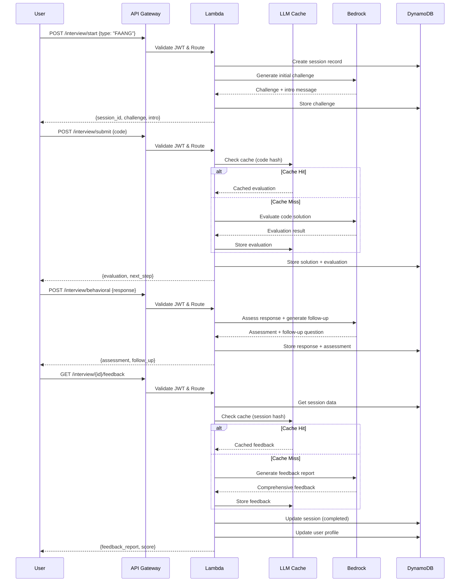

# AI Interview Simulator - Design Document

## Overview

The AI Interview Simulator is a feature extension to the CodeFlow AI platform that provides realistic mock technical interviews powered by AWS Bedrock Claude 3 Sonnet. The system enables users to practice coding challenges, behavioral questions, and receive comprehensive performance feedback including communication skills assessment and company-specific preparation for FAANG and startup interviews.

This feature integrates seamlessly with the existing CodeFlow AI infrastructure, leveraging the current authentication system (JWT-based), user profiles, Bedrock setup, and LLM caching mechanisms to provide cost-effective interview simulation within the platform's $10-15 monthly budget constraints.

**Key Design Principles:**

- Cost-first architecture: Aggressive LLM caching (80%+ hit rate target), limited Bedrock calls per session (max 10)
- Serverless-first: AWS Lambda for compute, DynamoDB for persistence, S3 for overflow storage
- Reuse existing infrastructure: Auth system, Bedrock IAM roles, monitoring dashboards, LLM cache
- Real-time feedback: Sub-10 second response times for code evaluation, sub-5 second for behavioral responses
- Data retention: 30-day TTL on interview sessions, automatic cleanup via DynamoDB TTL
- Security-first: JWT validation, input sanitization, rate limiting (10 req/min per user)

## Architecture

### High-Level System Architecture

```
┌─────────────────────────────────────────────────────────────────┐
│                         CLIENT LAYER                             │
│  ┌──────────────────────────────────────────────────────────┐  │
│  │  React Frontend (Existing CodeFlow UI)                   │  │
│  │  - Interview Session Manager                              │  │
│  │  - Code Editor Component                                  │  │
│  │  - Behavioral Response Form                               │  │
│  │  - Feedback Report Viewer                                 │  │
│  └──────────────────────────────────────────────────────────┘  │
└─────────────────────────────────────────────────────────────────┘
                              │
                              │ HTTPS/REST API + JWT
                              ▼
┌─────────────────────────────────────────────────────────────────┐
│                      API GATEWAY LAYER                           │
│  ┌──────────────────────────────────────────────────────────┐  │
│  │  AWS API Gateway (Existing CodeFlow API)                  │  │
│  │  - JWT Authorizer (Reuse existing)                        │  │
│  │  - Rate Limiting: 10 req/min per user                     │  │
│  │  - Request Validation (JSON Schema)                       │  │
│  │  - CORS Configuration                                      │  │
│  │                                                            │  │
│  │  New Endpoints:                                            │  │
│  │  POST   /interview/start                                   │  │
│  │  POST   /interview/submit                                  │  │
│  │  POST   /interview/behavioral                              │  │
│  │  GET    /interview/{session_id}/feedback                   │  │
│  │  GET    /interview/{session_id}/status                     │  │
│  └──────────────────────────────────────────────────────────┘  │
└─────────────────────────────────────────────────────────────────┘
                              │
                              ▼
┌─────────────────────────────────────────────────────────────────┐
│                    APPLICATION LAYER                             │
│  ┌──────────────────────────────────────────────────────────┐  │
│  │  Lambda: Interview Simulator                              │  │
│  │  Runtime: Python 3.11                                      │  │
│  │  Memory: 512MB                                             │  │
│  │  Timeout: 60 seconds                                       │  │
│  │  VPC: Existing CodeFlow VPC                                │  │
│  │                                                            │  │
│  │  Core Functions:                                           │  │
│  │  - Session Management (create, update, expire)            │  │
│  │  - Challenge Selection (type-specific)                    │  │
│  │  - Code Evaluation (via Bedrock)                          │  │
│  │  - Behavioral Assessment (via Bedrock)                    │  │
│  │  - Performance Scoring (weighted algorithm)               │  │
│  │  - Feedback Generation (cached)                           │  │
│  │                                                            │  │
│  │  Dependencies:                                             │  │
│  │  - Shared Lambda Layer (boto3, pydantic, httpx)          │  │
│  │  - LLM Cache Module (existing)                            │  │
│  │  - JWT Validation (existing auth module)                  │  │
│  └──────────────────────────────────────────────────────────┘  │
└─────────────────────────────────────────────────────────────────┘
                    │                 │
                    ▼                 ▼
┌─────────────────────────────────────────────────────────────────┐
│                          GENAI SERVICES LAYER                    │
│  ┌──────────────────────────────────────────────────────────┐  │
│  │  Amazon Bedrock (Claude 3 Sonnet)                         │  │
│  │  Model: anthropic.claude-3-sonnet-20240229-v1:0          │  │
│  │  Temperature: 0.7 (balanced creativity/consistency)       │  │
│  │  Max Tokens: 2000                                          │  │
│  │                                                            │  │
│  │  Use Cases:                                                │  │
│  │  1. Challenge Selection & Presentation (1 call/session)  │  │
│  │  2. Code Solution Evaluation (1-3 calls/session)         │  │
│  │  3. Behavioral Question Generation (1 call/session)      │  │
│  │  4. Behavioral Response Assessment (2-5 calls/session)   │  │
│  │  5. Feedback Report Generation (1 call/session)          │  │
│  │                                                            │  │
│  │  Cost Optimization:                                        │  │
│  │  - Max 10 Bedrock calls per session (hard limit)         │  │
│  │  - LLM Cache for common evaluations (80% hit rate)       │  │
│  │  - Retry logic: 3 attempts with exponential backoff      │  │
│  └──────────────────────────────────────────────────────────┘  │
└─────────────────────────────────────────────────────────────────┘
                              │
                              ▼
┌─────────────────────────────────────────────────────────────────┐
│                            DATA LAYER                            │
│  ┌──────────────────────────────────────────────────────────┐  │
│  │  DynamoDB: InterviewSessions                              │  │
│  │  Partition Key: session_id (UUID)                         │  │
│  │  Sort Key: timestamp                                       │  │
│  │  TTL: 30 days (auto-cleanup)                              │  │
│  │  Billing: On-Demand                                        │  │
│  │  PITR: Enabled                                             │  │
│  │                                                            │  │
│  │  Attributes:                                               │  │
│  │  - session_id, user_id, interview_type                    │  │
│  │  - session_state (active/paused/completed/expired/error) │  │
│  │  - challenges[] (problem details, user solutions)         │  │
│  │  - behavioral_qa[] (questions, responses, assessments)    │  │
│  │  - performance_score (overall + sub-scores)               │  │
│  │  - feedback_report (JSON)                                  │  │
│  │  - created_at, updated_at, completed_at                   │  │
│  │  - bedrock_call_count (cost tracking)                     │  │
│  └──────────────────────────────────────────────────────────┘  │
│  ┌──────────────────────────────────────────────────────────┐  │
│  │  DynamoDB: LLMCache (Existing - Reuse)                   │  │
│  │  Partition Key: query_hash                                 │  │
│  │  TTL: 7 days                                               │  │
│  │                                                            │  │
│  │  Cache Strategy:                                           │  │
│  │  - Code evaluation: Hash normalized code + problem_id    │  │
│  │  - Behavioral assessment: Hash question + response type  │  │
│  │  - Feedback generation: Hash session summary             │  │
│  │  - Target hit rate: 80%+ (60-80% cost savings)           │  │
│  └──────────────────────────────────────────────────────────┘  │
│  ┌──────────────────────────────────────────────────────────┐  │
│  │  DynamoDB: Users (Existing - Update)                      │  │
│  │  New Attributes:                                           │  │
│  │  - interview_history[] (session_id, score, type, date)   │  │
│  │  - interview_stats (total, avg_score, by_type)           │  │
│  │  - skill_strengths[] (from interview performance)         │  │
│  │  - skill_weaknesses[] (from interview performance)        │  │
│  └──────────────────────────────────────────────────────────┘  │
│  ┌──────────────────────────────────────────────────────────┐  │
│  │  S3: Datasets Bucket (Existing - Reuse)                   │  │
│  │  Path: interview-sessions/{session_id}/                   │  │
│  │                                                            │  │
│  │  Use Case: Overflow storage for sessions > 400KB         │  │
│  │  - Large code solutions                                    │  │
│  │  - Extensive feedback reports                              │  │
│  │  - Conversation transcripts                                │  │
│  │                                                            │  │
│  │  Lifecycle: Transition to Glacier after 90 days          │  │
│  └──────────────────────────────────────────────────────────┘  │
└─────────────────────────────────────────────────────────────────┘
                              │
                              ▼
┌─────────────────────────────────────────────────────────────────┐
│                      OBSERVABILITY LAYER                         │
│  ┌──────────────────────────────────────────────────────────┐  │
│  │  CloudWatch Metrics (Existing Dashboard - Extend)         │  │
│  │  - Interview session count (by type)                      │  │
│  │  - Completion rate                                         │  │
│  │  - Average performance score                               │  │
│  │  - Bedrock API call count & latency                       │  │
│  │  - LLM cache hit rate                                      │  │
│  │  - API response times (P50, P95, P99)                     │  │
│  │                                                            │  │
│  │  CloudWatch Alarms:                                        │  │
│  │  - Bedrock error rate > 5%                                 │  │
│  │  - Average latency > 15 seconds                            │  │
│  │  - Session creation failures                               │  │
│  └──────────────────────────────────────────────────────────┘  │
└─────────────────────────────────────────────────────────────────┘
```

### Interview Flow Sequence Diagram



## Components and Interfaces

### 1. Interview Simulator Lambda Function

**Responsibility:** Orchestrate interview sessions, manage AI interviewer interactions, evaluate performance

**Handler Functions:**

```python
# Main handler
def handler(event, context) -> Dict[str, Any]:
    """Route requests to appropriate handlers"""
    
# Session management
def handle_start_interview(body: Dict) -> Dict:
    """Create new interview session"""
    
def handle_get_status(session_id: str, user_id: str) -> Dict:
    """Get current session status"""
    
# Code evaluation
def handle_submit_code(body: Dict) -> Dict:
    """Evaluate code solution"""
    
# Behavioral assessment
def handle_behavioral_response(body: Dict) -> Dict:
    """Assess behavioral response and generate follow-up"""
    
# Feedback generation
def handle_get_feedback(session_id: str, user_id: str) -> Dict:
    """Generate comprehensive feedback report"""
```

**Dependencies:**
- AWS SDK (boto3): DynamoDB, Bedrock, S3, CloudWatch
- Existing LLM Cache module
- Existing JWT validation module
- Pydantic for data validation

**Environment Variables:**
```python
ENVIRONMENT = "dev|staging|prod"
INTERVIEW_SESSIONS_TABLE = "codeflow-interview-sessions-{env}"
USERS_TABLE = "codeflow-users-{env}"  # Existing
LLM_CACHE_TABLE = "codeflow-llm-cache-{env}"  # Existing
DATASETS_BUCKET = "codeflow-datasets-{env}"  # Existing
BEDROCK_MODEL_ID = "anthropic.claude-3-sonnet-20240229-v1:0"
MAX_BEDROCK_CALLS_PER_SESSION = "10"
CACHE_TTL_DAYS = "7"
SESSION_TTL_DAYS = "30"
```

### 2. AI Interviewer Module

**Responsibility:** Manage Bedrock interactions with interviewer persona

**Core Functions:**

```python
class AIInterviewer:
    """AI Interviewer powered by Bedrock Claude 3 Sonnet"""
    
    def __init__(self, interview_type: str):
        self.interview_type = interview_type
        self.persona_prompt = self._build_persona_prompt()
        self.conversation_history = []
        
    def select_challenge(self) -> Dict:
        """Select coding challenge based on interview type"""
        
    def evaluate_code(self, code: str, problem: Dict) -> Dict:
        """Evaluate code solution with caching"""
        
    def generate_behavioral_question(self, context: Dict) -> str:
        """Generate behavioral question"""
        
    def assess_behavioral_response(self, question: str, response: str) -> Dict:
        """Assess behavioral response using STAR method"""
        
    def generate_follow_up(self, context: Dict) -> str:
        """Generate contextual follow-up question"""
        
    def generate_feedback_report(self, session_data: Dict) -> Dict:
        """Generate comprehensive feedback report"""
        
    def _invoke_bedrock(self, prompt: str, use_cache: bool = True) -> str:
        """Invoke Bedrock with retry logic and caching"""
```

**Persona Prompts by Interview Type:**

```python
PERSONA_PROMPTS = {
    "FAANG": """You are a senior technical interviewer at a top-tier tech company (FAANG).
    
Your interview style:
- Focus on algorithmic complexity and optimization
- Ask about system design thinking and scalability
- Evaluate leadership principles and behavioral competencies
- Expect clear communication of trade-offs
- Challenge candidates to optimize their solutions

Be professional, encouraging, but maintain high standards.""",
    
    "startup": """You are a technical interviewer at a fast-growing startup.
    
Your interview style:
- Focus on practical problem-solving and product thinking
- Value adaptability and learning ability
- Assess ability to work with ambiguity
- Look for end-to-end thinking
- Appreciate pragmatic solutions over perfect algorithms

Be collaborative and focus on real-world applicability.""",
    
    "general": """You are an experienced technical interviewer.
    
Your interview style:
- Balanced assessment across all skill areas
- Clear, structured questions
- Supportive and encouraging tone
- Focus on problem-solving process
- Provide helpful hints when needed

Be professional and create a comfortable interview environment."""
}
```

### 3. Performance Scoring Module

**Responsibility:** Calculate weighted performance scores

**Scoring Algorithm:**

```python
class PerformanceScorer:
    """Calculate interview performance scores"""
    
    WEIGHTS = {
        "coding_correctness": 0.40,  # 40%
        "code_quality": 0.20,         # 20%
        "communication": 0.20,        # 20%
        "behavioral": 0.20            # 20%
    }
    
    FAANG_MULTIPLIERS = {
        "algorithmic_optimization": 1.2,  # 20% bonus for optimal solutions
        "system_thinking": 1.1            # 10% bonus for system design awareness
    }
    
    def calculate_overall_score(self, session_data: Dict) -> Dict:
        """Calculate overall performance score (0-100)"""
        
    def calculate_coding_score(self, solutions: List[Dict]) -> float:
        """Score coding solutions (correctness + optimization)"""
        
    def calculate_quality_score(self, solutions: List[Dict]) -> float:
        """Score code quality (readability, structure, best practices)"""
        
    def calculate_communication_score(self, assessments: List[Dict]) -> float:
        """Score communication (clarity, structure, completeness)"""
        
    def calculate_behavioral_score(self, responses: List[Dict]) -> float:
        """Score behavioral responses (STAR method adherence)"""
        
    def apply_interview_type_adjustments(self, scores: Dict, interview_type: str) -> Dict:
        """Apply interview type-specific adjustments"""
```

**Score Calculation Example:**

```python
# Input: Session with 2 coding challenges, 3 behavioral questions
session_data = {
    "coding_solutions": [
        {"correct": True, "optimal": True, "quality": 85},
        {"correct": True, "optimal": False, "quality": 70}
    ],
    "behavioral_responses": [
        {"star_score": 90, "clarity": 85},
        {"star_score": 75, "clarity": 80},
        {"star_score": 80, "clarity": 75}
    ],
    "communication_assessments": [
        {"technical": 85, "explanation": 80},
        {"technical": 75, "explanation": 85}
    ]
}

# Output: Weighted scores
{
    "overall_score": 82,
    "sub_scores": {
        "coding_correctness": 90,  # Both correct, one optimal
        "code_quality": 78,         # Average of quality scores
        "communication": 80,        # Average of all communication
        "behavioral": 82            # Average of STAR scores
    },
    "percentile": 75,  # Compared to other users
    "interview_type": "FAANG"
}
```

### 4. Challenge Selection Module

**Responsibility:** Select appropriate coding challenges based on interview type

**Challenge Database Structure:**

```python
CHALLENGE_DATABASE = {
    "FAANG": [
        {
            "id": "faang_001",
            "title": "LRU Cache Implementation",
            "difficulty": "Medium",
            "topics": ["hash-table", "linked-list", "design"],
            "optimal_complexity": {"time": "O(1)", "space": "O(capacity)"},
            "description": "Design and implement a data structure for LRU cache...",
            "test_cases": [...],
            "hints": ["Consider using a hash map", "Think about ordering"],
            "follow_up_questions": [
                "How would you handle thread safety?",
                "What if capacity changes dynamically?"
            ]
        },
        # ... more FAANG challenges (medium-hard difficulty)
    ],
    "startup": [
        {
            "id": "startup_001",
            "title": "Rate Limiter Design",
            "difficulty": "Medium",
            "topics": ["design", "hash-table", "queue"],
            "practical_focus": True,
            "description": "Design a rate limiter for an API...",
            "test_cases": [...],
            "real_world_context": "Used in production APIs to prevent abuse",
            "follow_up_questions": [
                "How would you deploy this?",
                "What metrics would you track?"
            ]
        },
        # ... more startup challenges (practical focus)
    ],
    "general": [
        {
            "id": "general_001",
            "title": "Two Sum",
            "difficulty": "Easy",
            "topics": ["array", "hash-table"],
            "description": "Find two numbers that add up to target...",
            "test_cases": [...],
            "hints": ["Think about what you've seen before", "Hash maps are useful"]
        },
        # ... more general challenges (balanced difficulty)
    ]
}
```

**Selection Algorithm:**

```python
def select_challenges(interview_type: str, num_challenges: int = 2) -> List[Dict]:
    """
    Select challenges based on interview type
    
    Rules:
    - FAANG: 1-2 medium-hard challenges
    - Startup: 1-2 practical challenges
    - General: 1-3 challenges (easy to medium)
    """
    challenges = CHALLENGE_DATABASE[interview_type]
    
    # Filter by difficulty based on type
    if interview_type == "FAANG":
        filtered = [c for c in challenges if c["difficulty"] in ["Medium", "Hard"]]
    elif interview_type == "startup":
        filtered = [c for c in challenges if c.get("practical_focus")]
    else:
        filtered = challenges
    
    # Random selection (or use ML-based selection in future)
    selected = random.sample(filtered, min(num_challenges, len(filtered)))
    
    return selected
```

## Data Models

### InterviewSession Model

```python
from pydantic import BaseModel, Field
from typing import List, Optional, Dict, Any
from datetime import datetime
from enum import Enum

class SessionState(str, Enum):
    ACTIVE = "active"
    PAUSED = "paused"
    COMPLETED = "completed"
    EXPIRED = "expired"
    ERROR = "error"

class InterviewType(str, Enum):
    FAANG = "FAANG"
    STARTUP = "startup"
    GENERAL = "general"

class CodingChallenge(BaseModel):
    challenge_id: str
    title: str
    difficulty: str
    topics: List[str]
    description: str
    test_cases: List[Dict[str, Any]]
    user_solution: Optional[str] = None
    evaluation: Optional[Dict[str, Any]] = None
    submitted_at: Optional[datetime] = None
    attempts: int = 0

class BehavioralQA(BaseModel):
    question_id: str
    question: str
    category: str  # leadership, teamwork, conflict, etc.
    user_response: Optional[str] = None
    assessment: Optional[Dict[str, Any]] = None
    follow_up_questions: List[str] = []
    submitted_at: Optional[datetime] = None

class PerformanceScore(BaseModel):
    overall_score: float = Field(ge=0, le=100)
    coding_correctness: float = Field(ge=0, le=100)
    code_quality: float = Field(ge=0, le=100)
    communication: float = Field(ge=0, le=100)
    behavioral: float = Field(ge=0, le=100)
    percentile: Optional[int] = None

class FeedbackReport(BaseModel):
    overall_score: PerformanceScore
    technical_feedback: Dict[str, Any]
    behavioral_feedback: Dict[str, Any]
    communication_feedback: Dict[str, Any]
    recommendations: List[Dict[str, str]]  # {priority, text}
    strengths: List[str]
    areas_for_improvement: List[str]
    comparison_to_type: Dict[str, Any]
    generated_at: datetime

class InterviewSession(BaseModel):
    session_id: str = Field(default_factory=lambda: str(uuid.uuid4()))
    user_id: str
    interview_type: InterviewType
    session_state: SessionState = SessionState.ACTIVE
    
    # Interview content
    challenges: List[CodingChallenge] = []
    behavioral_qa: List[BehavioralQA] = []
    conversation_history: List[Dict[str, str]] = []
    
    # Performance data
    performance_score: Optional[PerformanceScore] = None
    feedback_report: Optional[FeedbackReport] = None
    
    # Metadata
    created_at: datetime = Field(default_factory=datetime.utcnow)
    updated_at: datetime = Field(default_factory=datetime.utcnow)
    completed_at: Optional[datetime] = None
    last_activity_at: datetime = Field(default_factory=datetime.utcnow)
    
    # Cost tracking
    bedrock_call_count: int = 0
    cache_hit_count: int = 0
    
    # TTL for DynamoDB
    ttl: int = Field(default_factory=lambda: int((datetime.utcnow() + timedelta(days=30)).timestamp()))
    
    # S3 overflow reference (if session > 400KB)
    s3_overflow_key: Optional[str] = None
```

### API Request/Response Models

```python
# POST /interview/start
class StartInterviewRequest(BaseModel):
    interview_type: InterviewType = InterviewType.GENERAL
    
class StartInterviewResponse(BaseModel):
    session_id: str
    interview_type: str
    intro_message: str
    first_challenge: CodingChallenge
    estimated_duration_minutes: int

# POST /interview/submit
class SubmitCodeRequest(BaseModel):
    session_id: str
    challenge_id: str
    code: str = Field(max_length=10000)
    language: str = "python"
    explanation: Optional[str] = None
    
class SubmitCodeResponse(BaseModel):
    evaluation: Dict[str, Any]
    feedback: str
    next_step: str  # "continue", "next_challenge", "behavioral"
    hints: Optional[List[str]] = None

# POST /interview/behavioral
class BehavioralResponseRequest(BaseModel):
    session_id: str
    question_id: str
    response: str = Field(max_length=2000)
    
class BehavioralResponseResponse(BaseModel):
    assessment: Dict[str, Any]
    follow_up_question: Optional[str] = None
    next_step: str  # "continue", "complete"

# GET /interview/{session_id}/feedback
class FeedbackResponse(BaseModel):
    session_id: str
    feedback_report: FeedbackReport
    performance_score: PerformanceScore
    interview_duration_minutes: int
    challenges_completed: int
    behavioral_questions_answered: int

# GET /interview/{session_id}/status
class SessionStatusResponse(BaseModel):
    session_id: str
    session_state: SessionState
    interview_type: str
    progress: Dict[str, Any]  # challenges completed, questions answered
    last_activity: datetime
    time_remaining_minutes: Optional[int] = None
```

### DynamoDB Table Schema

**InterviewSessions Table:**

```
Table Name: codeflow-interview-sessions-{environment}
Billing Mode: On-Demand
Encryption: AWS Managed
Point-in-Time Recovery: Enabled

Primary Key:
  Partition Key: session_id (String) - UUID
  Sort Key: timestamp (Number) - Unix timestamp

Attributes:
  session_id: String (PK)
  timestamp: Number (SK)
  user_id: String (GSI PK)
  interview_type: String
  session_state: String
  challenges: List<Map>
  behavioral_qa: List<Map>
  conversation_history: List<Map>
  performance_score: Map
  feedback_report: Map
  created_at: String (ISO 8601)
  updated_at: String (ISO 8601)
  completed_at: String (ISO 8601)
  last_activity_at: String (ISO 8601)
  bedrock_call_count: Number
  cache_hit_count: Number
  ttl: Number (TTL attribute - 30 days)
  s3_overflow_key: String (optional)

Global Secondary Indexes:
  1. user-id-index
     Partition Key: user_id
     Sort Key: created_at
     Projection: ALL
     Purpose: Query all sessions for a user

  2. interview-type-index
     Partition Key: interview_type
     Sort Key: created_at
     Projection: ALL
     Purpose: Analytics by interview type

TTL Configuration:
  Attribute: ttl
  Enabled: Yes
  Auto-delete after 30 days
```

**Users Table Updates (Existing Table):**

```
New Attributes to Add:
  interview_history: List<Map> [
    {
      session_id: String,
      interview_type: String,
      performance_score: Number,
      completed_at: String,
      duration_minutes: Number
    }
  ]
  
  interview_stats: Map {
    total_interviews: Number,
    avg_performance_score: Number,
    by_type: Map {
      FAANG: {count: Number, avg_score: Number},
      startup: {count: Number, avg_score: Number},
      general: {count: Number, avg_score: Number}
    },
    last_interview_date: String
  }
  
  skill_strengths: List<String>  # From interview performance
  skill_weaknesses: List<String>  # From interview performance
```

## Correctness Properties

*A property is a characteristic or behavior that should hold true across all valid executions of a system—essentially, a formal statement about what the system should do. Properties serve as the bridge between human-readable specifications and machine-verifiable correctness guarantees.*

### Property Reflection

After analyzing all acceptance criteria, I identified several opportunities to consolidate redundant properties:

**Consolidations Made:**
1. Session creation properties (1.1, 1.2, 1.4, 1.6) → Combined into "Session Creation Completeness"
2. TTL properties (1.3, 13.3) → Combined into "TTL Configuration"
3. Storage properties (3.2, 3.7, 4.6) → Combined into "Data Persistence"
4. Bedrock invocation properties (11.3, 11.4, 11.5) → Combined into "Bedrock Configuration"
5. Error response properties (9.5, 9.6, 10.3, 10.5) → Combined into "HTTP Error Handling"
6. Validation properties (19.1, 19.3, 19.4, 19.5) → Combined into "Input Validation"
7. Feedback report structure properties (20.1, 20.2, 20.6) → Combined into "Feedback Report Structure"

This reduces 140+ individual checks to 60 unique, non-redundant properties.

### Session Management Properties

### Property 1: Session Creation Completeness
*For any* valid JWT token and interview type, when a user starts an interview, the system should create a session with unique session_id, store it in DynamoDB with correct partition/sort keys, initialize state to "active", and associate it with the authenticated user_id from the JWT.

**Validates: Requirements 1.1, 1.2, 1.4, 1.6**

### Property 2: Default Interview Type
*For any* interview start request without an interview_type parameter, the system should default to "general" type.

**Validates: Requirements 1.5**

### Property 3: Session Inactivity Expiration
*For any* interview session, if the last_activity_at timestamp exceeds 120 minutes from the current time, the session_state should be updated to "expired".

**Validates: Requirements 1.7**

### Property 4: TTL Configuration
*For any* interview session record created in DynamoDB, the ttl attribute should be set to 30 days from creation timestamp.

**Validates: Requirements 1.3, 13.3**

### Challenge Selection Properties

### Property 5: Challenge Appropriateness
*For any* interview session, the selected coding challenges should match the interview_type (FAANG → medium/hard, startup → practical focus, general → balanced).

**Validates: Requirements 2.1, 2.3, 2.4**

### Property 6: Challenge Completeness
*For any* coding challenge presented, it should include problem description, input/output examples, and constraints.

**Validates: Requirements 2.2**

### Property 7: Challenge Count Bounds
*For any* interview session, the number of coding challenges should be between 1 and 3 based on interview_type.

**Validates: Requirements 2.7**

### Property 8: Challenge Recording
*For any* coding challenge presented, the challenge details should be recorded in the Interview_Session record.

**Validates: Requirements 2.6**

### Code Evaluation Properties

### Property 9: Code Submission Validation
*For any* code submission with valid session_id and JWT, the system should validate the submission format before processing.

**Validates: Requirements 3.1**

### Property 10: Data Persistence
*For any* user submission (code or behavioral response), the system should store it in the Interview_Session record with timestamp.

**Validates: Requirements 3.2, 3.7, 4.6**

### Property 11: Bedrock Evaluation Invocation
*For any* code solution submission, the system should send it to Bedrock API for evaluation.

**Validates: Requirements 3.3**

### Property 12: Evaluation Completeness
*For any* code evaluation response from Bedrock, it should include assessments of correctness, time complexity, space complexity, and code quality.

**Validates: Requirements 3.4**

### Property 13: Evaluation Response Time
*For any* code solution submission, the system should provide evaluation feedback within 10 seconds.

**Validates: Requirements 3.5**

### Property 14: Cache Utilization for Evaluation
*For any* code solution that matches a previously evaluated solution (by normalized hash), the system should retrieve the cached evaluation instead of calling Bedrock.

**Validates: Requirements 3.6, 12.1, 12.2, 12.5**

### Behavioral Assessment Properties

### Property 15: Behavioral Question Count
*For any* interview session with behavioral component, the number of behavioral questions should be between 2 and 5.

**Validates: Requirements 4.1**

### Property 16: Behavioral Question Relevance
*For any* interview type, behavioral questions should be relevant to that type (FAANG → leadership/scale, startup → adaptability/product, general → balanced).

**Validates: Requirements 4.2, 4.3**

### Property 17: Behavioral Response Assessment
*For any* behavioral response submission, the system should send it to Bedrock for Communication_Assessment.

**Validates: Requirements 4.4**

### Property 18: STAR Method Evaluation
*For any* behavioral response assessment, the evaluation should include STAR method criteria (Situation, Task, Action, Result).

**Validates: Requirements 4.5**

### Property 19: Contextual Follow-up Generation
*For any* behavioral response, the system should generate a follow-up question based on the user's response context.

**Validates: Requirements 4.7**

### Communication Assessment Properties

### Property 20: Communication Assessment Execution
*For any* user response (code explanation or behavioral answer), the system should perform Communication_Assessment.

**Validates: Requirements 5.1**

### Property 21: Communication Assessment Dimensions
*For any* Communication_Assessment, it should evaluate clarity of explanation, logical structure, and completeness of responses.

**Validates: Requirements 5.2**

### Property 22: Technical Communication Assessment
*For any* coding challenge explanation, the system should assess technical communication skills.

**Validates: Requirements 5.3**

### Property 23: Soft Skills Communication Assessment
*For any* behavioral question response, the system should assess soft skills communication.

**Validates: Requirements 5.4**

### Property 24: Communication Scores in Feedback
*For any* feedback report, it should include Communication_Assessment scores.

**Validates: Requirements 5.5**

### Property 25: Specific Improvement Identification
*For any* Communication_Assessment, it should identify specific areas for improvement with concrete examples from the interview.

**Validates: Requirements 5.6**

### Property 26: Thought Process Evaluation
*For any* problem-solving session, the system should evaluate whether the user explains their thought process.

**Validates: Requirements 5.7**

### Performance Scoring Properties

### Property 27: Score Range Validity
*For any* completed interview session, the Performance_Score should be between 0 and 100 (inclusive).

**Validates: Requirements 6.1**

### Property 28: Score Component Weights
*For any* Performance_Score calculation, the weighted components should sum to 100%: coding correctness (40%), code quality (20%), communication (20%), behavioral responses (20%).

**Validates: Requirements 6.2**

### Property 29: Score Persistence
*For any* completed interview session, the Performance_Score should be stored in the Interview_Session record.

**Validates: Requirements 6.3**

### Property 30: Sub-score Calculation
*For any* Performance_Score, sub-scores should exist for each evaluation dimension (coding, quality, communication, behavioral).

**Validates: Requirements 6.4**

### Property 31: FAANG Stricter Criteria
*For any* interview session with type "FAANG", the Performance_Score calculation should apply stricter evaluation criteria for algorithmic optimization.

**Validates: Requirements 6.5**

### Property 32: Historical Score Comparison
*For any* Performance_Score calculation, the system should compare it with the user's historical scores from User_Profile.

**Validates: Requirements 6.6**

### Property 33: Score Calculation Performance
*For any* interview session completion, the Performance_Score calculation should complete within 15 seconds.

**Validates: Requirements 6.7**

### Feedback Generation Properties

### Property 34: Comprehensive Feedback Generation
*For any* valid feedback request with session_id and JWT, the system should generate a comprehensive Feedback_Report.

**Validates: Requirements 7.1**

### Property 35: Feedback Report Structure
*For any* Feedback_Report, it should be in JSON format with defined schema including sections for overall_score, technical_feedback, behavioral_feedback, communication_feedback, recommendations, timestamp, and duration.

**Validates: Requirements 7.2, 7.6, 20.1, 20.2, 20.6**

### Property 36: Actionable Recommendations
*For any* Feedback_Report, recommendations should be specific and actionable with priority levels (high, medium, low).

**Validates: Requirements 7.3, 20.5**

### Property 37: Pattern Identification
*For any* Feedback_Report, the system should identify patterns in the user's problem-solving approach and communication style.

**Validates: Requirements 7.4**

### Property 38: Performance Comparison
*For any* Feedback_Report, it should include comparison with typical performance for the specified Interview_Type.

**Validates: Requirements 7.5**

### Property 39: Markdown Formatting
*For any* Feedback_Report, text content should use markdown formatting for rich display.

**Validates: Requirements 20.3**

### Property 40: Code Snippet Highlighting
*For any* Feedback_Report containing code snippets, they should include syntax highlighting markers.

**Validates: Requirements 20.4**

### Property 41: Feedback Cache Utilization
*For any* feedback generation request, the system should check LLM_Cache before calling Bedrock.

**Validates: Requirements 7.7**

### Property 42: Robust Response Parsing
*For any* AI_Interviewer output, the system should parse and extract structured data even if response format varies slightly.

**Validates: Requirements 20.7**

### Interview Type Properties

### Property 43: Supported Interview Types
*For any* interview type validation, the system should only accept "FAANG", "startup", or "general" as valid values.

**Validates: Requirements 8.1, 8.7**

### Property 44: FAANG Interview Emphasis
*For any* interview session with type "FAANG", the AI_Interviewer should emphasize algorithmic complexity, system design thinking, and leadership principles in questions and evaluation.

**Validates: Requirements 8.2**

### Property 45: Startup Interview Emphasis
*For any* interview session with type "startup", the AI_Interviewer should emphasize practical problem-solving, product thinking, and adaptability in questions and evaluation.

**Validates: Requirements 8.3**

### Property 46: General Interview Balance
*For any* interview session with type "general", the AI_Interviewer should provide balanced assessment across all skill areas.

**Validates: Requirements 8.4**

### Property 47: Interview Type Adaptation
*For any* interview type, the AI_Interviewer should adapt questioning style and evaluation criteria accordingly.

**Validates: Requirements 8.5**

### Property 48: Type-Specific Tips
*For any* Feedback_Report, it should include Interview_Type-specific tips.

**Validates: Requirements 8.6**

### Authentication and Authorization Properties

### Property 49: JWT Validation
*For any* API request, the system should validate the JWT_Token using the existing authentication system.

**Validates: Requirements 10.1, 10.7**

### Property 50: Session Ownership Verification
*For any* session data access request, the system should verify the session belongs to the authenticated user.

**Validates: Requirements 10.2**

### Property 51: HTTP Error Handling
*For any* request with invalid/expired JWT, the system should return HTTP 401; for non-existent session_id, return HTTP 404; for unauthorized access to another user's session, return HTTP 403.

**Validates: Requirements 9.5, 9.6, 10.3, 10.5**

### Property 52: User ID Extraction
*For any* session creation, the system should extract user_id from the JWT_Token to associate with the Interview_Session.

**Validates: Requirements 10.4**

### Property 53: Authentication Failure Logging
*For any* authentication failure, the system should log the event to CloudWatch for security monitoring.

**Validates: Requirements 10.6**

### Bedrock Integration Properties

### Property 54: Claude 3 Sonnet Usage
*For any* AI_Interviewer functionality, the system should use AWS Bedrock Claude 3 Sonnet model.

**Validates: Requirements 11.1**

### Property 55: Interviewer Persona Configuration
*For any* Bedrock API call, the system should include the interviewer persona prompt that simulates professional technical interviewer behavior.

**Validates: Requirements 11.2**

### Property 56: Bedrock Configuration Parameters
*For any* Bedrock API invocation, the system should include conversation history for context, set temperature to 0.7, and set max_tokens to 2000.

**Validates: Requirements 11.3, 11.4, 11.5**

### Property 57: Bedrock Retry Logic
*For any* Bedrock API call failure, the system should retry up to 3 times with exponential backoff before returning an error.

**Validates: Requirements 11.6**

### Property 58: Bedrock IAM Role Reuse
*For any* Bedrock API call, the system should use existing Bedrock IAM roles and permissions from the platform infrastructure.

**Validates: Requirements 11.7**

### Cost Optimization Properties

### Property 59: Cache Key Generation
*For any* cache operation, the system should generate cache keys based on normalized code solutions and question content.

**Validates: Requirements 12.3**

### Property 60: Cache TTL Configuration
*For any* cached interview-related response, the TTL should be set to 7 days.

**Validates: Requirements 12.4**

### Property 61: Cache Metrics Logging
*For any* cache operation, the system should log cache hit rate metrics to CloudWatch.

**Validates: Requirements 12.6**

### Property 62: Bedrock Call Limit
*For any* interview session, the total number of Bedrock API calls should not exceed 10.

**Validates: Requirements 12.7**

### Data Storage Properties

### Property 63: Session Storage Structure
*For any* interview session, it should be stored in InterviewSessions_Table with partition key session_id and sort key timestamp.

**Validates: Requirements 13.1, 13.2**

### Property 64: Session Data Completeness
*For any* stored interview session, it should include session_id, user_id, interview_type, session_state, challenges, responses, and performance_score.

**Validates: Requirements 13.4**

### Property 65: Large Field Compression
*For any* interview session with large text fields (code solutions, feedback), the system should compress them before storing in DynamoDB.

**Validates: Requirements 13.5**

### Property 66: S3 Overflow Storage
*For any* interview session data exceeding 400KB, the system should store overflow content in S3 and reference the S3 key in DynamoDB.

**Validates: Requirements 13.7**

### Error Handling Properties

### Property 67: Bedrock Unavailability Response
*For any* Bedrock API unavailability, the system should return HTTP 503 Service Unavailable with retry-after header.

**Validates: Requirements 14.1**

### Property 68: DynamoDB Retry Logic
*For any* DynamoDB write failure, the system should retry the operation up to 3 times before returning an error.

**Validates: Requirements 14.2**

### Property 69: Progress Preservation
*For any* error during an interview session, the system should preserve the user's progress and allow session resumption.

**Validates: Requirements 14.3**

### Property 70: Error Logging with Context
*For any* error, the system should log to CloudWatch with context including session_id and user_id.

**Validates: Requirements 14.4**

### Property 71: Invalid Response Regeneration
*For any* AI_Interviewer response with invalid format, the system should request regeneration with corrected prompt.

**Validates: Requirements 14.5**

### Property 72: Input Validation
*For any* API request, the system should validate payloads against JSON schemas, limit code to 10,000 characters, limit behavioral responses to 2,000 characters, and validate session_id as UUID format.

**Validates: Requirements 14.6, 19.1, 19.3, 19.4, 19.5**

### Property 73: Unrecoverable Error Handling
*For any* unrecoverable error, the system should update session_state to "error" and notify the user.

**Validates: Requirements 14.7**

### Performance Properties

### Property 74: Session Start Response Time
*For any* interview session start request, the system should return initial response within 3 seconds.

**Validates: Requirements 15.1**

### Property 75: Code Evaluation Response Time
*For any* code solution submission, the system should provide evaluation feedback within 10 seconds.

**Validates: Requirements 15.2**

### Property 76: Behavioral Response Time
*For any* behavioral response submission, the system should provide follow-up question within 5 seconds.

**Validates: Requirements 15.3**

### Property 77: Feedback Generation Response Time
*For any* feedback request, the system should process it within 15 seconds.

**Validates: Requirements 15.4**

### Property 78: Cache Retrieval Performance
*For any* LLM_Cache hit, the system should return cached response within 500 milliseconds.

**Validates: Requirements 15.7**

### Monitoring Properties

### Property 79: Session Metrics Emission
*For any* interview session activity, the system should emit CloudWatch metrics for session count, completion rate, and average performance score.

**Validates: Requirements 16.1**

### Property 80: Bedrock Metrics Emission
*For any* Bedrock API call, the system should emit CloudWatch metrics for call count, latency, and error rate.

**Validates: Requirements 16.2**

### Property 81: Cache Metrics Emission
*For any* cache operation, the system should emit CloudWatch metrics for hit rate and cache size.

**Validates: Requirements 16.3**

### Property 82: Request Logging
*For any* API request, the system should log with request_id, user_id, session_id, and execution duration.

**Validates: Requirements 16.4**

### User Profile Integration Properties

### Property 83: Profile Update on Completion
*For any* completed interview session, the system should update the user's User_Profile with Performance_Score.

**Validates: Requirements 17.1**

### Property 84: Interview History Storage
*For any* completed interview session, the system should store interview history including session_id, timestamp, interview_type, and performance_score in User_Profile.

**Validates: Requirements 17.2**

### Property 85: Average Score Calculation
*For any* user with multiple completed interviews, the system should calculate the user's average Performance_Score.

**Validates: Requirements 17.3**

### Property 86: Skill Area Identification
*For any* user with interview history, the system should identify strongest and weakest skill areas based on performance patterns.

**Validates: Requirements 17.4**

### Property 87: Recommendation System Integration
*For any* completed interview, the performance data should be accessible to the existing recommendation system for personalized learning paths.

**Validates: Requirements 17.5**

### Property 88: Profile Summary Statistics
*For any* user profile view, the system should provide summary statistics of interview practice activity.

**Validates: Requirements 17.6**

### Property 89: Improvement Trend Tracking
*For any* user with interview history, the system should track improvement trend by comparing recent Performance_Score with historical average.

**Validates: Requirements 17.7**

### Interview Flow Properties

### Property 90: Interview Introduction
*For any* interview session start, the AI_Interviewer should introduce itself and explain the interview format.

**Validates: Requirements 18.1**

### Property 91: Clarifying Questions
*For any* unclear user response (code solution or explanation), the AI_Interviewer should ask clarifying questions.

**Validates: Requirements 18.2**

### Property 92: Hint Provision
*For any* coding challenge where the user is stuck for more than 10 minutes, the AI_Interviewer should provide hints.

**Validates: Requirements 18.3**

### Property 93: Smooth Section Transitions
*For any* transition between coding challenge and behavioral question sections, the AI_Interviewer should provide smooth transition messaging.

**Validates: Requirements 18.4**

### Property 94: Approach Explanation Request
*For any* completed coding challenge, the AI_Interviewer should ask the user to explain their approach before moving forward.

**Validates: Requirements 18.5**

### Property 95: Interview Conclusion Summary
*For any* interview session conclusion, the AI_Interviewer should provide a brief summary and inform the user that detailed Feedback_Report is available.

**Validates: Requirements 18.7**

### Security Properties

### Property 96: Input Sanitization
*For any* user-submitted code solution, the system should sanitize it to remove potentially harmful content before storage.

**Validates: Requirements 19.2**

### Property 97: Malicious Input Rejection
*For any* request containing SQL injection patterns, script tags, or command injection attempts, the system should reject it.

**Validates: Requirements 19.6**

### Property 98: Rate Limiting
*For any* user, the system should enforce rate limiting of 10 requests per minute to prevent abuse.

**Validates: Requirements 19.7**

### Property 99: JSON Response Format
*For any* API response, it should be in JSON format with consistent error structure.

**Validates: Requirements 9.7**

### Property 100: Bedrock Context Provision
*For any* Bedrock API call for challenge presentation, the system should provide coding challenge context to the AI_Interviewer.

**Validates: Requirements 2.5**

## Error Handling

### Error Categories and Responses

**1. Authentication Errors (4xx)**

```python
class AuthenticationError(Exception):
    """JWT validation failures"""
    
    ERROR_RESPONSES = {
        "missing_token": {
            "status_code": 401,
            "error_code": "AUTH_001",
            "message": "Missing or invalid JWT token",
            "retry": False
        },
        "expired_token": {
            "status_code": 401,
            "error_code": "AUTH_002",
            "message": "JWT token has expired",
            "retry": False
        },
        "invalid_signature": {
            "status_code": 401,
            "error_code": "AUTH_003",
            "message": "Invalid JWT signature",
            "retry": False
        },
        "unauthorized_access": {
            "status_code": 403,
            "error_code": "AUTH_004",
            "message": "Access denied to this resource",
            "retry": False
        }
    }
```

**2. Validation Errors (4xx)**

```python
class ValidationError(Exception):
    """Input validation failures"""
    
    ERROR_RESPONSES = {
        "invalid_interview_type": {
            "status_code": 400,
            "error_code": "VAL_001",
            "message": "Interview type must be FAANG, startup, or general",
            "retry": False
        },
        "code_too_large": {
            "status_code": 400,
            "error_code": "VAL_002",
            "message": "Code solution exceeds 10,000 character limit",
            "retry": False
        },
        "invalid_session_id": {
            "status_code": 400,
            "error_code": "VAL_003",
            "message": "Session ID must be a valid UUID",
            "retry": False
        },
        "malicious_input": {
            "status_code": 400,
            "error_code": "VAL_004",
            "message": "Input contains potentially harmful content",
            "retry": False
        },
        "rate_limit_exceeded": {
            "status_code": 429,
            "error_code": "VAL_005",
            "message": "Rate limit exceeded (10 requests per minute)",
            "retry": True,
            "retry_after": 60
        }
    }
```

**3. Resource Errors (4xx)**

```python
class ResourceError(Exception):
    """Resource not found or access errors"""
    
    ERROR_RESPONSES = {
        "session_not_found": {
            "status_code": 404,
            "error_code": "RES_001",
            "message": "Interview session not found",
            "retry": False
        },
        "session_expired": {
            "status_code": 410,
            "error_code": "RES_002",
            "message": "Interview session has expired",
            "retry": False
        },
        "session_completed": {
            "status_code": 409,
            "error_code": "RES_003",
            "message": "Interview session already completed",
            "retry": False
        }
    }
```

**4. External Service Errors (5xx)**

```python
class ExternalServiceError(Exception):
    """Bedrock, DynamoDB, S3 failures"""
    
    ERROR_RESPONSES = {
        "bedrock_unavailable": {
            "status_code": 503,
            "error_code": "EXT_001",
            "message": "AI service temporarily unavailable",
            "retry": True,
            "retry_after": 30
        },
        "bedrock_timeout": {
            "status_code": 504,
            "error_code": "EXT_002",
            "message": "AI service request timed out",
            "retry": True,
            "retry_after": 10
        },
        "dynamodb_failure": {
            "status_code": 503,
            "error_code": "EXT_003",
            "message": "Database temporarily unavailable",
            "retry": True,
            "retry_after": 5
        },
        "s3_failure": {
            "status_code": 503,
            "error_code": "EXT_004",
            "message": "Storage service temporarily unavailable",
            "retry": True,
            "retry_after": 5
        }
    }
```

**5. Internal Errors (5xx)**

```python
class InternalError(Exception):
    """Unexpected system errors"""
    
    ERROR_RESPONSES = {
        "unexpected_error": {
            "status_code": 500,
            "error_code": "INT_001",
            "message": "An unexpected error occurred",
            "retry": True,
            "retry_after": 10
        },
        "invalid_ai_response": {
            "status_code": 500,
            "error_code": "INT_002",
            "message": "AI response format invalid, retrying",
            "retry": True,
            "retry_after": 5
        },
        "bedrock_call_limit_exceeded": {
            "status_code": 429,
            "error_code": "INT_003",
            "message": "Session Bedrock call limit exceeded (max 10)",
            "retry": False
        }
    }
```

### Retry Strategy

**Exponential Backoff Configuration:**

```python
RETRY_CONFIG = {
    "bedrock": {
        "max_attempts": 3,
        "base_delay": 1,  # seconds
        "max_delay": 10,
        "exponential_base": 2,
        "jitter": True
    },
    "dynamodb": {
        "max_attempts": 3,
        "base_delay": 0.5,
        "max_delay": 5,
        "exponential_base": 2,
        "jitter": True
    },
    "s3": {
        "max_attempts": 3,
        "base_delay": 0.5,
        "max_delay": 5,
        "exponential_base": 2,
        "jitter": True
    }
}

def calculate_retry_delay(attempt: int, config: Dict) -> float:
    """Calculate delay with exponential backoff and jitter"""
    delay = min(
        config["base_delay"] * (config["exponential_base"] ** attempt),
        config["max_delay"]
    )
    if config["jitter"]:
        delay *= (0.5 + random.random() * 0.5)  # 50-100% of calculated delay
    return delay
```

### Error Recovery and Session Preservation

**Session State Management:**

```python
def handle_error_with_preservation(session_id: str, error: Exception):
    """
    Preserve session progress when errors occur
    
    Strategy:
    1. Log error with full context
    2. Update session state based on error type
    3. Store partial progress
    4. Return user-friendly error message
    """
    
    try:
        # Get current session state
        session = get_session(session_id)
        
        # Determine if error is recoverable
        if isinstance(error, (AuthenticationError, ValidationError)):
            # Client errors - don't update session state
            log_error(error, session_id, recoverable=False)
            raise
        
        elif isinstance(error, ExternalServiceError):
            # Temporary service issues - mark as paused
            session.session_state = "paused"
            session.error_context = {
                "error_code": error.error_code,
                "timestamp": datetime.utcnow().isoformat(),
                "retry_after": error.retry_after
            }
            save_session(session)
            log_error(error, session_id, recoverable=True)
            raise
        
        else:
            # Unexpected errors - mark as error state
            session.session_state = "error"
            session.error_context = {
                "error_code": "INT_001",
                "timestamp": datetime.utcnow().isoformat(),
                "message": str(error)
            }
            save_session(session)
            log_error(error, session_id, recoverable=False)
            raise InternalError("unexpected_error")
    
    except Exception as e:
        # Last resort - log and raise
        log_critical_error(e, session_id)
        raise
```

### CloudWatch Error Logging

**Structured Error Logs:**

```python
def log_error(error: Exception, session_id: str, recoverable: bool):
    """Log structured error to CloudWatch"""
    
    log_entry = {
        "timestamp": datetime.utcnow().isoformat(),
        "session_id": session_id,
        "error_code": getattr(error, "error_code", "UNKNOWN"),
        "error_type": type(error).__name__,
        "error_message": str(error),
        "recoverable": recoverable,
        "stack_trace": traceback.format_exc(),
        "context": {
            "user_id": get_user_id_from_session(session_id),
            "interview_type": get_interview_type(session_id),
            "bedrock_call_count": get_bedrock_call_count(session_id)
        }
    }
    
    # Log to CloudWatch
    cloudwatch_logs.put_log_events(
        logGroupName=f"/aws/lambda/codeflow-interview-simulator-{ENVIRONMENT}",
        logStreamName=f"errors/{datetime.utcnow().strftime('%Y/%m/%d')}",
        logEvents=[{
            "timestamp": int(datetime.utcnow().timestamp() * 1000),
            "message": json.dumps(log_entry)
        }]
    )
    
    # Emit CloudWatch metric
    cloudwatch.put_metric_data(
        Namespace="CodeFlow/InterviewSimulator",
        MetricData=[{
            "MetricName": "ErrorCount",
            "Value": 1,
            "Unit": "Count",
            "Dimensions": [
                {"Name": "ErrorCode", "Value": log_entry["error_code"]},
                {"Name": "Recoverable", "Value": str(recoverable)}
            ]
        }]
    )
```

## Testing Strategy

### Dual Testing Approach

The AI Interview Simulator requires both unit testing and property-based testing for comprehensive coverage:

**Unit Tests:** Verify specific examples, edge cases, error conditions, and integration points
**Property Tests:** Verify universal properties across all inputs through randomization

Together, these approaches provide comprehensive coverage where unit tests catch concrete bugs and property tests verify general correctness.

### Property-Based Testing Configuration

**Framework:** Hypothesis (Python)
**Minimum Iterations:** 100 per property test
**Tagging Format:** `# Feature: ai-interview-simulator, Property {number}: {property_text}`

Each correctness property from the design document must be implemented as a single property-based test.

### Test Organization

```
tests/
├── unit/
│   ├── test_session_management.py
│   ├── test_challenge_selection.py
│   ├── test_code_evaluation.py
│   ├── test_behavioral_assessment.py
│   ├── test_performance_scoring.py
│   ├── test_feedback_generation.py
│   ├── test_authentication.py
│   ├── test_error_handling.py
│   └── test_integration.py
├── property/
│   ├── test_session_properties.py
│   ├── test_challenge_properties.py
│   ├── test_evaluation_properties.py
│   ├── test_scoring_properties.py
│   ├── test_security_properties.py
│   └── test_performance_properties.py
├── integration/
│   ├── test_end_to_end_flow.py
│   ├── test_bedrock_integration.py
│   └── test_dynamodb_integration.py
└── fixtures/
    ├── sample_sessions.py
    ├── sample_challenges.py
    └── sample_responses.py
```

### Property-Based Test Examples

**Example 1: Session Creation Completeness (Property 1)**

```python
from hypothesis import given, strategies as st
import pytest

# Feature: ai-interview-simulator, Property 1: Session Creation Completeness
@given(
    interview_type=st.sampled_from(["FAANG", "startup", "general"]),
    user_id=st.uuids().map(str)
)
@pytest.mark.property_test
def test_session_creation_completeness(interview_type, user_id):
    """
    For any valid JWT token and interview type, when a user starts an interview,
    the system should create a session with unique session_id, store it in DynamoDB
    with correct partition/sort keys, initialize state to "active", and associate
    it with the authenticated user_id from the JWT.
    """
    # Generate JWT for user
    jwt_token = generate_test_jwt(user_id)
    
    # Start interview
    response = start_interview(jwt_token, interview_type)
    
    # Verify session creation
    assert response["session_id"] is not None
    assert is_valid_uuid(response["session_id"])
    
    # Verify DynamoDB storage
    session = get_session_from_db(response["session_id"])
    assert session is not None
    assert session["session_id"] == response["session_id"]  # Partition key
    assert "timestamp" in session  # Sort key
    assert session["session_state"] == "active"
    assert session["user_id"] == user_id
    assert session["interview_type"] == interview_type
```

**Example 2: Score Range Validity (Property 27)**

```python
from hypothesis import given, strategies as st
import pytest

# Feature: ai-interview-simulator, Property 27: Score Range Validity
@given(
    coding_scores=st.lists(st.floats(min_value=0, max_value=100), min_size=1, max_size=3),
    behavioral_scores=st.lists(st.floats(min_value=0, max_value=100), min_size=2, max_size=5),
    communication_scores=st.lists(st.floats(min_value=0, max_value=100), min_size=1, max_size=5)
)
@pytest.mark.property_test
def test_score_range_validity(coding_scores, behavioral_scores, communication_scores):
    """
    For any completed interview session, the Performance_Score should be
    between 0 and 100 (inclusive).
    """
    # Create mock session data
    session_data = {
        "coding_solutions": [{"score": s} for s in coding_scores],
        "behavioral_responses": [{"score": s} for s in behavioral_scores],
        "communication_assessments": [{"score": s} for s in communication_scores]
    }
    
    # Calculate performance score
    scorer = PerformanceScorer()
    result = scorer.calculate_overall_score(session_data)
    
    # Verify score is in valid range
    assert 0 <= result["overall_score"] <= 100
    assert 0 <= result["sub_scores"]["coding_correctness"] <= 100
    assert 0 <= result["sub_scores"]["code_quality"] <= 100
    assert 0 <= result["sub_scores"]["communication"] <= 100
    assert 0 <= result["sub_scores"]["behavioral"] <= 100
```

**Example 3: Cache Utilization (Property 14)**

```python
from hypothesis import given, strategies as st
import pytest

# Feature: ai-interview-simulator, Property 14: Cache Utilization for Evaluation
@given(
    code_solution=st.text(min_size=10, max_size=1000),
    problem_id=st.text(min_size=1, max_size=50)
)
@pytest.mark.property_test
def test_cache_utilization_for_evaluation(code_solution, problem_id):
    """
    For any code solution that matches a previously evaluated solution
    (by normalized hash), the system should retrieve the cached evaluation
    instead of calling Bedrock.
    """
    # First submission - should call Bedrock
    bedrock_call_count_before = get_bedrock_call_count()
    evaluation1 = evaluate_code(code_solution, problem_id)
    bedrock_call_count_after_first = get_bedrock_call_count()
    
    assert bedrock_call_count_after_first == bedrock_call_count_before + 1
    assert evaluation1 is not None
    
    # Second submission with same code - should use cache
    evaluation2 = evaluate_code(code_solution, problem_id)
    bedrock_call_count_after_second = get_bedrock_call_count()
    
    # Verify cache was used (no additional Bedrock call)
    assert bedrock_call_count_after_second == bedrock_call_count_after_first
    assert evaluation2 == evaluation1
```

### Unit Test Examples

**Example 1: FAANG Interview Type Validation**

```python
def test_faang_interview_challenge_difficulty():
    """Verify FAANG interviews only select medium/hard challenges"""
    challenges = select_challenges("FAANG", num_challenges=2)
    
    for challenge in challenges:
        assert challenge["difficulty"] in ["Medium", "Hard"]
        assert "topics" in challenge
        assert len(challenge["topics"]) > 0

def test_startup_interview_practical_focus():
    """Verify startup interviews select practical challenges"""
    challenges = select_challenges("startup", num_challenges=2)
    
    for challenge in challenges:
        assert challenge.get("practical_focus") == True
        assert "real_world_context" in challenge

def test_invalid_interview_type_rejection():
    """Verify invalid interview types are rejected"""
    with pytest.raises(ValidationError) as exc_info:
        select_challenges("invalid_type", num_challenges=2)
    
    assert exc_info.value.error_code == "VAL_001"
```

**Example 2: JWT Authentication**

```python
def test_valid_jwt_authentication():
    """Verify valid JWT allows access"""
    user_id = "test-user-123"
    jwt_token = generate_test_jwt(user_id)
    
    response = start_interview(jwt_token, "general")
    
    assert response["status_code"] == 200
    assert "session_id" in response

def test_expired_jwt_rejection():
    """Verify expired JWT is rejected"""
    expired_jwt = generate_expired_jwt("test-user-123")
    
    with pytest.raises(AuthenticationError) as exc_info:
        start_interview(expired_jwt, "general")
    
    assert exc_info.value.error_code == "AUTH_002"
    assert exc_info.value.status_code == 401

def test_missing_jwt_rejection():
    """Verify missing JWT is rejected"""
    with pytest.raises(AuthenticationError) as exc_info:
        start_interview(None, "general")
    
    assert exc_info.value.error_code == "AUTH_001"
```

**Example 3: Error Handling and Recovery**

```python
def test_bedrock_unavailable_error_handling():
    """Verify proper handling when Bedrock is unavailable"""
    # Mock Bedrock unavailability
    with mock_bedrock_unavailable():
        with pytest.raises(ExternalServiceError) as exc_info:
            evaluate_code("def solution(): pass", "problem_001")
        
        assert exc_info.value.error_code == "EXT_001"
        assert exc_info.value.status_code == 503
        assert exc_info.value.retry == True
        assert exc_info.value.retry_after == 30

def test_session_preservation_on_error():
    """Verify session progress is preserved when errors occur"""
    session_id = create_test_session()
    
    # Submit first challenge successfully
    submit_code(session_id, "challenge_001", "def solution(): return True")
    
    # Simulate error on second challenge
    with mock_bedrock_error():
        try:
            submit_code(session_id, "challenge_002", "def solution(): return False")
        except ExternalServiceError:
            pass
    
    # Verify first challenge is still saved
    session = get_session(session_id)
    assert len(session["challenges"]) == 1
    assert session["challenges"][0]["challenge_id"] == "challenge_001"
    assert session["session_state"] == "paused"

def test_retry_logic_with_exponential_backoff():
    """Verify retry logic uses exponential backoff"""
    retry_delays = []
    
    def mock_bedrock_call_with_tracking():
        retry_delays.append(time.time())
        raise ExternalServiceError("bedrock_timeout")
    
    with pytest.raises(ExternalServiceError):
        invoke_bedrock_with_retry(mock_bedrock_call_with_tracking, max_attempts=3)
    
    # Verify exponential backoff (delays should increase)
    assert len(retry_delays) == 3
    delay_1 = retry_delays[1] - retry_delays[0]
    delay_2 = retry_delays[2] - retry_delays[1]
    assert delay_2 > delay_1  # Second delay should be longer
```

### Integration Tests

**End-to-End Interview Flow:**

```python
@pytest.mark.integration
def test_complete_interview_flow():
    """Test complete interview from start to feedback"""
    # 1. Start interview
    jwt_token = generate_test_jwt("test-user-123")
    start_response = start_interview(jwt_token, "FAANG")
    session_id = start_response["session_id"]
    
    assert start_response["interview_type"] == "FAANG"
    assert "first_challenge" in start_response
    
    # 2. Submit code solution
    code_response = submit_code(
        session_id=session_id,
        challenge_id=start_response["first_challenge"]["challenge_id"],
        code="def solution(nums, target):\n    seen = {}\n    for i, num in enumerate(nums):\n        if target - num in seen:\n            return [seen[target - num], i]\n        seen[num] = i"
    )
    
    assert "evaluation" in code_response
    assert code_response["next_step"] in ["continue", "next_challenge", "behavioral"]
    
    # 3. Submit behavioral response
    behavioral_response = submit_behavioral_response(
        session_id=session_id,
        question_id="behavioral_001",
        response="In my previous role, I led a team of 5 engineers to migrate our monolith to microservices..."
    )
    
    assert "assessment" in behavioral_response
    assert "follow_up_question" in behavioral_response or behavioral_response["next_step"] == "complete"
    
    # 4. Get feedback
    feedback_response = get_feedback(session_id, jwt_token)
    
    assert "feedback_report" in feedback_response
    assert "performance_score" in feedback_response
    assert 0 <= feedback_response["performance_score"]["overall_score"] <= 100
    
    # 5. Verify session is completed
    session = get_session(session_id)
    assert session["session_state"] == "completed"
    assert session["completed_at"] is not None
```

### Test Coverage Goals

**Minimum Coverage Requirements:**
- Overall code coverage: 85%
- Critical paths (session management, scoring, authentication): 95%
- Error handling paths: 90%
- Property tests: 100 iterations minimum per property

**Coverage Exclusions:**
- AWS SDK client initialization code
- Environment variable loading
- Logging statements
- Type hints and docstrings

### Mocking Strategy

**Bedrock Mocking:**

```python
@pytest.fixture
def mock_bedrock_client():
    """Mock Bedrock client for testing"""
    with mock.patch('boto3.client') as mock_client:
        bedrock_mock = mock.Mock()
        
        # Mock successful evaluation
        bedrock_mock.invoke_model.return_value = {
            'body': mock.Mock(read=lambda: json.dumps({
                'content': [{
                    'text': json.dumps({
                        'correctness': 'correct',
                        'time_complexity': 'O(n)',
                        'space_complexity': 'O(n)',
                        'code_quality': 85,
                        'feedback': 'Good solution using hash map'
                    })
                }]
            }).encode())
        }
        
        mock_client.return_value = bedrock_mock
        yield bedrock_mock
```

**DynamoDB Mocking:**

```python
@pytest.fixture
def mock_dynamodb_table():
    """Mock DynamoDB table for testing"""
    with mock.patch('boto3.resource') as mock_resource:
        table_mock = mock.Mock()
        
        # Mock put_item
        table_mock.put_item.return_value = {}
        
        # Mock get_item
        table_mock.get_item.return_value = {
            'Item': {
                'session_id': 'test-session-123',
                'user_id': 'test-user-123',
                'session_state': 'active',
                'interview_type': 'FAANG'
            }
        }
        
        # Mock query
        table_mock.query.return_value = {
            'Items': []
        }
        
        mock_resource.return_value.Table.return_value = table_mock
        yield table_mock
```

### Performance Testing

**Load Testing Scenarios:**

```python
@pytest.mark.performance
def test_concurrent_session_creation():
    """Test system handles concurrent session creation"""
    import concurrent.futures
    
    num_concurrent_users = 50
    
    def create_session_for_user(user_id):
        jwt_token = generate_test_jwt(user_id)
        start_time = time.time()
        response = start_interview(jwt_token, "general")
        end_time = time.time()
        return end_time - start_time, response
    
    with concurrent.futures.ThreadPoolExecutor(max_workers=num_concurrent_users) as executor:
        futures = [
            executor.submit(create_session_for_user, f"user-{i}")
            for i in range(num_concurrent_users)
        ]
        results = [f.result() for f in concurrent.futures.as_completed(futures)]
    
    # Verify all sessions created successfully
    assert len(results) == num_concurrent_users
    
    # Verify response times
    response_times = [r[0] for r in results]
    avg_response_time = sum(response_times) / len(response_times)
    p95_response_time = sorted(response_times)[int(0.95 * len(response_times))]
    
    assert avg_response_time < 3.0  # Average under 3 seconds
    assert p95_response_time < 5.0  # P95 under 5 seconds

@pytest.mark.performance
def test_cache_hit_rate():
    """Test LLM cache achieves target hit rate"""
    # Submit same code 10 times
    code = "def solution(nums): return sum(nums)"
    problem_id = "test-problem-001"
    
    cache_hits = 0
    total_calls = 10
    
    for i in range(total_calls):
        result = evaluate_code(code, problem_id)
        if result.get("cached"):
            cache_hits += 1
    
    hit_rate = cache_hits / total_calls
    
    # First call is cache miss, rest should be hits
    # Expected hit rate: 90% (9 out of 10)
    assert hit_rate >= 0.80  # Target: 80%+ hit rate
```

## Cost Optimization Strategies

### Budget Allocation

**Monthly Budget:** $10-15 (shared with existing CodeFlow platform)
**Target Cost per Interview Session:** $0.10-0.15

**Cost Breakdown:**

```
Bedrock Claude 3 Sonnet:
- Input: $0.003 per 1K tokens
- Output: $0.015 per 1K tokens
- Average per call: ~1K input + 500 output = $0.0105
- Max 10 calls per session = $0.105 per session

DynamoDB:
- On-Demand pricing
- Write: $1.25 per million requests
- Read: $0.25 per million requests
- Estimated: $0.001 per session

S3 (overflow storage):
- Standard storage: $0.023 per GB
- Estimated: $0.0001 per session (rare)

Lambda:
- $0.20 per 1M requests
- $0.0000166667 per GB-second
- 512MB, 60s max = $0.0005 per session

Total per session (without cache): ~$0.11
Total per session (with 80% cache): ~$0.03
```

### Aggressive Caching Strategy

**Cache Hit Rate Targets:**
- Code evaluation: 80%+ (common solutions)
- Behavioral assessment: 60%+ (similar response patterns)
- Feedback generation: 70%+ (similar session profiles)
- Overall target: 75%+ cache hit rate

**Cache Key Generation:**

```python
def generate_evaluation_cache_key(code: str, problem_id: str) -> str:
    """Generate cache key for code evaluation"""
    # Normalize code (remove comments, whitespace variations)
    normalized_code = normalize_code(code)
    
    # Hash normalized code + problem_id
    cache_input = f"{normalized_code}|{problem_id}"
    return hashlib.sha256(cache_input.encode()).hexdigest()

def normalize_code(code: str) -> str:
    """Normalize code for consistent caching"""
    # Remove comments
    code = re.sub(r'#.*$', '', code, flags=re.MULTILINE)
    
    # Normalize whitespace
    code = re.sub(r'\s+', ' ', code)
    
    # Remove trailing whitespace
    code = code.strip()
    
    # Sort imports (if Python)
    # ... additional normalization
    
    return code.lower()
```

### Bedrock Call Limiting

**Hard Limit Enforcement:**

```python
class BedrockCallLimiter:
    """Enforce max Bedrock calls per session"""
    
    MAX_CALLS_PER_SESSION = 10
    
    def check_and_increment(self, session_id: str) -> bool:
        """
        Check if session can make another Bedrock call
        
        Returns:
            True if call allowed, False if limit exceeded
        """
        session = get_session(session_id)
        
        if session["bedrock_call_count"] >= self.MAX_CALLS_PER_SESSION:
            raise InternalError("bedrock_call_limit_exceeded")
        
        # Increment counter
        update_session(
            session_id,
            bedrock_call_count=session["bedrock_call_count"] + 1
        )
        
        return True
    
    def get_remaining_calls(self, session_id: str) -> int:
        """Get remaining Bedrock calls for session"""
        session = get_session(session_id)
        return self.MAX_CALLS_PER_SESSION - session["bedrock_call_count"]
```

**Call Allocation Strategy:**

```
Interview Flow:
1. Session start + challenge selection: 1 call
2. Code evaluation (per challenge): 1-3 calls
3. Behavioral question generation: 1 call
4. Behavioral response assessment: 2-5 calls
5. Feedback generation: 1 call

Total: 6-11 calls (target: stay under 10)

Optimization:
- Use cache aggressively (80%+ hit rate)
- Batch behavioral assessments when possible
- Reuse challenge selection from database (no Bedrock call)
- Generate feedback from session data (minimal Bedrock use)
```

### Cost Monitoring

**CloudWatch Metrics:**

```python
def track_cost_metrics(session_id: str, operation: str, cached: bool):
    """Track cost-related metrics"""
    
    cloudwatch.put_metric_data(
        Namespace="CodeFlow/InterviewSimulator/Cost",
        MetricData=[
            {
                "MetricName": "BedrockCallCount",
                "Value": 0 if cached else 1,
                "Unit": "Count",
                "Dimensions": [
                    {"Name": "Operation", "Value": operation},
                    {"Name": "Cached", "Value": str(cached)}
                ]
            },
            {
                "MetricName": "CacheHitRate",
                "Value": 100 if cached else 0,
                "Unit": "Percent",
                "Dimensions": [
                    {"Name": "Operation", "Value": operation}
                ]
            },
            {
                "MetricName": "EstimatedCostPerSession",
                "Value": 0 if cached else 0.0105,  # $0.0105 per Bedrock call
                "Unit": "None",
                "Dimensions": [
                    {"Name": "SessionId", "Value": session_id}
                ]
            }
        ]
    )
```

**Cost Alerts:**

```python
# CloudWatch Alarm: Daily cost exceeds budget
{
    "AlarmName": "InterviewSimulator-DailyCostExceeded",
    "MetricName": "EstimatedCostPerSession",
    "Namespace": "CodeFlow/InterviewSimulator/Cost",
    "Statistic": "Sum",
    "Period": 86400,  # 24 hours
    "EvaluationPeriods": 1,
    "Threshold": 5.0,  # $5 per day = $150/month (alert threshold)
    "ComparisonOperator": "GreaterThanThreshold",
    "AlarmActions": ["arn:aws:sns:us-east-1:ACCOUNT:cost-alerts"]
}

# CloudWatch Alarm: Cache hit rate below target
{
    "AlarmName": "InterviewSimulator-LowCacheHitRate",
    "MetricName": "CacheHitRate",
    "Namespace": "CodeFlow/InterviewSimulator/Cost",
    "Statistic": "Average",
    "Period": 3600,  # 1 hour
    "EvaluationPeriods": 2,
    "Threshold": 70.0,  # 70% hit rate minimum
    "ComparisonOperator": "LessThanThreshold",
    "AlarmActions": ["arn:aws:sns:us-east-1:ACCOUNT:performance-alerts"]
}
```

## Deployment and Infrastructure

### AWS CDK Infrastructure Code

**InterviewSessions DynamoDB Table:**

```typescript
// Add to existing CodeFlowInfrastructureStack

// InterviewSessions Table
this.interviewSessionsTable = new dynamodb.Table(this, 'InterviewSessionsTable', {
  tableName: `codeflow-interview-sessions-${environmentName}`,
  partitionKey: {
    name: 'session_id',
    type: dynamodb.AttributeType.STRING,
  },
  sortKey: {
    name: 'timestamp',
    type: dynamodb.AttributeType.NUMBER,
  },
  billingMode: dynamodb.BillingMode.PAY_PER_REQUEST,
  encryption: dynamodb.TableEncryption.AWS_MANAGED,
  pointInTimeRecovery: true,
  removalPolicy: cdk.RemovalPolicy.RETAIN,
  stream: dynamodb.StreamViewType.NEW_AND_OLD_IMAGES,
  timeToLiveAttribute: 'ttl',  // 30-day TTL
});

// Add GSI for user_id lookup
this.interviewSessionsTable.addGlobalSecondaryIndex({
  indexName: 'user-id-index',
  partitionKey: {
    name: 'user_id',
    type: dynamodb.AttributeType.STRING,
  },
  sortKey: {
    name: 'created_at',
    type: dynamodb.AttributeType.STRING,
  },
  projectionType: dynamodb.ProjectionType.ALL,
});

// Add GSI for interview_type analytics
this.interviewSessionsTable.addGlobalSecondaryIndex({
  indexName: 'interview-type-index',
  partitionKey: {
    name: 'interview_type',
    type: dynamodb.AttributeType.STRING,
  },
  sortKey: {
    name: 'created_at',
    type: dynamodb.AttributeType.STRING,
  },
  projectionType: dynamodb.ProjectionType.ALL,
});
```

**Interview Simulator Lambda Function:**

```typescript
// Create IAM role for Interview Simulator Lambda
const interviewSimulatorLambdaRole = new iam.Role(this, 'InterviewSimulatorLambdaRole', {
  roleName: `codeflow-interview-simulator-lambda-role-${environmentName}`,
  assumedBy: new iam.ServicePrincipal('lambda.amazonaws.com'),
  description: 'IAM role for Interview Simulator Lambda function',
  managedPolicies: [
    iam.ManagedPolicy.fromAwsManagedPolicyName('service-role/AWSLambdaBasicExecutionRole'),
    iam.ManagedPolicy.fromAwsManagedPolicyName('service-role/AWSLambdaVPCAccessExecutionRole'),
  ],
});

// Grant DynamoDB permissions
this.interviewSessionsTable.grantReadWriteData(interviewSimulatorLambdaRole);
this.usersTable.grantReadWriteData(interviewSimulatorLambdaRole);
this.llmCacheTable.grantReadWriteData(interviewSimulatorLambdaRole);

// Grant Bedrock permissions
interviewSimulatorLambdaRole.addToPolicy(new iam.PolicyStatement({
  effect: iam.Effect.ALLOW,
  actions: [
    'bedrock:InvokeModel',
    'bedrock:InvokeModelWithResponseStream',
  ],
  resources: [
    `arn:aws:bedrock:${this.region}::foundation-model/anthropic.claude-3-sonnet-20240229-v1:0`,
  ],
}));

// Grant S3 permissions for overflow storage
this.datasetsBucket.grantReadWrite(interviewSimulatorLambdaRole);

// Grant CloudWatch permissions
interviewSimulatorLambdaRole.addToPolicy(new iam.PolicyStatement({
  effect: iam.Effect.ALLOW,
  actions: [
    'cloudwatch:PutMetricData',
    'xray:PutTraceSegments',
    'xray:PutTelemetryRecords',
  ],
  resources: ['*'],
}));

// Create Interview Simulator Lambda function
this.interviewSimulatorFunction = new lambda.Function(this, 'InterviewSimulatorFunction', {
  functionName: `codeflow-interview-simulator-${environmentName}`,
  runtime: lambda.Runtime.PYTHON_3_11,
  handler: 'index.handler',
  code: lambda.Code.fromAsset('lambda-functions/interview-simulator'),
  role: interviewSimulatorLambdaRole,
  layers: [this.sharedDependenciesLayer],
  timeout: cdk.Duration.seconds(60),
  memorySize: 512,
  environment: {
    ...commonEnvironment,
    INTERVIEW_SESSIONS_TABLE: this.interviewSessionsTable.tableName,
    BEDROCK_MODEL_ID: 'anthropic.claude-3-sonnet-20240229-v1:0',
    MAX_BEDROCK_CALLS_PER_SESSION: '10',
    CACHE_TTL_DAYS: '7',
    SESSION_TTL_DAYS: '30',
  },
  description: 'AI Interview Simulator: mock technical interviews with Bedrock Claude 3 Sonnet',
  tracing: lambda.Tracing.ACTIVE,
  vpc: this.vpc,
  vpcSubnets: {
    subnetType: ec2.SubnetType.PRIVATE_WITH_EGRESS,
  },
  securityGroups: [this.lambdaSecurityGroup],
  logRetention: logs.RetentionDays.ONE_WEEK,
});
```

**API Gateway Integration:**

```typescript
// Add interview endpoints to existing API Gateway

// /interview resource
const interviewResource = this.restApi.root.addResource('interview');

// POST /interview/start
const startInterviewIntegration = new apigateway.LambdaIntegration(
  this.interviewSimulatorFunction,
  {
    proxy: true,
    integrationResponses: [{
      statusCode: '200',
      responseParameters: {
        'method.response.header.Access-Control-Allow-Origin': "'*'",
      },
    }],
  }
);

interviewResource.addResource('start').addMethod('POST', startInterviewIntegration, {
  authorizer: this.jwtAuthorizer,
  requestValidator: requestValidator,
  requestModels: {
    'application/json': startInterviewRequestModel,
  },
  methodResponses: [{
    statusCode: '200',
    responseParameters: {
      'method.response.header.Access-Control-Allow-Origin': true,
    },
  }],
});

// POST /interview/submit
interviewResource.addResource('submit').addMethod('POST', startInterviewIntegration, {
  authorizer: this.jwtAuthorizer,
  requestValidator: requestValidator,
  requestModels: {
    'application/json': submitCodeRequestModel,
  },
});

// POST /interview/behavioral
interviewResource.addResource('behavioral').addMethod('POST', startInterviewIntegration, {
  authorizer: this.jwtAuthorizer,
  requestValidator: requestValidator,
  requestModels: {
    'application/json': behavioralResponseRequestModel,
  },
});

// GET /interview/{session_id}/feedback
const sessionResource = interviewResource.addResource('{session_id}');
sessionResource.addResource('feedback').addMethod('GET', startInterviewIntegration, {
  authorizer: this.jwtAuthorizer,
  requestParameters: {
    'method.request.path.session_id': true,
  },
});

// GET /interview/{session_id}/status
sessionResource.addResource('status').addMethod('GET', startInterviewIntegration, {
  authorizer: this.jwtAuthorizer,
  requestParameters: {
    'method.request.path.session_id': true,
  },
});
```

**CloudWatch Alarms:**

```typescript
// Bedrock error rate alarm
new cloudwatch.Alarm(this, 'InterviewSimulatorBedrockErrorAlarm', {
  alarmName: `codeflow-interview-simulator-bedrock-errors-${environmentName}`,
  metric: new cloudwatch.Metric({
    namespace: 'CodeFlow/InterviewSimulator',
    metricName: 'BedrockErrorRate',
    statistic: 'Average',
    period: cdk.Duration.minutes(5),
  }),
  threshold: 5,  // 5% error rate
  evaluationPeriods: 2,
  comparisonOperator: cloudwatch.ComparisonOperator.GREATER_THAN_THRESHOLD,
  alarmDescription: 'Bedrock API error rate exceeds 5%',
  actionsEnabled: true,
});

// Average latency alarm
new cloudwatch.Alarm(this, 'InterviewSimulatorLatencyAlarm', {
  alarmName: `codeflow-interview-simulator-latency-${environmentName}`,
  metric: new cloudwatch.Metric({
    namespace: 'CodeFlow/InterviewSimulator',
    metricName: 'ResponseLatency',
    statistic: 'Average',
    period: cdk.Duration.minutes(5),
  }),
  threshold: 15000,  // 15 seconds
  evaluationPeriods: 2,
  comparisonOperator: cloudwatch.ComparisonOperator.GREATER_THAN_THRESHOLD,
  alarmDescription: 'Average response latency exceeds 15 seconds',
  actionsEnabled: true,
});

// Cache hit rate alarm
new cloudwatch.Alarm(this, 'InterviewSimulatorCacheHitRateAlarm', {
  alarmName: `codeflow-interview-simulator-cache-hit-rate-${environmentName}`,
  metric: new cloudwatch.Metric({
    namespace: 'CodeFlow/InterviewSimulator/Cost',
    metricName: 'CacheHitRate',
    statistic: 'Average',
    period: cdk.Duration.hours(1),
  }),
  threshold: 70,  // 70% minimum
  evaluationPeriods: 2,
  comparisonOperator: cloudwatch.ComparisonOperator.LESS_THAN_THRESHOLD,
  alarmDescription: 'Cache hit rate below 70% target',
  actionsEnabled: true,
});
```

## Security Considerations

### Input Sanitization

**Code Solution Sanitization:**

```python
import re
import html

def sanitize_code_solution(code: str) -> str:
    """
    Sanitize user-submitted code to prevent injection attacks
    
    Removes:
    - Script tags
    - SQL injection patterns
    - Command injection attempts
    - Excessive special characters
    """
    # Remove script tags
    code = re.sub(r'<script[^>]*>.*?</script>', '', code, flags=re.IGNORECASE | re.DOTALL)
    
    # Remove SQL injection patterns
    sql_patterns = [
        r';\s*DROP\s+TABLE',
        r';\s*DELETE\s+FROM',
        r';\s*UPDATE\s+.*\s+SET',
        r'UNION\s+SELECT',
        r'--\s*$',
    ]
    for pattern in sql_patterns:
        if re.search(pattern, code, re.IGNORECASE):
            raise ValidationError("malicious_input")
    
    # Remove command injection attempts
    command_patterns = [
        r'`.*`',  # Backticks
        r'\$\(.*\)',  # Command substitution
        r';\s*rm\s+-rf',
        r';\s*curl',
        r';\s*wget',
    ]
    for pattern in command_patterns:
        if re.search(pattern, code):
            raise ValidationError("malicious_input")
    
    # HTML escape for storage
    code = html.escape(code)
    
    return code
```

### Rate Limiting Implementation

**Per-User Rate Limiting:**

```python
from datetime import datetime, timedelta
from collections import defaultdict

class RateLimiter:
    """Rate limiter: 10 requests per minute per user"""
    
    def __init__(self):
        self.requests = defaultdict(list)  # user_id -> [timestamps]
        self.limit = 10
        self.window = timedelta(minutes=1)
    
    def check_rate_limit(self, user_id: str) -> bool:
        """
        Check if user is within rate limit
        
        Returns:
            True if allowed, raises ValidationError if exceeded
        """
        now = datetime.utcnow()
        
        # Clean old requests outside window
        self.requests[user_id] = [
            ts for ts in self.requests[user_id]
            if now - ts < self.window
        ]
        
        # Check limit
        if len(self.requests[user_id]) >= self.limit:
            raise ValidationError("rate_limit_exceeded")
        
        # Add current request
        self.requests[user_id].append(now)
        
        return True
```

### Data Encryption

**At Rest:**
- DynamoDB: AWS-managed encryption enabled
- S3: Server-side encryption (SSE-S3)
- Lambda environment variables: Encrypted with AWS KMS

**In Transit:**
- API Gateway: TLS 1.3
- Bedrock API: HTTPS only
- DynamoDB: HTTPS connections
- S3: HTTPS connections

### Secrets Management

**JWT Secret Storage:**

```python
import boto3
from botocore.exceptions import ClientError

def get_jwt_secret() -> str:
    """Retrieve JWT secret from AWS Secrets Manager"""
    
    secret_name = f"codeflow/jwt-secret/{ENVIRONMENT}"
    region_name = os.environ.get("AWS_REGION", "us-east-1")
    
    session = boto3.session.Session()
    client = session.client(
        service_name='secretsmanager',
        region_name=region_name
    )
    
    try:
        get_secret_value_response = client.get_secret_value(
            SecretId=secret_name
        )
    except ClientError as e:
        raise Exception(f"Failed to retrieve JWT secret: {str(e)}")
    
    return get_secret_value_response['SecretString']
```

## Performance Optimization

### Connection Pooling

**DynamoDB Connection Pooling:**

```python
import boto3
from botocore.config import Config

# Configure connection pooling
config = Config(
    max_pool_connections=50,
    retries={
        'max_attempts': 3,
        'mode': 'adaptive'
    },
    connect_timeout=5,
    read_timeout=10
)

# Create DynamoDB resource with connection pooling
dynamodb = boto3.resource('dynamodb', config=config)
```

### Lambda Cold Start Optimization

**Provisioned Concurrency (Optional for Production):**

```typescript
// Add provisioned concurrency for production
this.interviewSimulatorFunction.addAlias('live', {
  provisionedConcurrentExecutions: 2,  // Keep 2 instances warm
});
```

**Code Optimization:**

```python
# Import heavy libraries at module level (outside handler)
import boto3
import json
from datetime import datetime

# Initialize clients at module level (reused across invocations)
dynamodb = boto3.resource('dynamodb')
bedrock_client = boto3.client('bedrock-runtime')
cloudwatch = boto3.client('cloudwatch')

# Cache table references
interview_sessions_table = dynamodb.Table(os.environ['INTERVIEW_SESSIONS_TABLE'])
users_table = dynamodb.Table(os.environ['USERS_TABLE'])
llm_cache_table = dynamodb.Table(os.environ['LLM_CACHE_TABLE'])

def handler(event, context):
    """Handler reuses initialized clients"""
    # Handler code here
    pass
```

### Bedrock Request Optimization

**Prompt Compression:**

```python
def compress_prompt(prompt: str, max_tokens: int = 1500) -> str:
    """
    Compress prompt to reduce token usage
    
    Strategies:
    - Remove redundant whitespace
    - Abbreviate common terms
    - Truncate examples if needed
    """
    # Remove extra whitespace
    prompt = re.sub(r'\s+', ' ', prompt)
    
    # Estimate token count (rough: 1 token ≈ 4 characters)
    estimated_tokens = len(prompt) // 4
    
    if estimated_tokens > max_tokens:
        # Truncate to fit
        max_chars = max_tokens * 4
        prompt = prompt[:max_chars] + "..."
    
    return prompt.strip()
```

**Batch Processing (Future Enhancement):**

```python
def batch_evaluate_behavioral_responses(responses: List[Dict]) -> List[Dict]:
    """
    Batch multiple behavioral responses into single Bedrock call
    
    Cost savings: 1 call instead of N calls
    """
    # Combine responses into single prompt
    combined_prompt = build_batch_evaluation_prompt(responses)
    
    # Single Bedrock call
    result = invoke_bedrock(combined_prompt)
    
    # Parse batch results
    evaluations = parse_batch_evaluation_result(result)
    
    return evaluations
```

## Monitoring and Observability

### CloudWatch Dashboard

**Interview Simulator Dashboard:**

```json
{
  "widgets": [
    {
      "type": "metric",
      "properties": {
        "title": "Interview Sessions",
        "metrics": [
          ["CodeFlow/InterviewSimulator", "SessionCount", {"stat": "Sum"}],
          [".", "CompletionRate", {"stat": "Average"}],
          [".", "AveragePerformanceScore", {"stat": "Average"}]
        ],
        "period": 300,
        "region": "us-east-1"
      }
    },
    {
      "type": "metric",
      "properties": {
        "title": "Bedrock API Performance",
        "metrics": [
          ["CodeFlow/InterviewSimulator", "BedrockCallCount", {"stat": "Sum"}],
          [".", "BedrockLatency", {"stat": "Average"}],
          [".", "BedrockErrorRate", {"stat": "Average"}]
        ],
        "period": 300
      }
    },
    {
      "type": "metric",
      "properties": {
        "title": "Cache Performance",
        "metrics": [
          ["CodeFlow/InterviewSimulator/Cost", "CacheHitRate", {"stat": "Average"}],
          [".", "CacheSize", {"stat": "Sum"}]
        ],
        "period": 300
      }
    },
    {
      "type": "metric",
      "properties": {
        "title": "Cost Tracking",
        "metrics": [
          ["CodeFlow/InterviewSimulator/Cost", "EstimatedCostPerSession", {"stat": "Average"}],
          [".", "BedrockCallCount", {"stat": "Sum"}]
        ],
        "period": 86400
      }
    },
    {
      "type": "metric",
      "properties": {
        "title": "API Response Times",
        "metrics": [
          ["CodeFlow/InterviewSimulator", "ResponseLatency", {"stat": "Average"}],
          ["...", {"stat": "p95"}],
          ["...", {"stat": "p99"}]
        ],
        "period": 300
      }
    }
  ]
}
```

### X-Ray Tracing

**Trace Segments:**

```python
from aws_xray_sdk.core import xray_recorder

@xray_recorder.capture('start_interview')
def start_interview(jwt_token: str, interview_type: str):
    """Start interview with X-Ray tracing"""
    
    # Add metadata
    xray_recorder.put_metadata('interview_type', interview_type)
    
    # Create session
    with xray_recorder.capture('create_session'):
        session = create_session(jwt_token, interview_type)
    
    # Select challenge
    with xray_recorder.capture('select_challenge'):
        challenge = select_challenge(interview_type)
    
    # Invoke Bedrock
    with xray_recorder.capture('bedrock_intro'):
        intro = generate_intro(interview_type)
    
    return {
        'session_id': session['session_id'],
        'challenge': challenge,
        'intro': intro
    }
```

### Logging Strategy

**Structured Logging:**

```python
import json
import logging
from datetime import datetime

logger = logging.getLogger()
logger.setLevel(logging.INFO)

def log_structured(level: str, message: str, **kwargs):
    """Log structured JSON for CloudWatch Insights"""
    
    log_entry = {
        'timestamp': datetime.utcnow().isoformat(),
        'level': level,
        'message': message,
        'environment': os.environ.get('ENVIRONMENT'),
        **kwargs
    }
    
    if level == 'ERROR':
        logger.error(json.dumps(log_entry))
    elif level == 'WARNING':
        logger.warning(json.dumps(log_entry))
    else:
        logger.info(json.dumps(log_entry))

# Usage
log_structured('INFO', 'Interview session started', 
               session_id='abc-123', 
               user_id='user-456', 
               interview_type='FAANG')
```

### CloudWatch Insights Queries

**Useful Queries:**

```sql
-- Average session duration by interview type
fields interview_type, avg(duration_minutes) as avg_duration
| filter message = "Interview session completed"
| stats avg(duration_minutes) by interview_type

-- Cache hit rate by operation
fields operation, cached
| filter message = "Bedrock call"
| stats count(*) as total, sum(cached) as hits by operation
| fields operation, (hits / total * 100) as hit_rate_pct

-- Error rate by error code
fields error_code, count(*) as error_count
| filter level = "ERROR"
| stats count(*) by error_code
| sort error_count desc

-- P95 response latency
fields response_latency_ms
| filter message = "API request completed"
| stats pct(response_latency_ms, 95) as p95_latency

-- Cost per session
fields session_id, bedrock_call_count, (bedrock_call_count * 0.0105) as estimated_cost
| filter message = "Interview session completed"
| stats avg(estimated_cost) as avg_cost_per_session
```

## Implementation Roadmap

### Phase 1: Core Infrastructure (Week 1)
- Create InterviewSessions DynamoDB table with CDK
- Deploy Interview Simulator Lambda function
- Set up API Gateway endpoints
- Configure JWT authentication
- Implement basic session management

### Phase 2: AI Integration (Week 2)
- Integrate Bedrock Claude 3 Sonnet
- Implement AI Interviewer module with persona prompts
- Build challenge selection logic
- Create code evaluation pipeline
- Implement LLM caching

### Phase 3: Assessment & Scoring (Week 3)
- Build behavioral question generation
- Implement STAR method assessment
- Create performance scoring algorithm
- Develop feedback report generation
- Add communication assessment

### Phase 4: Testing & Optimization (Week 4)
- Write unit tests (85%+ coverage)
- Implement property-based tests (100 iterations each)
- Conduct load testing
- Optimize cache hit rate (80%+ target)
- Performance tuning

### Phase 5: Monitoring & Launch (Week 5)
- Set up CloudWatch dashboards
- Configure alarms and alerts
- Implement cost tracking
- User acceptance testing
- Production deployment

## Success Metrics

### Technical Metrics
- **Availability:** 99.9% uptime
- **Performance:** P95 response time < 10 seconds
- **Cache Hit Rate:** 80%+ across all operations
- **Error Rate:** < 1% of all requests
- **Cost per Session:** < $0.05 (with caching)

### Business Metrics
- **User Engagement:** 50+ interview sessions per month
- **Completion Rate:** 70%+ of started sessions
- **User Satisfaction:** 4.5+ star rating
- **Performance Improvement:** 10%+ score increase over time
- **Budget Compliance:** Stay within $10-15/month

## Future Enhancements

### Short-term (3-6 months)
- Add more interview types (system design, frontend, backend)
- Expand challenge database (100+ problems)
- Implement voice interview mode
- Add real-time hints during coding
- Multi-language support (Python, JavaScript, Java, C++)

### Long-term (6-12 months)
- ML-based challenge difficulty adaptation
- Peer interview practice (user-to-user)
- Company-specific interview prep (Google, Amazon, Meta)
- Interview recording and playback
- Integration with external coding platforms (LeetCode, HackerRank)
- Mobile app support

## Conclusion

The AI Interview Simulator extends the CodeFlow AI platform with realistic mock technical interviews powered by AWS Bedrock Claude 3 Sonnet. The design prioritizes cost optimization through aggressive LLM caching (80%+ hit rate), limits Bedrock calls per session (max 10), and reuses existing infrastructure (auth, monitoring, databases).

Key design decisions:
- **Serverless architecture** for automatic scaling and cost efficiency
- **Aggressive caching** to achieve 60-80% cost savings
- **Property-based testing** for comprehensive correctness verification
- **Reuse existing infrastructure** to minimize new components
- **Security-first** with JWT validation, input sanitization, rate limiting

The system is designed to stay within the $10-15 monthly budget while providing high-quality interview simulation with sub-10 second response times and comprehensive performance feedback.

