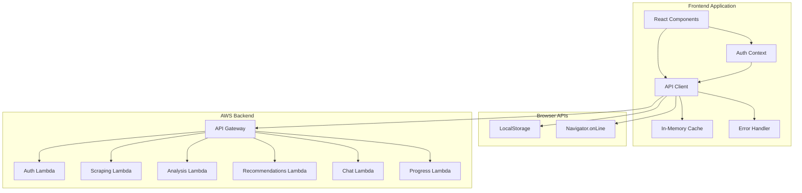
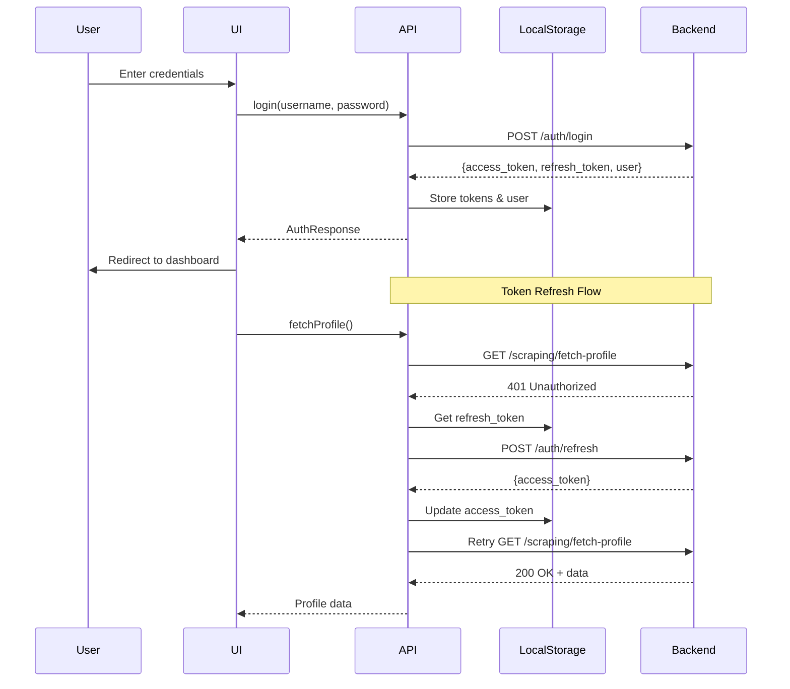
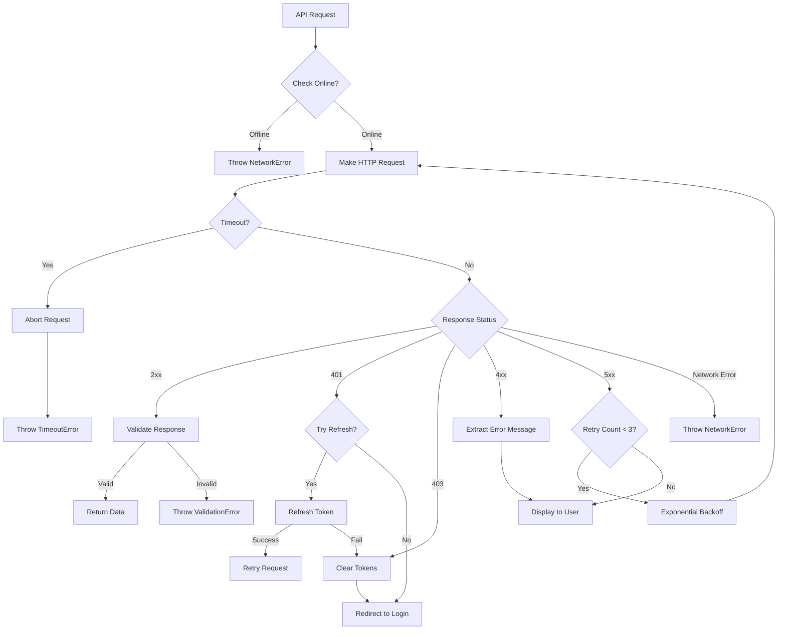

# Design Document: Backend API Integration

## Overview

This design document specifies the technical implementation for integrating the Next.js frontend application with the deployed AWS backend API. The integration replaces all mock data with real API calls, implementing authentication, data fetching, error handling, caching, and offline detection.

### Goals

- Remove all mock data dependencies from production builds
- Implement secure authentication flow with JWT tokens
- Integrate all backend endpoints (auth, scraping, analysis, recommendations, chat, progress)
- Provide robust error handling and user feedback
- Implement request timeout, retry logic, and caching strategies
- Support offline mode detection and graceful degradation

### Non-Goals

- Modifying backend API endpoints or contracts
- Implementing new features beyond API integration
- Changing UI/UX design (only adding loading states and error messages)
- Building a custom property-based testing framework

### Research Findings

**API Integration Patterns:**
- The existing API client uses a class-based singleton pattern which provides centralized token management and request handling
- Modern Next.js applications benefit from using fetch with built-in Request/Response APIs for better type safety
- The current implementation already includes basic token refresh logic, which aligns with OAuth 2.0 best practices

**Error Handling Strategies:**
- HTTP status codes should be mapped to user-friendly messages (4xx = client errors, 5xx = server errors)
- Network errors (fetch failures) should be distinguished from API errors (HTTP error responses)
- Error boundaries in React can catch rendering errors, but API errors need explicit try-catch handling

**Caching Approaches:**
- In-memory caching is appropriate for short-lived data (5-10 minutes)
- Cache invalidation should occur on mutations (POST/PUT/DELETE operations)
- Next.js App Router provides built-in fetch caching, but we need manual control for dynamic data

**Retry Logic Best Practices:**
- Exponential backoff prevents overwhelming the server during outages
- Idempotent operations (GET) can be safely retried
- Non-idempotent operations (POST/PUT/DELETE) should not be automatically retried to avoid duplicates
- Maximum 3 retry attempts is industry standard

**Timeout Configuration:**
- Standard API requests: 30 seconds (covers most operations)
- Long-running operations (profile scraping, AI chat): 60 seconds
- AbortController API provides clean timeout implementation in modern browsers

## Architecture

### System Components



### Request Flow

1. **Component initiates request** → Calls API client method
2. **API client checks cache** → Returns cached data if valid
3. **API client checks online status** → Aborts if offline
4. **API client prepares request** → Adds auth headers, sets timeout
5. **Request sent to backend** → Via fetch API with AbortController
6. **Response handling**:
   - Success (2xx): Parse JSON, update cache, return data
   - Auth error (401): Attempt token refresh, retry once
   - Forbidden (403): Clear tokens, redirect to login
   - Client error (4xx): Display error message from response
   - Server error (5xx): Retry with exponential backoff (max 3 attempts)
   - Timeout: Abort request, display timeout message
   - Network error: Display connectivity message
7. **Update UI** → Component receives data or error

### Authentication Flow



## Components and Interfaces

### Enhanced API Client

The existing `APIClient` class will be enhanced with the following capabilities:

**Core Responsibilities:**
- HTTP request management with timeout and retry logic
- Authentication token storage and refresh
- Response caching with TTL
- Error handling and transformation
- Offline detection

**Key Methods:**

```typescript
class APIClient {
  private baseURL: string
  private accessToken: string | null
  private cache: Map<string, CacheEntry>
  private requestTimeouts: Map<string, number>
  
  // Configuration
  constructor(baseURL: string)
  setToken(token: string): void
  clearToken(): void
  
  // Core request method with retry and timeout
  private async request<T>(
    endpoint: string,
    options: RequestInit,
    config?: RequestConfig
  ): Promise<T>
  
  // Cache management
  private getCached<T>(key: string): T | null
  private setCache<T>(key: string, data: T, ttl: number): void
  private invalidateCache(pattern: string): void
  
  // Authentication methods
  async register(...): Promise<AuthResponse>
  async login(...): Promise<AuthResponse>
  async refreshToken(): Promise<boolean>
  
  // API endpoint methods
  async fetchProfile(...): Promise<ProfileData>
  async analyzeProfile(...): Promise<ProfileAnalysis>
  async getTopics(...): Promise<TopicData>
  async getProgress(...): Promise<Progress>
  async chatMentor(...): Promise<ChatResponse>
  async generateLearningPath(...): Promise<LearningPath>
  async getNextProblem(...): Promise<ProblemData>
  async generateHint(...): Promise<HintData>
  
  // Utility methods
  getCurrentUser(): User | null
  isAuthenticated(): boolean
  isOnline(): boolean
}
```

**Request Configuration Interface:**

```typescript
interface RequestConfig {
  timeout?: number          // Default: 30000ms
  retryable?: boolean       // Default: true for GET, false for mutations
  maxRetries?: number       // Default: 3
  cacheable?: boolean       // Default: false
  cacheTTL?: number        // Default: 300000ms (5 minutes)
  skipAuthRefresh?: boolean // Default: false
}

interface CacheEntry {
  data: any
  timestamp: number
  ttl: number
}
```

### Error Handler Module

A new error handling module will provide consistent error transformation and user messaging:

```typescript
// lib/error-handler.ts

export class APIError extends Error {
  constructor(
    message: string,
    public statusCode?: number,
    public originalError?: Error
  ) {
    super(message)
    this.name = 'APIError'
  }
}

export class NetworkError extends APIError {
  constructor(message: string = 'Network connection failed') {
    super(message)
    this.name = 'NetworkError'
  }
}

export class TimeoutError extends APIError {
  constructor(message: string = 'Request timed out') {
    super(message)
    this.name = 'TimeoutError'
  }
}

export class ValidationError extends APIError {
  constructor(message: string, public fields?: string[]) {
    super(message)
    this.name = 'ValidationError'
  }
}

export function handleAPIError(error: unknown): APIError {
  // Transform various error types into user-friendly messages
  if (error instanceof APIError) return error
  
  if (error instanceof TypeError && error.message.includes('fetch')) {
    return new NetworkError()
  }
  
  if (error instanceof Error) {
    return new APIError(error.message, undefined, error)
  }
  
  return new APIError('An unexpected error occurred')
}

export function getErrorMessage(error: APIError): string {
  // Map error types to user-friendly messages
  if (error instanceof NetworkError) {
    return 'Unable to connect to the server. Please check your internet connection.'
  }
  
  if (error instanceof TimeoutError) {
    return 'The request took too long. Please try again.'
  }
  
  if (error.statusCode === 403) {
    return 'Your session has expired. Please log in again.'
  }
  
  if (error.statusCode && error.statusCode >= 500) {
    return 'Server error. Please try again later.'
  }
  
  return error.message || 'An error occurred. Please try again.'
}
```

### Response Validator

A validation module to ensure API responses match expected schemas:

```typescript
// lib/response-validator.ts

export function validateAuthResponse(data: any): AuthResponse {
  if (!data.access_token || typeof data.access_token !== 'string') {
    throw new ValidationError('Invalid auth response: missing access_token')
  }
  if (!data.refresh_token || typeof data.refresh_token !== 'string') {
    throw new ValidationError('Invalid auth response: missing refresh_token')
  }
  return data as AuthResponse
}

export function validateProfileAnalysis(data: any): ProfileAnalysis {
  if (!data.user_id || typeof data.user_id !== 'string') {
    throw new ValidationError('Invalid profile analysis: missing user_id')
  }
  if (!data.topics || typeof data.topics !== 'object') {
    throw new ValidationError('Invalid profile analysis: missing topics')
  }
  if (!data.heatmap || !data.heatmap.weak || !data.heatmap.moderate || !data.heatmap.strong) {
    throw new ValidationError('Invalid profile analysis: malformed heatmap')
  }
  return data as ProfileAnalysis
}

// Additional validators for each response type...
```

### Offline Detector

A utility module for detecting and responding to offline status:

```typescript
// lib/offline-detector.ts

export class OfflineDetector {
  private listeners: Set<(online: boolean) => void> = new Set()
  
  constructor() {
    if (typeof window !== 'undefined') {
      window.addEventListener('online', () => this.notifyListeners(true))
      window.addEventListener('offline', () => this.notifyListeners(false))
    }
  }
  
  isOnline(): boolean {
    return typeof navigator !== 'undefined' ? navigator.onLine : true
  }
  
  subscribe(callback: (online: boolean) => void): () => void {
    this.listeners.add(callback)
    return () => this.listeners.delete(callback)
  }
  
  private notifyListeners(online: boolean): void {
    this.listeners.forEach(listener => listener(online))
  }
}

export const offlineDetector = new OfflineDetector()
```

### Loading State Hook

A React hook for managing loading states:

```typescript
// lib/use-loading.ts

export function useLoading() {
  const [loading, setLoading] = useState(false)
  const [error, setError] = useState<APIError | null>(null)
  
  const execute = async <T>(
    promise: Promise<T>,
    onSuccess?: (data: T) => void,
    onError?: (error: APIError) => void
  ): Promise<T | null> => {
    setLoading(true)
    setError(null)
    
    try {
      const result = await promise
      onSuccess?.(result)
      return result
    } catch (err) {
      const apiError = handleAPIError(err)
      setError(apiError)
      onError?.(apiError)
      return null
    } finally {
      setLoading(false)
    }
  }
  
  return { loading, error, execute }
}
```

## Data Models

### TypeScript Interfaces

All data models are already defined in `frontend/lib/api.ts`. Key interfaces include:

**Authentication:**
```typescript
interface User {
  user_id: string
  leetcode_username: string
  language_preference: string
}

interface AuthResponse {
  access_token: string
  refresh_token: string
  user?: User
  expires_in?: number
}
```

**Profile Analysis:**
```typescript
interface TopicProficiency {
  proficiency: number
  classification: 'weak' | 'moderate' | 'strong'
}

interface ProfileAnalysis {
  user_id: string
  topics: Record<string, TopicProficiency>
  heatmap: {
    weak: Array<{ name: string; proficiency: number }>
    moderate: Array<{ name: string; proficiency: number }>
    strong: Array<{ name: string; proficiency: number }>
  }
  summary: {
    total_topics: number
    weak_topics: number
    moderate_topics: number
    strong_topics: number
  }
}
```

**Learning Path:**
```typescript
interface Problem {
  title: string
  difficulty: 'Easy' | 'Medium' | 'Hard'
  topics: string[]
  leetcode_id: string
  estimated_time_minutes: number
  reason?: string
}

interface LearningPath {
  path_id: string
  problems: Problem[]
  total_problems: number
  weak_topics_targeted: string[]
  created_at: string
}
```

**Progress Tracking:**
```typescript
interface Badge {
  badge_id: string
  name: string
  earned_at: string
  milestone: number
}

interface Progress {
  user_id: string
  streak_count: number
  badges: Badge[]
  problems_solved_today: number
  total_problems_solved: number
  last_solve_timestamp: string | null
  next_milestone: {
    days: number
    badge_name: string
    days_remaining: number
  } | null
}
```

**Chat:**
```typescript
interface ChatResponse {
  response: string
  intent: 'CODE_DEBUGGING' | 'CONCEPT_QUESTION' | 'HINT_REQUEST' | 'GENERAL'
  cached: boolean
  model_used: 'nova-lite'
}
```

### Environment Variables

```typescript
// .env.local
NEXT_PUBLIC_API_URL=https://n8e9ghd13g.execute-api.ap-south-1.amazonaws.com/dev
NEXT_PUBLIC_USE_MOCK_DATA=false  // Set to true for development with mocks
```

### Cache Storage Structure

```typescript
// In-memory cache structure
Map<string, CacheEntry> where:
  key: `${method}:${endpoint}:${JSON.stringify(params)}`
  value: {
    data: any,
    timestamp: number,
    ttl: number
  }

// Example keys:
// "GET:/analyze/user123/topics:{}"
// "GET:/progress/user123:{}"
// "POST:/recommendations/generate-path:{user_id:'user123',proficiency_level:'intermediate'}"
```


## Correctness Properties

*A property is a characteristic or behavior that should hold true across all valid executions of a system—essentially, a formal statement about what the system should do. Properties serve as the bridge between human-readable specifications and machine-verifiable correctness guarantees.*

### Property 1: Mock Data Exclusion in Production

*For any* API client method call when USE_MOCK_DATA environment variable is false, the method should make an actual HTTP request to the backend API rather than returning mock data.

**Validates: Requirements 1.3**

### Property 2: HTTPS URL Validation

*For any* URL string that does not start with "https://", the API client URL validation should reject it as invalid.

**Validates: Requirements 2.4**

### Property 3: Token Storage on Authentication

*For any* successful authentication response (login or register), the API client should store the access_token in browser localStorage.

**Validates: Requirements 3.3**

### Property 4: Authorization Header Inclusion

*For any* authenticated API request, the request should include an Authorization header with the format "Bearer {token}".

**Validates: Requirements 3.6**

### Property 5: Topic Classification Mapping

*For any* topic in the ProfileAnalysis response, the classification field should correctly map to 'weak', 'moderate', or 'strong' based on the proficiency score.

**Validates: Requirements 5.3**

### Property 6: Optional Parameters Inclusion

*For any* chat mentor request, when optional parameters (code, problem_id) are provided, they should be included in the request body.

**Validates: Requirements 7.2**

### Property 7: Client Error Message Display

*For any* API response with a 4xx status code, the error handler should extract and display the error message from the response body.

**Validates: Requirements 9.1**

### Property 8: Server Error Generic Message

*For any* API response with a 5xx status code, the error handler should display a generic server error message rather than exposing internal error details.

**Validates: Requirements 9.2**

### Property 9: Error Logging

*For any* error that occurs during API operations, the error should be logged to the browser console with sufficient detail for debugging.

**Validates: Requirements 9.5**

### Property 10: Cache Behavior for GET Requests

*For any* GET request, when valid cached data exists (not expired), the API client should return the cached data without making a network request; otherwise, it should make the request and cache the response.

**Validates: Requirements 12.1, 12.4**

### Property 11: Cache Invalidation on Mutations

*For any* mutation request (POST, PUT, DELETE) that completes successfully, the API client should invalidate related cache entries to ensure data consistency.

**Validates: Requirements 12.5**

### Property 12: No Retry for Client Errors

*For any* API request that fails with a 4xx status code, the API client should not attempt to retry the request.

**Validates: Requirements 13.3**

### Property 13: No Retry for Mutation Methods

*For any* API request using POST, PUT, or DELETE methods, the API client should not automatically retry the request even on failure, to avoid duplicate operations.

**Validates: Requirements 13.5**

### Property 14: Response Validation

*For any* API response, the API client should validate that all required fields are present and have the correct types according to the TypeScript interface; if validation fails, it should throw a ValidationError.

**Validates: Requirements 14.1, 14.2, 14.3**

### Property 15: Offline Request Prevention

*For any* API request attempt when the browser is offline (navigator.onLine === false), the API client should not make the network request and should throw a NetworkError.

**Validates: Requirements 15.4**


## Error Handling

### Error Classification

The system categorizes errors into distinct types for appropriate handling:

**1. Network Errors**
- Cause: No internet connection, DNS failure, network timeout
- Detection: fetch() throws TypeError, navigator.onLine === false
- User Message: "Unable to connect to the server. Please check your internet connection."
- Action: Display offline banner, prevent further requests until online

**2. Timeout Errors**
- Cause: Request exceeds configured timeout (30s or 60s)
- Detection: AbortController signal triggers
- User Message: "The request took too long. Please try again."
- Action: Abort request, allow retry

**3. Authentication Errors (401)**
- Cause: Expired or invalid access token
- Detection: HTTP 401 status code
- User Message: None (automatic token refresh attempted)
- Action: Attempt token refresh, retry request once, clear tokens if refresh fails

**4. Authorization Errors (403)**
- Cause: User lacks permission or session expired
- Detection: HTTP 403 status code
- User Message: "Your session has expired. Please log in again."
- Action: Clear all tokens, redirect to login page

**5. Client Errors (4xx)**
- Cause: Invalid request data, validation failure
- Detection: HTTP 4xx status codes (except 401, 403)
- User Message: Error message from API response body
- Action: Display error, do not retry

**6. Server Errors (5xx)**
- Cause: Backend service failure, database error
- Detection: HTTP 5xx status codes
- User Message: "Server error. Please try again later."
- Action: Retry with exponential backoff (max 3 attempts)

**7. Validation Errors**
- Cause: API response missing required fields or wrong types
- Detection: Response validation fails
- User Message: "Received invalid data from server. Please try again."
- Action: Log detailed error to console, display generic message to user

### Error Handling Flow



### Error Recovery Strategies

**Automatic Recovery:**
- Token refresh on 401 errors (one attempt)
- Retry with exponential backoff on 5xx errors (max 3 attempts)
- Automatic reconnection when browser comes back online

**User-Initiated Recovery:**
- Manual retry button for failed requests
- Manual refresh to bypass cache
- Re-login for authentication failures

**Graceful Degradation:**
- Display cached data when offline (if available)
- Show offline banner with clear status
- Disable features that require network connectivity
- Preserve user input during errors (e.g., chat messages)

### Error Logging

All errors are logged to the browser console with the following information:
- Error type and message
- Request details (method, endpoint, parameters)
- Response status code (if applicable)
- Timestamp
- Stack trace (for debugging)

Example log format:
```
[APIError] 2024-01-15T10:30:45.123Z
  Type: ServerError
  Status: 500
  Endpoint: POST /recommendations/generate-path
  Message: Internal server error
  Stack: Error: Internal server error
    at APIClient.request (api.ts:145)
    ...
```

## Testing Strategy

### Dual Testing Approach

This feature requires both unit tests and property-based tests to ensure comprehensive coverage:

**Unit Tests** focus on:
- Specific examples and edge cases
- Integration points between components
- Error conditions with known inputs
- UI state management during API calls

**Property-Based Tests** focus on:
- Universal properties that hold for all inputs
- Comprehensive input coverage through randomization
- Invariants that must always be true
- Round-trip properties (e.g., serialize/deserialize)

Both testing approaches are complementary and necessary. Unit tests catch concrete bugs with specific scenarios, while property tests verify general correctness across a wide range of inputs.

### Property-Based Testing Configuration

**Library Selection:** Use `fast-check` for TypeScript/JavaScript property-based testing

**Configuration:**
- Minimum 100 iterations per property test (due to randomization)
- Each property test must reference its design document property
- Tag format: `Feature: backend-api-integration, Property {number}: {property_text}`

**Example Property Test Structure:**

```typescript
import fc from 'fast-check'
import { describe, it, expect } from 'vitest'
import { api } from '@/lib/api'

describe('Property 1: Mock Data Exclusion in Production', () => {
  it('should make HTTP requests when USE_MOCK_DATA is false', async () => {
    // Feature: backend-api-integration, Property 1: Mock Data Exclusion in Production
    
    await fc.assert(
      fc.asyncProperty(
        fc.record({
          user_id: fc.uuid(),
          leetcode_username: fc.string({ minLength: 3, maxLength: 20 })
        }),
        async (input) => {
          // Set environment to production mode
          process.env.NEXT_PUBLIC_USE_MOCK_DATA = 'false'
          
          // Mock fetch to verify it's called
          const fetchSpy = vi.spyOn(global, 'fetch')
          
          try {
            await api.fetchProfile(input.user_id, input.leetcode_username)
          } catch (e) {
            // Ignore errors, we're just checking if fetch was called
          }
          
          // Verify that fetch was called (not returning mock data)
          expect(fetchSpy).toHaveBeenCalled()
          
          fetchSpy.mockRestore()
        }
      ),
      { numRuns: 100 }
    )
  })
})
```

### Unit Test Coverage

**API Client Tests:**
- Authentication flow (login, register, token refresh)
- Token storage and retrieval from localStorage
- Request header construction
- Timeout handling with AbortController
- Retry logic with exponential backoff
- Cache hit/miss scenarios
- Offline detection

**Error Handler Tests:**
- Error type classification (network, timeout, 4xx, 5xx)
- Error message transformation
- Console logging
- Validation error handling

**Response Validator Tests:**
- Valid response acceptance
- Missing required fields detection
- Type mismatch detection
- Each response type (AuthResponse, ProfileAnalysis, etc.)

**Offline Detector Tests:**
- Online/offline status detection
- Event listener registration
- Subscriber notification

**Integration Tests:**
- Complete authentication flow
- Profile fetch and analysis flow
- Learning path generation flow
- Chat mentor interaction flow
- Progress tracking flow
- Error recovery scenarios

### Test Data Generators

For property-based testing, create generators for common data types:

```typescript
// Generators for property-based tests
const userIdGen = fc.uuid()
const usernameGen = fc.string({ minLength: 3, maxLength: 20 })
const tokenGen = fc.string({ minLength: 100, maxLength: 200 })
const urlGen = fc.webUrl({ validSchemes: ['https'] })
const httpStatusGen = fc.integer({ min: 200, max: 599 })
const topicGen = fc.constantFrom('arrays', 'strings', 'trees', 'graphs', 'dp')
const difficultyGen = fc.constantFrom('Easy', 'Medium', 'Hard')
const proficiencyGen = fc.float({ min: 0, max: 1 })
const classificationGen = fc.constantFrom('weak', 'moderate', 'strong')
```

### Mock Backend Setup

For testing, use MSW (Mock Service Worker) to intercept HTTP requests:

```typescript
import { setupServer } from 'msw/node'
import { http, HttpResponse } from 'msw'

const server = setupServer(
  http.post('/auth/login', () => {
    return HttpResponse.json({
      access_token: 'mock-access-token',
      refresh_token: 'mock-refresh-token',
      user: { user_id: '123', leetcode_username: 'testuser', language_preference: 'en' }
    })
  }),
  
  http.post('/scraping/fetch-profile', () => {
    return HttpResponse.json({
      message: 'Profile fetched successfully',
      user_id: '123',
      leetcode_username: 'testuser',
      profile: { /* mock profile data */ }
    })
  }),
  
  // Additional handlers for other endpoints...
)

beforeAll(() => server.listen())
afterEach(() => server.resetHandlers())
afterAll(() => server.close())
```

### Test Scenarios

**Critical Path Tests:**
1. User registration → Profile fetch → Analysis → Learning path generation
2. User login → Dashboard load → Progress display
3. Chat interaction with code → Hint generation
4. Token expiration → Refresh → Continue operation

**Error Scenario Tests:**
1. Network failure during login → Offline banner → Reconnect → Retry
2. 500 error on profile fetch → Retry 3 times → Display error
3. 403 error on any request → Clear tokens → Redirect to login
4. Timeout on chat request → Display timeout message → Allow retry
5. Invalid response data → Validation error → Generic error message

**Edge Case Tests:**
1. Empty environment variable → Use default URL
2. Non-HTTPS URL → Validation error
3. Missing optional parameters → Request succeeds without them
4. Expired cache → Make new request
5. Multiple concurrent requests → All complete successfully

### Performance Testing

While not part of correctness properties, performance should be monitored:
- API request latency (target: < 2s for most requests)
- Cache hit rate (target: > 60% for repeated requests)
- Time to first meaningful paint after login (target: < 3s)
- Memory usage with large cache (target: < 50MB)

### Continuous Integration

All tests should run on:
- Every pull request
- Before deployment to production
- Nightly builds for extended property-based test runs (1000+ iterations)

**Test Commands:**
```bash
# Run all tests
npm test

# Run unit tests only
npm run test:unit

# Run property-based tests only
npm run test:property

# Run tests with coverage
npm run test:coverage

# Run tests in watch mode
npm run test:watch
```

### Success Criteria

The implementation is considered complete when:
- All 15 correctness properties pass with 100 iterations
- Unit test coverage > 80% for API client and error handler
- All integration tests pass
- No mock data in production bundle
- All API endpoints successfully integrated
- Error handling gracefully manages all error types
- Performance targets met

