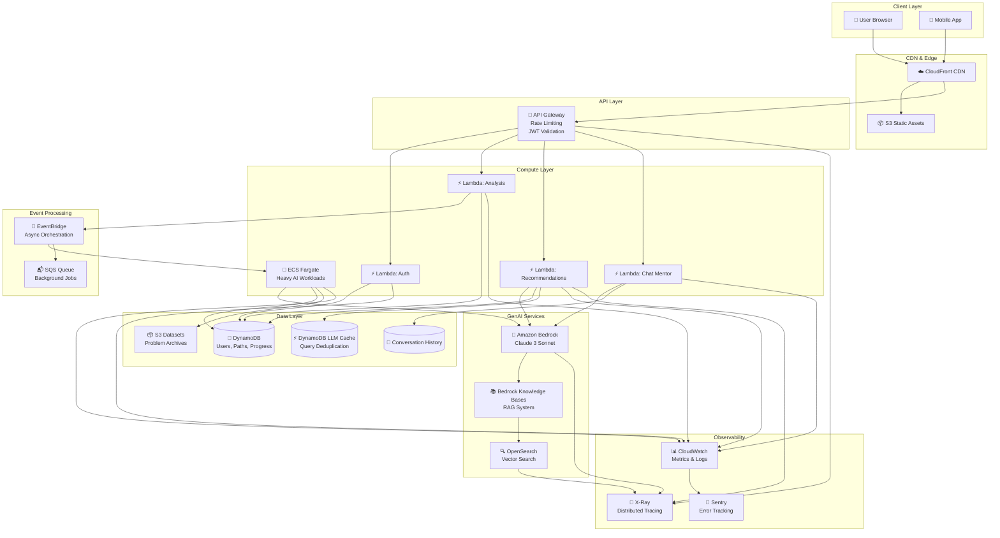
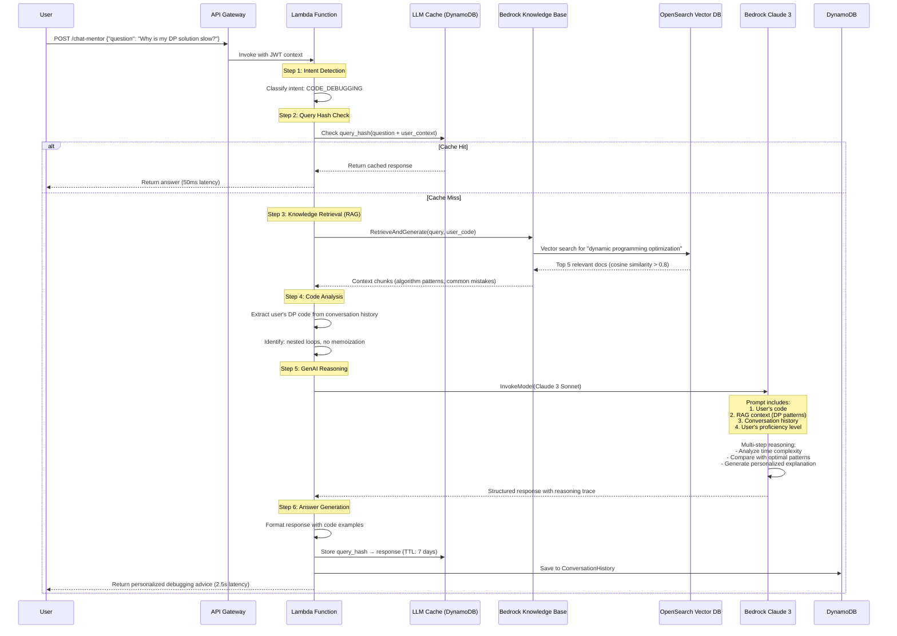
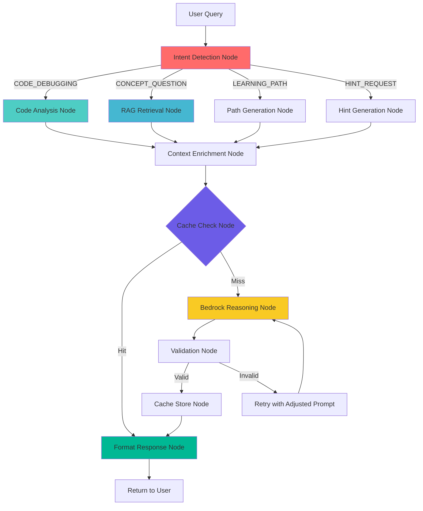
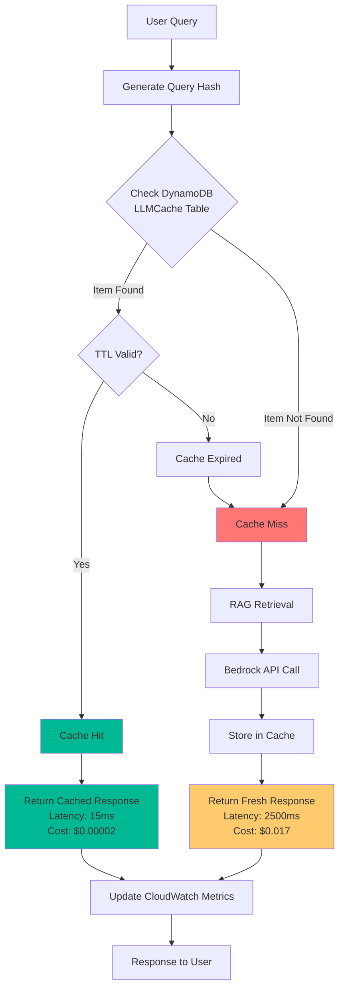
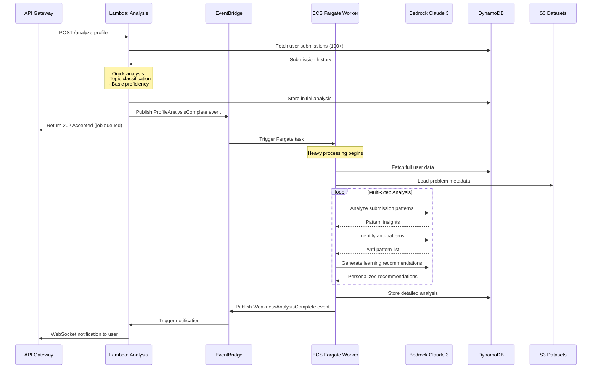

# Design Document

## Overview

CodeFlow AI is a full-stack web application that transforms unstructured competitive programming practice into personalized, AI-guided learning experiences. The system integrates with LeetCode's public API, leverages AWS AI services (Bedrock Claude 3 Sonnet, Amazon Q Developer), and provides real-time analytics through a responsive React frontend.

The architecture follows a serverless-first approach using AWS Lambda for compute, DynamoDB for data persistence, and Bedrock for AI capabilities. The frontend is built with React + Vite + Tailwind CSS for rapid development and optimal performance. The backend uses FastAPI with Pydantic for type-safe API development.

**Key Design Principles:**

- Serverless architecture for automatic scaling and cost optimization
- API-first design with OpenAPI specification
- Real-time data synchronization with optimistic UI updates
- Graceful degradation when external services are unavailable
- Mobile-first responsive design
- Bilingual support (English/Hindi) at the infrastructure level

## Complete AWS Production Architecture

### High-Level Architecture Overview



### Detailed Component Architecture

```
┌─────────────────────────────────────────────────────────────────────────────┐
│                            FRONTEND LAYER                                    │
│  ┌────────────────────────────────────────────────────────────────────────┐ │
│  │  CloudFront CDN (Edge Locations Worldwide)                             │ │
│  │  - TLS 1.3 Encryption                                                  │ │
│  │  - Gzip/Brotli Compression                                             │ │
│  │  - Cache-Control Headers (static: 1 year, API: no-cache)              │ │
│  │  - Origin: S3 (static) + API Gateway (dynamic)                        │ │
│  └────────────────────────────────────────────────────────────────────────┘ │
│  ┌────────────────────────────────────────────────────────────────────────┐ │
│  │  S3 Static Hosting (React + Vite Build)                               │ │
│  │  - index.html, JS bundles, CSS, images                                │ │
│  │  - Versioned assets with content hashing                              │ │
│  │  - Bucket Policy: CloudFront OAI only                                 │ │
│  └────────────────────────────────────────────────────────────────────────┘ │
└─────────────────────────────────────────────────────────────────────────────┘
                                      │
                                      │ HTTPS (TLS 1.3)
                                      ▼
┌─────────────────────────────────────────────────────────────────────────────┐
│                          API GATEWAY LAYER                                   │
│  ┌────────────────────────────────────────────────────────────────────────┐ │
│  │  AWS API Gateway (REST API)                                            │ │
│  │  ┌──────────────────────────────────────────────────────────────────┐ │ │
│  │  │ Request Validation:                                               │ │ │
│  │  │  - JSON Schema validation                                         │ │ │
│  │  │  - Required headers check                                         │ │ │
│  │  │  - Content-Type enforcement                                       │ │ │
│  │  └──────────────────────────────────────────────────────────────────┘ │ │
│  │  ┌──────────────────────────────────────────────────────────────────┐ │ │
│  │  │ Rate Limiting:                                                    │ │ │
│  │  │  - Per User: 100 req/min (JWT-based)                             │ │ │
│  │  │  - Per IP: 10 req/min (anonymous)                                │ │ │
│  │  │  - Burst: 200 requests                                            │ │ │
│  │  │  - Throttle: 429 Too Many Requests                               │ │ │
│  │  └──────────────────────────────────────────────────────────────────┘ │ │
│  │  ┌──────────────────────────────────────────────────────────────────┐ │ │
│  │  │ Authorization:                                                    │ │ │
│  │  │  - Lambda Authorizer (JWT validation)                            │ │ │
│  │  │  - Cognito User Pools integration                                │ │ │
│  │  │  - API Key for admin endpoints                                   │ │ │
│  │  └──────────────────────────────────────────────────────────────────┘ │ │
│  │  ┌──────────────────────────────────────────────────────────────────┐ │ │
│  │  │ CORS Configuration:                                               │ │ │
│  │  │  - Allowed Origins: https://codeflow.ai                          │ │ │
│  │  │  - Methods: GET, POST, PUT, DELETE, OPTIONS                      │ │ │
│  │  │  - Headers: Authorization, Content-Type, X-Request-ID            │ │ │
│  │  └──────────────────────────────────────────────────────────────────┘ │ │
│  └────────────────────────────────────────────────────────────────────────┘ │
└─────────────────────────────────────────────────────────────────────────────┘
                                      │
                    ┌─────────────────┼─────────────────┐
                    │                 │                 │
                    ▼                 ▼                 ▼
┌─────────────────────────────────────────────────────────────────────────────┐
│                        COMPUTE LAYER (Serverless)                            │
│  ┌──────────────┐  ┌──────────────┐  ┌──────────────┐  ┌──────────────┐   │
│  │ Lambda:      │  │ Lambda:      │  │ Lambda:      │  │ Lambda:      │   │
│  │ Auth         │  │ Analysis     │  │ Recommend    │  │ Chat Mentor  │   │
│  │              │  │              │  │              │  │              │   │
│  │ - Register   │  │ - Parse      │  │ - Goldilocks │  │ - RAG Query  │   │
│  │ - Login      │  │ - Classify   │  │ - Next Prob  │  │ - Context    │   │
│  │ - JWT Issue  │  │ - Proficiency│  │ - Adaptive   │  │ - Bedrock    │   │
│  │              │  │              │  │              │  │              │   │
│  │ Memory: 512  │  │ Memory: 1024 │  │ Memory: 1024 │  │ Memory: 2048 │   │
│  │ Timeout: 10s │  │ Timeout: 30s │  │ Timeout: 30s │  │ Timeout: 60s │   │
│  └──────────────┘  └──────────────┘  └──────────────┘  └──────────────┘   │
│                           │                                                  │
│                           │ Triggers EventBridge for heavy workloads         │
│                           ▼                                                  │
│  ┌────────────────────────────────────────────────────────────────────────┐ │
│  │  ECS Fargate (Heavy AI Processing)                                     │ │
│  │  ┌──────────────────────────────────────────────────────────────────┐ │ │
│  │  │ Weakness Analysis Worker:                                         │ │ │
│  │  │  - Deep profile analysis (100+ submissions)                       │ │ │
│  │  │  - Pattern recognition across topics                              │ │ │
│  │  │  - Multi-step Bedrock reasoning                                   │ │ │
│  │  │  - Learning path optimization                                     │ │ │
│  │  │                                                                    │ │ │
│  │  │ Resources: 2 vCPU, 4GB RAM                                        │ │ │
│  │  │ Timeout: 15 minutes                                               │ │ │
│  │  │ Auto-scaling: 0-10 tasks based on SQS queue depth                │ │ │
│  │  └──────────────────────────────────────────────────────────────────┘ │ │
│  └────────────────────────────────────────────────────────────────────────┘ │
└─────────────────────────────────────────────────────────────────────────────┘
                    │                 │                 │
                    ▼                 ▼                 ▼
┌─────────────────────────────────────────────────────────────────────────────┐
│                          GENAI SERVICES LAYER                                │
│  ┌────────────────────────────────────────────────────────────────────────┐ │
│  │  Amazon Bedrock (Claude 3 Sonnet)                                      │ │
│  │  ┌──────────────────────────────────────────────────────────────────┐ │ │
│  │  │ Model: anthropic.claude-3-sonnet-20240229-v1:0                   │ │ │
│  │  │ Max Tokens: 4096                                                  │ │ │
│  │  │ Temperature: 0.7 (creative), 0.3 (analytical)                    │ │ │
│  │  │                                                                    │ │ │
│  │  │ Use Cases:                                                        │ │ │
│  │  │  1. Learning Path Generation (70% of calls)                      │ │ │
│  │  │  2. Conversational Mentor Chat (20% of calls)                    │ │ │
│  │  │  3. Code Analysis & Debugging Hints (10% of calls)               │ │ │
│  │  └──────────────────────────────────────────────────────────────────┘ │ │
│  └────────────────────────────────────────────────────────────────────────┘ │
│  ┌────────────────────────────────────────────────────────────────────────┐ │
│  │  Amazon Bedrock Knowledge Bases (RAG System)                           │ │
│  │  ┌──────────────────────────────────────────────────────────────────┐ │ │
│  │  │ Knowledge Base ID: kb-codeflow-algorithms                         │ │ │
│  │  │ Embedding Model: amazon.titan-embed-text-v1                       │ │ │
│  │  │ Vector Dimensions: 1536                                           │ │ │
│  │  │                                                                    │ │ │
│  │  │ Data Sources:                                                     │ │ │
│  │  │  - Algorithm explanations (S3: s3://codeflow-kb/algorithms/)     │ │ │
│  │  │  - Common patterns (S3: s3://codeflow-kb/patterns/)              │ │ │
│  │  │  - Debugging guides (S3: s3://codeflow-kb/debugging/)            │ │ │
│  │  │  - Interview tips (S3: s3://codeflow-kb/interview/)              │ │ │
│  │  │                                                                    │ │ │
│  │  │ Sync Schedule: Daily at 2 AM UTC                                 │ │ │
│  │  └──────────────────────────────────────────────────────────────────┘ │ │
│  └────────────────────────────────────────────────────────────────────────┘ │
│  ┌────────────────────────────────────────────────────────────────────────┐ │
│  │  Amazon OpenSearch Service (Vector Search)                             │ │
│  │  ┌──────────────────────────────────────────────────────────────────┐ │ │
│  │  │ Instance: r6g.large.search (2 nodes)                              │ │ │
│  │  │ Storage: 100GB EBS per node                                       │ │ │
│  │  │ Engine: OpenSearch 2.11                                           │ │ │
│  │  │                                                                    │ │ │
│  │  │ Indices:                                                          │ │ │
│  │  │  - codeflow-algorithms (k-NN enabled)                            │ │ │
│  │  │  - codeflow-patterns (k-NN enabled)                              │ │ │
│  │  │  - codeflow-debugging (k-NN enabled)                             │ │ │
│  │  │                                                                    │ │ │
│  │  │ k-NN Configuration:                                               │ │ │
│  │  │  - Algorithm: HNSW (Hierarchical Navigable Small World)          │ │ │
│  │  │  - Distance: Cosine similarity                                   │ │ │
│  │  │  - Top-k: 5 results per query                                    │ │ │
│  │  └──────────────────────────────────────────────────────────────────┘ │ │
│  └────────────────────────────────────────────────────────────────────────┘ │
└─────────────────────────────────────────────────────────────────────────────┘
                                      │
                                      ▼
┌─────────────────────────────────────────────────────────────────────────────┐
│                            DATA LAYER                                        │
│  ┌──────────────────┐  ┌──────────────────┐  ┌──────────────────┐          │
│  │ DynamoDB:        │  │ DynamoDB:        │  │ DynamoDB:        │          │
│  │ Users            │  │ LearningPaths    │  │ Progress         │          │
│  │                  │  │                  │  │                  │          │
│  │ PK: user_id      │  │ PK: path_id      │  │ PK: user#date    │          │
│  │ GSI: leetcode_un │  │ GSI: user_id     │  │ GSI: user_id     │          │
│  │                  │  │                  │  │                  │          │
│  │ Billing: On-Dem  │  │ Billing: On-Dem  │  │ Billing: On-Dem  │          │
│  │ Encryption: Yes  │  │ Encryption: Yes  │  │ Encryption: Yes  │          │
│  │ PITR: Enabled    │  │ PITR: Enabled    │  │ PITR: Enabled    │          │
│  └──────────────────┘  └──────────────────┘  └──────────────────┘          │
│  ┌──────────────────┐  ┌──────────────────┐  ┌──────────────────┐          │
│  │ DynamoDB:        │  │ DynamoDB:        │  │ DynamoDB:        │          │
│  │ LLMCache         │  │ ConvoHistory     │  │ KnowledgeBase    │          │
│  │                  │  │                  │  │                  │          │
│  │ PK: query_hash   │  │ PK: user_id      │  │ PK: doc_id       │          │
│  │ Attrs:           │  │ SK: timestamp    │  │ Attrs:           │          │
│  │  - response      │  │ Attrs:           │  │  - title         │          │
│  │  - timestamp     │  │  - message       │  │  - content       │          │
│  │  - ttl (7 days)  │  │  - role          │  │  - embedding_id  │          │
│  │                  │  │  - context       │  │  - category      │          │
│  │ Cost Savings:    │  │                  │  │                  │          │
│  │ ~60% reduction   │  │ TTL: 90 days     │  │ Sync: Daily      │          │
│  └──────────────────┘  └──────────────────┘  └──────────────────┘          │
│  ┌────────────────────────────────────────────────────────────────────────┐ │
│  │  S3 Buckets                                                             │ │
│  │  ┌──────────────────────────────────────────────────────────────────┐ │ │
│  │  │ codeflow-static-assets:                                           │ │ │
│  │  │  - React build artifacts                                          │ │ │
│  │  │  - Images, fonts, icons                                           │ │ │
│  │  │  - Lifecycle: Transition to IA after 90 days                     │ │ │
│  │  │                                                                    │ │ │
│  │  │ codeflow-kb-documents:                                            │ │ │
│  │  │  - Algorithm explanations (Markdown)                              │ │ │
│  │  │  - Pattern libraries (JSON)                                       │ │ │
│  │  │  - Debugging guides (Markdown)                                    │ │ │
│  │  │  - Versioning: Enabled                                            │ │ │
│  │  │                                                                    │ │ │
│  │  │ codeflow-datasets:                                                │ │ │
│  │  │  - LeetCode problem archives                                      │ │ │
│  │  │  - User submission exports                                        │ │ │
│  │  │  - Analytics snapshots                                            │ │ │
│  │  │  - Lifecycle: Archive to Glacier after 180 days                  │ │ │
│  │  └──────────────────────────────────────────────────────────────────┘ │ │
│  └────────────────────────────────────────────────────────────────────────┘ │
└─────────────────────────────────────────────────────────────────────────────┘
                                      │
                                      ▼
┌─────────────────────────────────────────────────────────────────────────────┐
│                      EVENT PROCESSING LAYER                                  │
│  ┌────────────────────────────────────────────────────────────────────────┐ │
│  │  Amazon EventBridge (Event Bus: codeflow-events)                       │ │
│  │  ┌──────────────────────────────────────────────────────────────────┐ │ │
│  │  │ Event Patterns:                                                   │ │ │
│  │  │                                                                    │ │ │
│  │  │ 1. Profile Analysis Complete:                                     │ │ │
│  │  │    Source: codeflow.analysis                                      │ │ │
│  │  │    DetailType: ProfileAnalysisComplete                            │ │ │
│  │  │    Target: ECS Task (Weakness Analysis)                           │ │ │
│  │  │                                                                    │ │ │
│  │  │ 2. Learning Path Requested:                                       │ │ │
│  │  │    Source: codeflow.learning                                      │ │ │
│  │  │    DetailType: LearningPathRequested                              │ │ │
│  │  │    Target: Lambda (Path Generator)                                │ │ │
│  │  │                                                                    │ │ │
│  │  │ 3. Problem Completed:                                             │ │ │
│  │  │    Source: codeflow.progress                                      │ │ │
│  │  │    DetailType: ProblemCompleted                                   │ │ │
│  │  │    Target: Lambda (Progress Update) + SQS (Analytics)            │ │ │
│  │  │                                                                    │ │ │
│  │  │ 4. Daily Sync Scheduled:                                          │ │ │
│  │  │    Schedule: cron(0 2 * * ? *)  # 2 AM UTC daily                │ │ │
│  │  │    Target: Lambda (LeetCode Sync)                                 │ │ │
│  │  └──────────────────────────────────────────────────────────────────┘ │ │
│  └────────────────────────────────────────────────────────────────────────┘ │
│  ┌────────────────────────────────────────────────────────────────────────┐ │
│  │  Amazon SQS (Queue: codeflow-background-jobs)                          │ │
│  │  ┌──────────────────────────────────────────────────────────────────┐ │ │
│  │  │ Queue Type: Standard                                              │ │ │
│  │  │ Visibility Timeout: 15 minutes                                    │ │ │
│  │  │ Message Retention: 4 days                                         │ │ │
│  │  │ Dead Letter Queue: codeflow-dlq (after 3 retries)                │ │ │
│  │  │                                                                    │ │ │
│  │  │ Job Types:                                                        │ │ │
│  │  │  - Heavy profile analysis (ECS consumer)                          │ │ │
│  │  │  - Bulk LeetCode sync (Lambda consumer)                           │ │ │
│  │  │  - Weekly email reports (Lambda consumer)                         │ │ │
│  │  │  - Analytics aggregation (Lambda consumer)                        │ │ │
│  │  └──────────────────────────────────────────────────────────────────┘ │ │
│  └────────────────────────────────────────────────────────────────────────┘ │
└─────────────────────────────────────────────────────────────────────────────┘
                                      │
                                      ▼
┌─────────────────────────────────────────────────────────────────────────────┐
│                      OBSERVABILITY LAYER                                     │
│  ┌────────────────────────────────────────────────────────────────────────┐ │
│  │  Amazon CloudWatch                                                      │ │
│  │  ┌──────────────────────────────────────────────────────────────────┐ │ │
│  │  │ Log Groups:                                                       │ │ │
│  │  │  - /aws/lambda/codeflow-*                                         │ │ │
│  │  │  - /aws/ecs/codeflow-workers                                      │ │ │
│  │  │  - /aws/apigateway/codeflow-api                                   │ │ │
│  │  │                                                                    │ │ │
│  │  │ Metrics:                                                          │ │ │
│  │  │  - API latency (P50, P95, P99)                                   │ │ │
│  │  │  - Bedrock invocation count & duration                           │ │ │
│  │  │  - RAG retrieval time                                             │ │ │
│  │  │  - DynamoDB read/write capacity                                   │ │ │
│  │  │  - Lambda cold starts                                             │ │ │
│  │  │  - ECS task count & CPU/memory                                    │ │ │
│  │  │                                                                    │ │ │
│  │  │ Dashboards:                                                       │ │ │
│  │  │  - GenAI Performance (Bedrock latency, token usage, cache hits)  │ │ │
│  │  │  - API Health (request rate, error rate, latency)                │ │ │
│  │  │  - User Engagement (DAU, problems solved, paths generated)       │ │ │
│  │  │                                                                    │ │ │
│  │  │ Alarms:                                                           │ │ │
│  │  │  - API error rate > 5% for 5 minutes                             │ │ │
│  │  │  - Bedrock latency > 10s (P95)                                   │ │ │
│  │  │  - DynamoDB throttling events                                     │ │ │
│  │  │  - Lambda concurrent executions > 800                             │ │ │
│  │  │  - ECS task failures > 3 in 10 minutes                           │ │ │
│  │  └──────────────────────────────────────────────────────────────────┘ │ │
│  └────────────────────────────────────────────────────────────────────────┘ │
│  ┌────────────────────────────────────────────────────────────────────────┐ │
│  │  AWS X-Ray (Distributed Tracing)                                       │ │
│  │  ┌──────────────────────────────────────────────────────────────────┐ │ │
│  │  │ Trace Sampling: 10% of requests                                   │ │ │
│  │  │                                                                    │ │ │
│  │  │ Instrumented Services:                                            │ │ │
│  │  │  - API Gateway → Lambda → DynamoDB                                │ │ │
│  │  │  - Lambda → Bedrock → OpenSearch                                  │ │ │
│  │  │  - Lambda → EventBridge → ECS                                     │ │ │
│  │  │                                                                    │ │ │
│  │  │ Service Map:                                                      │ │ │
│  │  │  User → APIGW → Lambda:ChatMentor → LLMCache (check)             │ │ │
│  │  │                    ↓                                              │ │ │
│  │  │                 Bedrock KB → OpenSearch (RAG)                     │ │ │
│  │  │                    ↓                                              │ │ │
│  │  │                 Bedrock (Claude) → Response                       │ │ │
│  │  │                    ↓                                              │ │ │
│  │  │                 LLMCache (store) → DynamoDB                       │ │ │
│  │  └──────────────────────────────────────────────────────────────────┘ │ │
│  └────────────────────────────────────────────────────────────────────────┘ │
│  ┌────────────────────────────────────────────────────────────────────────┐ │
│  │  Sentry (Error Tracking & Performance)                                 │ │
│  │  ┌──────────────────────────────────────────────────────────────────┐ │ │
│  │  │ Projects:                                                         │ │ │
│  │  │  - codeflow-frontend (React)                                      │ │ │
│  │  │  - codeflow-backend (Lambda)                                      │ │ │
│  │  │  - codeflow-workers (ECS)                                         │ │ │
│  │  │                                                                    │ │ │
│  │  │ Features:                                                         │ │ │
│  │  │  - Error grouping & deduplication                                 │ │ │
│  │  │  - Session replay for frontend errors                             │ │ │
│  │  │  - Performance monitoring (transaction traces)                    │ │ │
│  │  │  - Release tracking & deploy notifications                        │ │ │
│  │  │  - Slack integration for critical errors                          │ │ │
│  │  └──────────────────────────────────────────────────────────────────┘ │ │
│  └────────────────────────────────────────────────────────────────────────┘ │
└─────────────────────────────────────────────────────────────────────────────┘
```

## Architecture

```
┌─────────────────────────────────────────────────────────────────┐
│                         CLIENT LAYER                             │
│  ┌──────────────────────────────────────────────────────────┐  │
│  │  React + Vite + Tailwind CSS (Deployed on Vercel)       │  │
│  │  - Dashboard Components                                   │  │
│  │  - Learning Path Viewer                                   │  │
│  │  - Problem Recommendation UI                              │  │
│  │  - Skill Heatmap Visualization                           │  │
│  │  - GitHub OAuth Integration                               │  │
│  └──────────────────────────────────────────────────────────┘  │
└─────────────────────────────────────────────────────────────────┘
                              │
                              │ HTTPS/REST API + JWT
                              ▼
┌─────────────────────────────────────────────────────────────────┐
│                      API GATEWAY LAYER                           │
│  ┌──────────────────────────────────────────────────────────┐  │
│  │  AWS API Gateway                                          │  │
│  │  - Rate Limiting (100 req/min per user, 10 req/min IP)  │  │
│  │  - Request Validation                                     │  │
│  │  - CORS Configuration (React origin)                     │  │
│  │  - JWT Token Validation                                   │  │
│  └──────────────────────────────────────────────────────────┘  │
└─────────────────────────────────────────────────────────────────┘
                              │
                              ▼
┌─────────────────────────────────────────────────────────────────┐
│                    APPLICATION LAYER                             │
│  ┌──────────────────────────────────────────────────────────┐  │
│  │  FastAPI Backend (AWS Lambda + Function URLs)            │  │
│  │  Middleware Stack:                                        │  │
│  │  - CORS Middleware (React frontend)                      │  │
│  │  - Rate Limiting Middleware (SlowAPI)                    │  │
│  │  - JWT Authentication Middleware                          │  │
│  │  - Request Logging Middleware                             │  │
│  │                                                            │  │
│  │  ┌─────────────────┐  ┌──────────────────┐              │  │
│  │  │ Auth Service    │  │ Analysis Service │              │  │
│  │  │ - JWT Auth      │  │ - Profile Parse  │              │  │
│  │  │ - GitHub OAuth  │  │ - Topic Classify │              │  │
│  │  └─────────────────┘  └──────────────────┘              │  │
│  │                                                            │  │
│  │  ┌─────────────────┐  ┌──────────────────┐              │  │
│  │  │ Learning Path   │  │ Recommendation   │              │  │
│  │  │ Service         │  │ Engine           │              │  │
│  │  └─────────────────┘  └──────────────────┘              │  │
│  │                                                            │  │
│  │  ┌─────────────────┐  ┌──────────────────┐              │  │
│  │  │ Hint Service    │  │ Admin Service    │              │  │
│  │  └─────────────────┘  └──────────────────┘              │  │
│  └──────────────────────────────────────────────────────────┘  │
└─────────────────────────────────────────────────────────────────┘
        │                    │                    │
        │                    │                    │
        ▼                    ▼                    ▼
┌──────────────┐  ┌──────────────────┐  ┌──────────────────┐
│ Redis Cache  │  │   DynamoDB       │  │ Celery + SQS     │
│ ElastiCache  │  │   - Users        │  │ Background Jobs: │
│              │  │   - Paths        │  │ - Heavy Analysis │
│ TTL Config:  │  │   - Progress     │  │ - Weekly Emails  │
│ - User: 1h   │  │   - Analytics    │  │ - Bulk Import    │
│ - Path: 24h  │  │   - Sessions     │  │                  │
│ - Hints: 1h  │  │                  │  │                  │
└──────────────┘  └──────────────────┘  └──────────────────┘
        │                    │                    │
        └────────────────────┴────────────────────┘
                              │
        ┌─────────────────────┴─────────────────────┐
        ▼                     ▼                     ▼
┌──────────────┐  ┌──────────────────┐  ┌──────────────────┐
│ AWS Bedrock  │  │ LeetCode Public  │  │ GitHub OAuth API │
│ Claude 3     │  │ API / Scraping   │  │                  │
│ Sonnet       │  │                  │  │                  │
│              │  │                  │  │                  │
│ Amazon Q     │  │                  │  │                  │
│ Developer    │  │                  │  │                  │
└──────────────┘  └──────────────────┘  └──────────────────┘
                           │
                           ▼
                  ┌──────────────────┐
                  │  CloudWatch +    │
                  │  Sentry          │
                  │  (Monitoring)    │
                  └──────────────────┘
```

## GenAI Pipeline Architecture (Load-Bearing Intelligence Layer)

### Why GenAI is Critical to CodeFlow AI

**WITHOUT GenAI:**
- Static problem recommendations based on simple difficulty matching
- No personalized explanations or adaptive learning paths
- Generic hints that don't consider user's specific weaknesses
- No conversational mentor for debugging help
- Manual topic classification and proficiency tracking
- One-size-fits-all learning approach

**WITH GenAI (Load-Bearing):**
- Deep multi-step reasoning about user's learning patterns and weaknesses
- Personalized learning paths that adapt to performance in real-time
- Context-aware hints that guide without spoiling solutions
- Conversational AI mentor that understands user's code and provides debugging insights
- Automated pattern recognition across 100+ submissions
- RAG-powered knowledge retrieval for algorithm explanations
- Intelligent code analysis that identifies anti-patterns and suggests improvements

**GenAI is load-bearing because:** If you remove Bedrock, the core value proposition collapses. The system becomes a simple problem tracker instead of an intelligent learning companion.

### Multi-Step GenAI Reasoning Pipeline



### LangGraph-Style Orchestration Workflow



### Detailed Pipeline Steps

#### Step 1: Intent Detection

```python
async def detect_intent(user_query: str, conversation_history: List[Message]) -> Intent:
    """
    Classify user intent using lightweight pattern matching + optional Bedrock call
    """
    # Fast path: Pattern matching for common intents
    patterns = {
        "CODE_DEBUGGING": r"(why.*slow|error|bug|not working|time limit)",
        "CONCEPT_QUESTION": r"(what is|how does|explain|difference between)",
        "HINT_REQUEST": r"(hint|clue|help|stuck|don't know)",
        "LEARNING_PATH": r"(learn|improve|practice|weak at|struggling with)"
    }
    
    for intent, pattern in patterns.items():
        if re.search(pattern, user_query.lower()):
            return Intent(type=intent, confidence=0.9)
    
    # Slow path: Use Bedrock for ambiguous queries
    prompt = f"""Classify this user query into one of: CODE_DEBUGGING, CONCEPT_QUESTION, HINT_REQUEST, LEARNING_PATH
    
    Query: {user_query}
    Recent context: {conversation_history[-3:]}
    
    Return JSON: {{"intent": "...", "confidence": 0.0-1.0}}"""
    
    response = await bedrock_client.invoke_model(
        modelId="anthropic.claude-3-haiku-20240307-v1:0",  # Faster, cheaper model
        body={"messages": [{"role": "user", "content": prompt}], "max_tokens": 100}
    )
    
    return parse_intent(response)
```

#### Step 2: Query Hash Check (LLM Cache)

```python
async def check_llm_cache(
    query: str,
    user_context: UserContext
) -> Optional[CachedResponse]:
    """
    Check if we've answered a similar query before
    Uses semantic hashing to match similar questions
    """
    # Create semantic hash from query + user proficiency level
    query_embedding = await get_embedding(query)  # Titan Embeddings
    context_hash = hashlib.sha256(
        f"{user_context.proficiency_level}:{user_context.weak_topics}".encode()
    ).hexdigest()[:8]
    
    # Check DynamoDB LLMCache table
    cache_key = f"{query_embedding[:16]}:{context_hash}"
    
    response = await dynamodb.get_item(
        TableName="LLMCache",
        Key={"query_hash": cache_key}
    )
    
    if response.get("Item"):
        item = response["Item"]
        # Check if cache is still valid (TTL not expired)
        if item["ttl"] > int(time.time()):
            logger.info(f"LLM Cache HIT: {cache_key}")
            return CachedResponse(
                answer=item["response"],
                cached_at=item["timestamp"],
                cache_hit=True
            )
    
    logger.info(f"LLM Cache MISS: {cache_key}")
    return None
```

#### Step 3: Knowledge Retrieval (RAG)

```python
async def retrieve_knowledge(
    query: str,
    intent: Intent,
    user_proficiency: str
) -> List[KnowledgeChunk]:
    """
    Use Bedrock Knowledge Bases to retrieve relevant algorithm explanations
    """
    # Invoke Bedrock Knowledge Base with RetrieveAndGenerate API
    response = await bedrock_agent_client.retrieve(
        knowledgeBaseId="kb-codeflow-algorithms",
        retrievalQuery={
            "text": query
        },
        retrievalConfiguration={
            "vectorSearchConfiguration": {
                "numberOfResults": 5,  # Top-5 retrieval
                "overrideSearchType": "HYBRID"  # Combine vector + keyword search
            }
        }
    )
    
    # Filter results by relevance score
    relevant_chunks = [
        KnowledgeChunk(
            content=result["content"]["text"],
            source=result["location"]["s3Location"]["uri"],
            score=result["score"],
            metadata=result["metadata"]
        )
        for result in response["retrievalResults"]
        if result["score"] > 0.7  # Only high-confidence matches
    ]
    
    # Adjust complexity based on user proficiency
    if user_proficiency == "beginner":
        # Prioritize simpler explanations
        relevant_chunks = [
            chunk for chunk in relevant_chunks
            if chunk.metadata.get("complexity") in ["basic", "intermediate"]
        ]
    
    return relevant_chunks
```

#### Step 4: Code Analysis

```python
async def analyze_user_code(
    code: str,
    problem_context: Problem
) -> CodeAnalysis:
    """
    Analyze user's code for patterns, complexity, and potential issues
    """
    analysis = CodeAnalysis()
    
    # Static analysis
    analysis.time_complexity = estimate_time_complexity(code)
    analysis.space_complexity = estimate_space_complexity(code)
    analysis.patterns_used = detect_patterns(code)  # DP, sliding window, etc.
    
    # Compare with optimal solution patterns
    optimal_patterns = problem_context.optimal_patterns
    analysis.missing_optimizations = set(optimal_patterns) - set(analysis.patterns_used)
    
    # Detect anti-patterns
    analysis.anti_patterns = detect_anti_patterns(code)  # Nested loops, redundant work
    
    return analysis
```

#### Step 5: GenAI Reasoning (Bedrock)

```python
async def generate_personalized_response(
    query: str,
    intent: Intent,
    rag_context: List[KnowledgeChunk],
    code_analysis: Optional[CodeAnalysis],
    user_profile: UserProfile,
    conversation_history: List[Message]
) -> BedrockResponse:
    """
    Invoke Claude 3 Sonnet with full context for deep reasoning
    """
    # Build comprehensive prompt
    system_prompt = """You are an expert competitive programming mentor. Your role is to:
    1. Analyze the user's code and identify specific issues
    2. Provide personalized explanations based on their proficiency level
    3. Guide them toward the solution without giving away the answer
    4. Use the provided knowledge base context to ground your explanations
    5. Be encouraging and supportive
    
    User Profile:
    - Proficiency: {user_profile.proficiency_level}
    - Weak Topics: {user_profile.weak_topics}
    - Strong Topics: {user_profile.strong_topics}
    - Recent Success Rate: {user_profile.recent_success_rate}%
    """
    
    user_prompt = f"""Question: {query}
    
    {"Code Analysis:" if code_analysis else ""}
    {format_code_analysis(code_analysis) if code_analysis else ""}
    
    Relevant Knowledge Base Context:
    {format_rag_context(rag_context)}
    
    Recent Conversation:
    {format_conversation(conversation_history[-5:])}
    
    Provide a personalized response that:
    1. Directly addresses the user's question
    2. References specific parts of their code (if applicable)
    3. Explains the underlying concept using the knowledge base context
    4. Suggests a concrete next step
    5. Adjusts complexity to their proficiency level ({user_profile.proficiency_level})
    """
    
    response = await bedrock_client.invoke_model(
        modelId="anthropic.claude-3-sonnet-20240229-v1:0",
        body={
            "anthropic_version": "bedrock-2023-05-31",
            "max_tokens": 2048,
            "temperature": 0.7,
            "system": system_prompt,
            "messages": [
                {"role": "user", "content": user_prompt}
            ]
        }
    )
    
    # Parse response and extract reasoning trace
    parsed = parse_bedrock_response(response)
    
    return BedrockResponse(
        answer=parsed.content,
        reasoning_trace=parsed.thinking,  # Claude's chain-of-thought
        tokens_used=parsed.usage.total_tokens,
        latency_ms=parsed.latency
    )
```

#### Step 6: Answer Generation & Caching

```python
async def finalize_response(
    bedrock_response: BedrockResponse,
    query_hash: str,
    user_id: str
) -> FinalResponse:
    """
    Format response, store in cache, and save to conversation history
    """
    # Format response with markdown, code blocks, etc.
    formatted_answer = format_markdown(bedrock_response.answer)
    
    # Store in LLM Cache for future queries
    await dynamodb.put_item(
        TableName="LLMCache",
        Item={
            "query_hash": query_hash,
            "response": formatted_answer,
            "timestamp": int(time.time()),
            "ttl": int(time.time()) + (7 * 24 * 60 * 60),  # 7 days
            "tokens_used": bedrock_response.tokens_used,
            "latency_ms": bedrock_response.latency_ms
        }
    )
    
    # Save to conversation history
    await dynamodb.put_item(
        TableName="ConversationHistory",
        Item={
            "user_id": user_id,
            "timestamp": int(time.time() * 1000),  # Milliseconds for sorting
            "message": query,
            "role": "user",
            "context": {"intent": intent.type}
        }
    )
    
    await dynamodb.put_item(
        TableName="ConversationHistory",
        Item={
            "user_id": user_id,
            "timestamp": int(time.time() * 1000) + 1,
            "message": formatted_answer,
            "role": "assistant",
            "context": {
                "rag_sources": [chunk.source for chunk in rag_context],
                "tokens_used": bedrock_response.tokens_used
            }
        }
    )
    
    return FinalResponse(
        answer=formatted_answer,
        sources=[chunk.source for chunk in rag_context],
        cache_hit=False,
        latency_ms=bedrock_response.latency_ms
    )
```

### Pipeline Performance Metrics

| Step | Latency (P50) | Latency (P95) | Cost per Request |
|------|---------------|---------------|------------------|
| 1. Intent Detection | 5ms | 15ms | $0.0001 |
| 2. Cache Check | 10ms | 25ms | $0.00001 |
| 3. RAG Retrieval | 150ms | 300ms | $0.002 |
| 4. Code Analysis | 50ms | 100ms | $0 (local) |
| 5. Bedrock Reasoning | 2000ms | 4000ms | $0.015 |
| 6. Cache Store | 20ms | 50ms | $0.00001 |
| **Total (Cache Miss)** | **2235ms** | **4490ms** | **$0.017** |
| **Total (Cache Hit)** | **15ms** | **40ms** | **$0.00002** |

**Cache Hit Rate Target:** 60% (saves ~$0.01 per request)

## RAG (Retrieval-Augmented Generation) Workflow

### Knowledge Base Structure

```
s3://codeflow-kb-documents/
├── algorithms/
│   ├── dynamic-programming/
│   │   ├── 01-introduction.md
│   │   ├── 02-memoization-vs-tabulation.md
│   │   ├── 03-common-patterns.md
│   │   ├── 04-optimization-techniques.md
│   │   └── 05-practice-problems.md
│   ├── graphs/
│   │   ├── 01-traversal-basics.md
│   │   ├── 02-shortest-path.md
│   │   ├── 03-topological-sort.md
│   │   └── 04-advanced-techniques.md
│   ├── trees/
│   ├── arrays/
│   ├── strings/
│   └── ...
├── patterns/
│   ├── sliding-window.md
│   ├── two-pointers.md
│   ├── binary-search.md
│   ├── backtracking.md
│   └── ...
├── debugging/
│   ├── time-limit-exceeded.md
│   ├── memory-limit-exceeded.md
│   ├── wrong-answer-debugging.md
│   ├── edge-cases-checklist.md
│   └── ...
└── interview/
    ├── system-design-basics.md
    ├── behavioral-questions.md
    ├── company-specific/
    │   ├── google.md
    │   ├── amazon.md
    │   └── ...
    └── ...
```

### Document Format (Markdown with Metadata)

```markdown
---
title: "Dynamic Programming: Memoization vs Tabulation"
category: algorithms
subcategory: dynamic-programming
complexity: intermediate
topics: [dp, recursion, optimization]
estimated_reading_time: 10
last_updated: 2024-01-15
---

# Memoization vs Tabulation

## Overview

Dynamic Programming can be implemented using two approaches: memoization (top-down) and tabulation (bottom-up). Understanding when to use each is crucial for writing efficient solutions.

## Memoization (Top-Down)

Memoization uses recursion with caching to avoid redundant calculations...

[Content continues with examples, code snippets, complexity analysis]
```

### Embedding Generation Process

```python
async def generate_embeddings_for_knowledge_base():
    """
    Process all knowledge base documents and generate embeddings
    Runs daily via EventBridge scheduled rule
    """
    s3_client = boto3.client('s3')
    bedrock_client = boto3.client('bedrock-agent')
    
    # List all markdown files in knowledge base bucket
    response = s3_client.list_objects_v2(
        Bucket='codeflow-kb-documents',
        Prefix=''
    )
    
    for obj in response.get('Contents', []):
        if obj['Key'].endswith('.md'):
            # Read document
            doc_content = s3_client.get_object(
                Bucket='codeflow-kb-documents',
                Key=obj['Key']
            )['Body'].read().decode('utf-8')
            
            # Parse metadata and content
            metadata, content = parse_markdown_with_frontmatter(doc_content)
            
            # Chunk content (max 500 tokens per chunk with 50 token overlap)
            chunks = chunk_text(content, max_tokens=500, overlap=50)
            
            for i, chunk in enumerate(chunks):
                # Generate embedding using Titan Embeddings
                embedding_response = await bedrock_client.invoke_model(
                    modelId="amazon.titan-embed-text-v1",
                    body={"inputText": chunk}
                )
                
                embedding_vector = embedding_response['embedding']
                
                # Store in OpenSearch with k-NN index
                await opensearch_client.index(
                    index='codeflow-algorithms',
                    body={
                        'content': chunk,
                        'embedding': embedding_vector,
                        'metadata': {
                            'source': obj['Key'],
                            'chunk_index': i,
                            'title': metadata.get('title'),
                            'category': metadata.get('category'),
                            'complexity': metadata.get('complexity'),
                            'topics': metadata.get('topics', [])
                        },
                        'timestamp': datetime.utcnow().isoformat()
                    }
                )
    
    logger.info(f"Processed {len(response.get('Contents', []))} documents")
```

### OpenSearch Vector Search Integration

```python
async def vector_search(
    query: str,
    top_k: int = 5,
    filters: Optional[Dict] = None
) -> List[SearchResult]:
    """
    Perform k-NN vector search in OpenSearch
    """
    # Generate query embedding
    query_embedding = await generate_embedding(query)
    
    # Build OpenSearch k-NN query
    search_body = {
        "size": top_k,
        "query": {
            "script_score": {
                "query": {
                    "bool": {
                        "must": [],
                        "filter": []
                    }
                },
                "script": {
                    "source": "cosineSimilarity(params.query_vector, 'embedding') + 1.0",
                    "params": {
                        "query_vector": query_embedding
                    }
                }
            }
        },
        "_source": ["content", "metadata"]
    }
    
    # Add filters if provided
    if filters:
        if filters.get('complexity'):
            search_body["query"]["script_score"]["query"]["bool"]["filter"].append({
                "term": {"metadata.complexity": filters['complexity']}
            })
        if filters.get('category'):
            search_body["query"]["script_score"]["query"]["bool"]["filter"].append({
                "term": {"metadata.category": filters['category']}
            })
    
    # Execute search
    response = await opensearch_client.search(
        index='codeflow-algorithms',
        body=search_body
    )
    
    # Parse results
    results = []
    for hit in response['hits']['hits']:
        results.append(SearchResult(
            content=hit['_source']['content'],
            score=hit['_score'] - 1.0,  # Normalize back to cosine similarity
            source=hit['_source']['metadata']['source'],
            metadata=hit['_source']['metadata']
        ))
    
    return results
```

### Context Retrieval and Injection

```python
async def retrieve_and_inject_context(
    user_query: str,
    user_profile: UserProfile,
    max_context_tokens: int = 2000
) -> str:
    """
    Retrieve relevant context and format for Bedrock prompt
    """
    # Perform vector search with user proficiency filter
    search_results = await vector_search(
        query=user_query,
        top_k=5,
        filters={'complexity': user_profile.proficiency_level}
    )
    
    # Build context string
    context_parts = []
    total_tokens = 0
    
    for result in search_results:
        # Estimate tokens (rough: 1 token ≈ 4 characters)
        result_tokens = len(result.content) // 4
        
        if total_tokens + result_tokens > max_context_tokens:
            break
        
        context_parts.append(f"""
### Source: {result.metadata['title']}
**Relevance Score:** {result.score:.2f}
**Category:** {result.metadata['category']} > {result.metadata.get('subcategory', 'N/A')}

{result.content}

---
""")
        total_tokens += result_tokens
    
    if not context_parts:
        return "No relevant context found in knowledge base."
    
    return "\n".join(context_parts)
```

### Amazon Bedrock Knowledge Bases Integration

```python
async def retrieve_and_generate_with_kb(
    query: str,
    user_context: UserContext
) -> RAGResponse:
    """
    Use Bedrock Knowledge Bases RetrieveAndGenerate API
    This is a managed RAG solution that handles retrieval + generation
    """
    bedrock_agent_client = boto3.client('bedrock-agent-runtime')
    
    response = await bedrock_agent_client.retrieve_and_generate(
        input={
            "text": query
        },
        retrieveAndGenerateConfiguration={
            "type": "KNOWLEDGE_BASE",
            "knowledgeBaseConfiguration": {
                "knowledgeBaseId": "kb-codeflow-algorithms",
                "modelArn": "arn:aws:bedrock:us-east-1::foundation-model/anthropic.claude-3-sonnet-20240229-v1:0",
                "retrievalConfiguration": {
                    "vectorSearchConfiguration": {
                        "numberOfResults": 5,
                        "overrideSearchType": "HYBRID"  # Vector + keyword search
                    }
                },
                "generationConfiguration": {
                    "promptTemplate": {
                        "textPromptTemplate": """You are a competitive programming mentor helping a {proficiency_level} level student.
                        
Use the following context to answer the question:

$search_results$

Question: $query$

Provide a clear, personalized explanation that:
1. Directly answers the question
2. References specific concepts from the context
3. Adjusts complexity to the student's level
4. Suggests a concrete next step

Answer:"""
                    },
                    "inferenceConfig": {
                        "textInferenceConfig": {
                            "temperature": 0.7,
                            "maxTokens": 2048
                        }
                    }
                }
            }
        },
        sessionConfiguration={
            "kmsKeyArn": "arn:aws:kms:us-east-1:ACCOUNT:key/KEY_ID"
        }
    )
    
    return RAGResponse(
        answer=response['output']['text'],
        citations=[
            Citation(
                content=ref['content']['text'],
                source=ref['location']['s3Location']['uri'],
                score=ref.get('score', 0.0)
            )
            for ref in response.get('citations', [])
        ],
        session_id=response.get('sessionId')
    )
```

## Components and Interfaces

### Frontend Components

#### 1. Dashboard Component

**Responsibility:** Display user's skill heatmap, current streak, and quick stats

**Props:**

```typescript
interface DashboardProps {
  userId: string;
  language: 'en' | 'hi';
}
```

**State Management:**

- Uses React Query for server state caching
- Optimistic updates for real-time feel
- Automatic refetch on window focus

#### 2. Learning Path Viewer

**Responsibility:** Display AI-generated problem sequence with progress tracking

**Props:**

```typescript
interface LearningPathProps {
  pathId: string;
  problems: Problem[];
  currentIndex: number;
  onProblemSelect: (problemId: string) => void;
}
```

#### 3. Skill Heatmap Visualization

**Responsibility:** Interactive visualization of topic proficiency using D3.js or Recharts

**Props:**

```typescript
interface SkillHeatmapProps {
  topics: TopicProficiency[];
  onTopicClick: (topic: string) => void;
}
```

#### 4. Problem Recommendation Card

**Responsibility:** Display next recommended problem with hint access

**Props:**

```typescript
interface ProblemCardProps {
  problem: Problem;
  onRequestHint: () => void;
  onMarkComplete: () => void;
}
```

### Backend Services

#### 1. User Service

**Endpoints:**

- `POST /api/v1/users/register` - Register new user with LeetCode username
- `GET /api/v1/users/{user_id}` - Fetch user profile
- `PUT /api/v1/users/{user_id}/preferences` - Update language/settings
- `DELETE /api/v1/users/{user_id}` - Delete user account

**Dependencies:** DynamoDB (Users table), Scraping Service

#### 2. Analysis Service

**Endpoints:**

- `POST /api/v1/analysis/profile` - Analyze LeetCode profile
- `GET /api/v1/analysis/{user_id}/topics` - Get topic proficiency breakdown
- `POST /api/v1/analysis/{user_id}/sync` - Trigger manual sync with LeetCode

**Dependencies:** Scraping Service, DynamoDB (Users, Progress tables)

**Core Logic:**

```python
def calculate_topic_proficiency(submissions: List[Submission]) -> Dict[str, float]:
    """
    Calculate success rate per topic
    Returns: {topic: proficiency_score (0-100)}
    """
    topic_stats = defaultdict(lambda: {"solved": 0, "attempted": 0})
    
    for submission in submissions:
        for topic in submission.topics:
            topic_stats[topic]["attempted"] += 1
            if submission.status == "Accepted":
                topic_stats[topic]["solved"] += 1
    
    return {
        topic: (stats["solved"] / stats["attempted"] * 100)
        for topic, stats in topic_stats.items()
        if stats["attempted"] > 0
    }
```

#### 3. Learning Path Service

**Endpoints:**

- `POST /api/v1/learning-paths/generate` - Generate AI learning path
- `GET /api/v1/learning-paths/{path_id}` - Retrieve learning path
- `PUT /api/v1/learning-paths/{path_id}/regenerate` - Regenerate with updated profile

**Dependencies:** AWS Bedrock, DynamoDB (Paths table)

**Bedrock Integration:**

```python
async def generate_learning_path(
    weak_topics: List[str],
    strong_topics: List[str],
    user_level: str,
    language: str
) -> LearningPath:
    """
    Invoke Claude 3 Sonnet to generate personalized path
    """
    prompt = f"""You are an expert competitive programming mentor.
    
    User Profile:
    - Weak Topics: {', '.join(weak_topics)}
    - Strong Topics: {', '.join(strong_topics)}
    - Current Level: {user_level}
    
    Generate a learning path of 25 problems that:
    1. Prioritizes weak topics (70% of problems)
    2. Includes mixed difficulty (Easy: 30%, Medium: 50%, Hard: 20%)
    3. Follows logical progression (easier concepts first)
    4. Includes 2-3 problems per weak topic
    
    Return JSON format:
    {{
      "problems": [
        {{"title": "...", "difficulty": "...", "topic": "...", "leetcode_id": "..."}}
      ],
      "reasoning": "..."
    }}
    """
    
    response = bedrock_client.invoke_model(
        modelId="anthropic.claude-3-sonnet-20240229-v1:0",
        body=json.dumps({
            "anthropic_version": "bedrock-2023-05-31",
            "max_tokens": 4096,
            "messages": [{"role": "user", "content": prompt}],
            "temperature": 0.7
        })
    )
    
    return parse_learning_path(response)
```

#### 4. Recommendation Engine

**Endpoints:**

- `GET /api/v1/recommendations/{user_id}/next` - Get next Goldilocks problem
- `POST /api/v1/recommendations/{user_id}/feedback` - Record problem completion

**Dependencies:** DynamoDB (Progress, Paths tables)

**Goldilocks Algorithm:**

```python
def select_goldilocks_problem(
    user_id: str,
    learning_path: LearningPath,
    recent_performance: List[Attempt]
) -> Problem:
    """
    Select problem matching current skill level
    """
    # Calculate recent success rate (last 5 attempts)
    recent_success_rate = sum(1 for a in recent_performance[-5:] if a.success) / 5
    
    # Adjust difficulty based on performance
    if recent_success_rate >= 0.8:
        target_difficulty = "Medium" if current_level == "Easy" else "Hard"
    elif recent_success_rate <= 0.4:
        target_difficulty = "Easy" if current_level == "Medium" else "Medium"
    else:
        target_difficulty = current_level
    
    # Find next unsolved problem in path matching difficulty
    for problem in learning_path.problems:
        if not problem.completed and problem.difficulty == target_difficulty:
            return problem
    
    # Fallback to next unsolved problem
    return next(p for p in learning_path.problems if not p.completed)
```

#### 5. Hint Service

**Endpoints:**

- `POST /api/v1/hints/generate` - Generate hint using Amazon Q
- `GET /api/v1/hints/{problem_id}/levels` - Get progressive hints (levels 1-3)

**Dependencies:** Amazon Q Developer, DynamoDB (Hints cache)

**Amazon Q Integration:**

```python
async def generate_hint(
    problem_description: str,
    hint_level: int,
    language: str
) -> str:
    """
    Generate conceptual hint without code spoilers
    """
    system_prompt = """You are a coding mentor. Provide hints that guide thinking 
    without revealing the solution. Focus on:
    - Key observations about the problem
    - Relevant data structures or algorithms
    - Edge cases to consider
    
    DO NOT provide code or explicit step-by-step solutions."""
    
    hint_prompts = {
        1: "What is the key insight needed to solve this problem?",
        2: "What data structure would be most efficient here?",
        3: "Can you outline the high-level approach without code?"
    }
    
    response = await amazon_q_client.generate_hint(
        problem=problem_description,
        hint_level=hint_prompts[hint_level],
        system=system_prompt,
        language=language
    )
    
    return response.hint_text
```

#### 6. Progress Service

**Endpoints:**

- `GET /api/v1/progress/{user_id}` - Get overall progress stats
- `POST /api/v1/progress/{user_id}/update` - Record problem completion
- `GET /api/v1/progress/{user_id}/streak` - Get current streak and badges

**Dependencies:** DynamoDB (Progress, Users tables)

#### 7. Scraping Service

**Endpoints:**

- `POST /api/v1/scrape/leetcode/{username}` - Fetch LeetCode profile data
- `GET /api/v1/scrape/status/{job_id}` - Check scraping job status

**Dependencies:** LeetCode GraphQL API

**Implementation:**

```python
async def scrape_leetcode_profile(username: str) -> LeetCodeProfile:
    """
    Fetch user data from LeetCode GraphQL API
    Implements rate limiting and retry logic
    """
    query = """
    query getUserProfile($username: String!) {
      matchedUser(username: $username) {
        username
        submitStats {
          acSubmissionNum {
            difficulty
            count
          }
        }
        tagProblemCounts {
          advanced {
            tagName
            problemsSolved
          }
        }
        recentSubmissionList(limit: 100) {
          title
          titleSlug
          timestamp
          statusDisplay
          lang
        }
      }
    }
    """
    
    async with httpx.AsyncClient() as client:
        response = await client.post(
            "https://leetcode.com/graphql",
            json={"query": query, "variables": {"username": username}},
            headers={"Content-Type": "application/json"},
            timeout=10.0
        )
        
        if response.status_code == 429:
            raise RateLimitError("LeetCode rate limit exceeded")
        
        data = response.json()
        return parse_leetcode_response(data)
```

#### 8. Admin Service

**Endpoints:**

- `GET /api/v1/admin/analytics/dau` - Daily active users
- `GET /api/v1/admin/analytics/retention` - User retention metrics
- `GET /api/v1/admin/health` - System health check
- `GET /api/v1/admin/errors` - Recent error logs

**Dependencies:** DynamoDB (Analytics table), CloudWatch

## Data Models

## DynamoDB LLM Cache Design

### Cache Strategy Overview

The LLM Cache is a critical cost optimization component that reduces Bedrock API calls by ~60% through intelligent query deduplication and response caching.

**Key Benefits:**
- Cost Reduction: $0.015 → $0.00002 per cached request (750x cheaper)
- Latency Improvement: 2.5s → 15ms for cache hits (167x faster)
- Bedrock Quota Conservation: Reduces API calls from 1000/day to 400/day
- User Experience: Near-instant responses for common questions

### Query Hashing Strategy

```python
def generate_query_hash(
    query: str,
    user_context: UserContext
) -> str:
    """
    Generate semantic hash for LLM cache lookup
    
    Hash Components:
    1. Query embedding (first 16 chars) - captures semantic meaning
    2. User proficiency level - ensures appropriate complexity
    3. Weak topics - personalizes context
    
    This allows matching similar questions even with different wording
    """
    # Generate embedding for semantic similarity
    query_embedding = generate_embedding(query)  # Titan Embeddings
    embedding_hash = hashlib.sha256(query_embedding.tobytes()).hexdigest()[:16]
    
    # Create context fingerprint
    context_parts = [
        user_context.proficiency_level,
        ":".join(sorted(user_context.weak_topics[:3])),  # Top 3 weak topics
        user_context.language_preference
    ]
    context_fingerprint = hashlib.sha256(
        ":".join(context_parts).encode()
    ).hexdigest()[:8]
    
    # Combine for final hash
    query_hash = f"{embedding_hash}:{context_fingerprint}"
    
    return query_hash
```

### Cache Hit/Miss Flow



### Cache Implementation

```python
class LLMCache:
    """
    DynamoDB-backed LLM response cache with TTL management
    """
    
    def __init__(self):
        self.table = boto3.resource('dynamodb').Table('LLMCache')
        self.ttl_days = 7
        self.metrics = CloudWatchMetrics()
    
    async def get(self, query_hash: str) -> Optional[CachedResponse]:
        """
        Retrieve cached response if available and valid
        """
        try:
            response = await self.table.get_item(
                Key={'query_hash': query_hash}
            )
            
            if 'Item' not in response:
                self.metrics.increment('cache_miss')
                return None
            
            item = response['Item']
            
            # Check TTL (DynamoDB TTL is eventual, so we double-check)
            if item['ttl'] < int(time.time()):
                self.metrics.increment('cache_expired')
                return None
            
            self.metrics.increment('cache_hit')
            self.metrics.record_latency('cache_retrieval', 15)  # ms
            
            return CachedResponse(
                answer=item['response'],
                sources=item.get('sources', []),
                cached_at=item['timestamp'],
                tokens_saved=item.get('tokens_used', 0)
            )
            
        except Exception as e:
            logger.error(f"Cache retrieval error: {e}")
            self.metrics.increment('cache_error')
            return None
    
    async def set(
        self,
        query_hash: str,
        response: str,
        sources: List[str],
        tokens_used: int
    ) -> bool:
        """
        Store response in cache with TTL
        """
        try:
            ttl_timestamp = int(time.time()) + (self.ttl_days * 24 * 60 * 60)
            
            await self.table.put_item(
                Item={
                    'query_hash': query_hash,
                    'response': response,
                    'sources': sources,
                    'tokens_used': tokens_used,
                    'timestamp': int(time.time()),
                    'ttl': ttl_timestamp,
                    'access_count': 0
                }
            )
            
            self.metrics.increment('cache_store')
            return True
            
        except Exception as e:
            logger.error(f"Cache storage error: {e}")
            self.metrics.increment('cache_store_error')
            return False
    
    async def increment_access_count(self, query_hash: str):
        """
        Track how often cached responses are reused
        """
        await self.table.update_item(
            Key={'query_hash': query_hash},
            UpdateExpression='ADD access_count :inc',
            ExpressionAttributeValues={':inc': 1}
        )
```

### Cost Optimization Calculation

**Assumptions:**
- 10,000 daily active users
- Average 5 queries per user per day = 50,000 queries/day
- Cache hit rate: 60% (after warm-up period)

**Without LLM Cache:**
```
50,000 queries × $0.017 per query = $850/day = $25,500/month
```

**With LLM Cache:**
```
Cache Hits:  30,000 queries × $0.00002 = $0.60/day
Cache Misses: 20,000 queries × $0.017 = $340/day
Total: $340.60/day = $10,218/month

Monthly Savings: $25,500 - $10,218 = $15,282 (60% reduction)
```

**Additional DynamoDB Costs:**
```
Storage: ~10GB × $0.25/GB = $2.50/month
Read Units: 30,000 reads/day × $0.25/million = $0.23/day = $6.90/month
Write Units: 20,000 writes/day × $1.25/million = $0.025/day = $0.75/month

Total DynamoDB Cost: $10.15/month

Net Savings: $15,282 - $10.15 = $15,271.85/month (59.9% total reduction)
```

### TTL Configuration

```python
# DynamoDB Table Definition with TTL
table_definition = {
    "TableName": "LLMCache",
    "KeySchema": [
        {"AttributeName": "query_hash", "KeyType": "HASH"}
    ],
    "AttributeDefinitions": [
        {"AttributeName": "query_hash", "AttributeType": "S"}
    ],
    "BillingMode": "PAY_PER_REQUEST",
    "TimeToLiveSpecification": {
        "Enabled": True,
        "AttributeName": "ttl"  # Unix timestamp
    },
    "Tags": [
        {"Key": "Purpose", "Value": "LLM Response Caching"},
        {"Key": "CostOptimization", "Value": "High"}
    ]
}
```

### Cache Analytics Dashboard

```python
async def get_cache_analytics(days: int = 7) -> CacheAnalytics:
    """
    Generate cache performance analytics for monitoring
    """
    cloudwatch = boto3.client('cloudwatch')
    
    # Query CloudWatch metrics
    metrics = await cloudwatch.get_metric_statistics(
        Namespace='CodeFlow/LLMCache',
        MetricName='CacheHitRate',
        StartTime=datetime.utcnow() - timedelta(days=days),
        EndTime=datetime.utcnow(),
        Period=3600,  # 1 hour
        Statistics=['Average']
    )
    
    # Calculate cost savings
    total_queries = await get_total_queries(days)
    cache_hits = await get_cache_hits(days)
    cache_misses = total_queries - cache_hits
    
    cost_without_cache = total_queries * 0.017
    cost_with_cache = (cache_hits * 0.00002) + (cache_misses * 0.017)
    savings = cost_without_cache - cost_with_cache
    
    return CacheAnalytics(
        hit_rate=cache_hits / total_queries,
        total_queries=total_queries,
        cache_hits=cache_hits,
        cache_misses=cache_misses,
        cost_savings=savings,
        avg_latency_hit=15,  # ms
        avg_latency_miss=2500,  # ms
        storage_size_gb=await get_cache_storage_size()
    )
```

## Async Processing Pipeline

### EventBridge Event Patterns

```python
# Event pattern definitions for CodeFlow AI

# 1. Profile Analysis Complete Event
profile_analysis_complete = {
    "source": ["codeflow.analysis"],
    "detail-type": ["ProfileAnalysisComplete"],
    "detail": {
        "user_id": [{"exists": True}],
        "weak_topics": [{"exists": True}],
        "submission_count": [{"numeric": [">", 10]}]  # Only trigger for substantial profiles
    }
}

# 2. Learning Path Requested Event
learning_path_requested = {
    "source": ["codeflow.learning"],
    "detail-type": ["LearningPathRequested"],
    "detail": {
        "user_id": [{"exists": True}],
        "priority": ["high", "normal"]
    }
}

# 3. Problem Completed Event
problem_completed = {
    "source": ["codeflow.progress"],
    "detail-type": ["ProblemCompleted"],
    "detail": {
        "user_id": [{"exists": True}],
        "problem_id": [{"exists": True}],
        "success": [True, False]
    }
}

# 4. Daily Sync Scheduled Event (Cron)
daily_sync_schedule = {
    "schedule": "cron(0 2 * * ? *)"  # 2 AM UTC daily
}
```

### ECS Fargate Worker Architecture

```python
# ECS Task Definition for Heavy AI Processing
task_definition = {
    "family": "codeflow-weakness-analysis-worker",
    "networkMode": "awsvpc",
    "requiresCompatibilities": ["FARGATE"],
    "cpu": "2048",  # 2 vCPU
    "memory": "4096",  # 4 GB
    "containerDefinitions": [
        {
            "name": "weakness-analyzer",
            "image": "ACCOUNT.dkr.ecr.us-east-1.amazonaws.com/codeflow-workers:latest",
            "essential": True,
            "environment": [
                {"name": "BEDROCK_MODEL_ID", "value": "anthropic.claude-3-sonnet-20240229-v1:0"},
                {"name": "DYNAMODB_TABLE_PREFIX", "value": "codeflow"},
                {"name": "LOG_LEVEL", "value": "INFO"}
            ],
            "secrets": [
                {
                    "name": "OPENAI_API_KEY",
                    "valueFrom": "arn:aws:secretsmanager:us-east-1:ACCOUNT:secret:codeflow/openai-key"
                }
            ],
            "logConfiguration": {
                "logDriver": "awslogs",
                "options": {
                    "awslogs-group": "/ecs/codeflow-workers",
                    "awslogs-region": "us-east-1",
                    "awslogs-stream-prefix": "weakness-analysis"
                }
            }
        }
    ],
    "executionRoleArn": "arn:aws:iam::ACCOUNT:role/ecsTaskExecutionRole",
    "taskRoleArn": "arn:aws:iam::ACCOUNT:role/codeflowWorkerRole"
}
```

### Weakness Analysis Workflow



### ECS Worker Implementation

```python
# weakness_analysis_worker.py
import asyncio
import boto3
import json
from typing import List, Dict

class WeaknessAnalysisWorker:
    """
    ECS Fargate worker for deep profile analysis
    Processes heavy AI workloads that exceed Lambda timeout limits
    """
    
    def __init__(self):
        self.bedrock = boto3.client('bedrock-runtime')
        self.dynamodb = boto3.resource('dynamodb')
        self.s3 = boto3.client('s3')
        self.eventbridge = boto3.client('events')
    
    async def process_event(self, event: Dict):
        """
        Main event processing loop
        """
        user_id = event['detail']['user_id']
        submission_count = event['detail']['submission_count']
        
        logger.info(f"Starting weakness analysis for user {user_id} ({submission_count} submissions)")
        
        # Step 1: Fetch all user data
        user_data = await self.fetch_user_data(user_id)
        problem_metadata = await self.fetch_problem_metadata(user_data.problems)
        
        # Step 2: Multi-step Bedrock analysis
        pattern_analysis = await self.analyze_patterns(user_data, problem_metadata)
        anti_patterns = await self.identify_anti_patterns(user_data, problem_metadata)
        learning_gaps = await self.identify_learning_gaps(pattern_analysis, anti_patterns)
        
        # Step 3: Generate personalized recommendations
        recommendations = await self.generate_recommendations(
            user_data,
            pattern_analysis,
            anti_patterns,
            learning_gaps
        )
        
        # Step 4: Store results
        await self.store_analysis_results(user_id, {
            'pattern_analysis': pattern_analysis,
            'anti_patterns': anti_patterns,
            'learning_gaps': learning_gaps,
            'recommendations': recommendations,
            'analyzed_at': datetime.utcnow().isoformat()
        })
        
        # Step 5: Publish completion event
        await self.publish_completion_event(user_id)
        
        logger.info(f"Completed weakness analysis for user {user_id}")
    
    async def analyze_patterns(
        self,
        user_data: UserData,
        problem_metadata: List[Problem]
    ) -> PatternAnalysis:
        """
        Use Bedrock to identify patterns in user's solving approach
        """
        prompt = f"""Analyze this competitive programmer's submission history and identify patterns:

User Profile:
- Total Submissions: {len(user_data.submissions)}
- Success Rate: {user_data.success_rate}%
- Topics Attempted: {', '.join(user_data.topics_attempted)}

Submission History (last 50):
{format_submissions(user_data.submissions[-50:])}

Problem Metadata:
{format_problem_metadata(problem_metadata)}

Identify:
1. Preferred problem-solving approaches (greedy, DP, brute force, etc.)
2. Topics where user shows consistent success
3. Topics where user struggles repeatedly
4. Difficulty progression patterns
5. Time management patterns (quick solves vs. long struggles)

Return JSON format:
{{
  "preferred_approaches": [...],
  "strong_topics": [...],
  "weak_topics": [...],
  "difficulty_comfort_zone": "...",
  "time_patterns": {{...}}
}}
"""
        
        response = await self.bedrock.invoke_model(
            modelId="anthropic.claude-3-sonnet-20240229-v1:0",
            body=json.dumps({
                "anthropic_version": "bedrock-2023-05-31",
                "max_tokens": 2048,
                "temperature": 0.3,  # Lower temperature for analytical tasks
                "messages": [{"role": "user", "content": prompt}]
            })
        )
        
        return parse_pattern_analysis(response)
    
    async def identify_anti_patterns(
        self,
        user_data: UserData,
        problem_metadata: List[Problem]
    ) -> List[AntiPattern]:
        """
        Identify common mistakes and anti-patterns in user's code
        """
        # Fetch user's code submissions from S3
        code_submissions = await self.fetch_code_submissions(user_data.user_id)
        
        prompt = f"""Analyze these code submissions and identify anti-patterns:

{format_code_submissions(code_submissions[:20])}  # Last 20 submissions

Common anti-patterns to look for:
- Inefficient nested loops
- Missing edge case handling
- Redundant computations
- Poor variable naming
- Lack of optimization
- Incorrect algorithm choice

For each anti-pattern found, provide:
1. Description of the issue
2. Example from user's code
3. Suggested improvement
4. Estimated impact on performance

Return JSON array of anti-patterns.
"""
        
        response = await self.bedrock.invoke_model(
            modelId="anthropic.claude-3-sonnet-20240229-v1:0",
            body=json.dumps({
                "anthropic_version": "bedrock-2023-05-31",
                "max_tokens": 3072,
                "temperature": 0.3,
                "messages": [{"role": "user", "content": prompt}]
            })
        )
        
        return parse_anti_patterns(response)

# Main entry point for ECS task
async def main():
    """
    ECS task entry point - processes events from EventBridge
    """
    worker = WeaknessAnalysisWorker()
    
    # Get event from environment (passed by EventBridge target)
    event_json = os.environ.get('EVENT_PAYLOAD')
    event = json.loads(event_json)
    
    await worker.process_event(event)

if __name__ == "__main__":
    asyncio.run(main())
```

### Auto-Scaling Configuration

```python
# ECS Service Auto-Scaling based on SQS queue depth
autoscaling_config = {
    "ServiceName": "codeflow-weakness-analysis",
    "ScalableTargetAction": {
        "MinCapacity": 0,  # Scale to zero when idle
        "MaxCapacity": 10  # Max 10 concurrent tasks
    },
    "TargetTrackingScalingPolicies": [
        {
            "PolicyName": "SQSQueueDepthScaling",
            "TargetValue": 5.0,  # Target 5 messages per task
            "PredefinedMetricSpecification": {
                "PredefinedMetricType": "SQSQueueMessagesVisible"
            },
            "ScaleInCooldown": 300,  # 5 minutes
            "ScaleOutCooldown": 60   # 1 minute
        }
    ]
}
```

## Enhanced DynamoDB Schema

### DynamoDB Tables

#### Users Table

```python
class User(BaseModel):
    user_id: str  # Partition Key (UUID)
    leetcode_username: str  # GSI
    email: Optional[str]
    language_preference: Literal["en", "hi"] = "en"
    created_at: datetime
    last_login: datetime
    profile_data: LeetCodeProfile
    
class LeetCodeProfile(BaseModel):
    total_solved: int
    easy_solved: int
    medium_solved: int
    hard_solved: int
    topic_proficiency: Dict[str, float]  # {topic: score}
    recent_submissions: List[Submission]
    last_synced: datetime
```

#### LearningPaths Table

```python
class LearningPath(BaseModel):
    path_id: str  # Partition Key (UUID)
    user_id: str  # GSI
    problems: List[PathProblem]
    created_at: datetime
    current_index: int
    completion_rate: float
    
class PathProblem(BaseModel):
    leetcode_id: str
    title: str
    difficulty: Literal["Easy", "Medium", "Hard"]
    topic: str
    completed: bool
    attempts: int
    hints_used: int
```

#### Progress Table

```python
class Progress(BaseModel):
    progress_id: str  # Partition Key (user_id#date)
    user_id: str  # GSI
    date: str  # ISO date
    problems_solved: int
    topics_practiced: List[str]
    streak_count: int
    badges: List[Badge]
    
class Badge(BaseModel):
    badge_id: str
    name: str
    earned_at: datetime
    milestone: int  # e.g., 7, 30, 100 days
```

#### Hints Table (Cache)

```python
class HintCache(BaseModel):
    problem_id: str  # Partition Key
    hint_level: int  # Sort Key (1-3)
    hint_text_en: str
    hint_text_hi: str
    generated_at: datetime
    ttl: int  # DynamoDB TTL for auto-deletion
```

#### LLMCache Table (NEW)

```python
class LLMCache(BaseModel):
    query_hash: str  # Partition Key (semantic hash of query + context)
    response: str  # Cached Bedrock response
    sources: List[str]  # RAG sources used
    tokens_used: int  # Token count for cost tracking
    timestamp: int  # Unix timestamp of cache creation
    ttl: int  # DynamoDB TTL (7 days default)
    access_count: int  # How many times this cache entry was reused
    user_proficiency: str  # Context: beginner/intermediate/advanced
    
# Table Configuration
{
    "TableName": "codeflow-llm-cache",
    "KeySchema": [{"AttributeName": "query_hash", "KeyType": "HASH"}],
    "BillingMode": "PAY_PER_REQUEST",
    "TimeToLiveSpecification": {
        "Enabled": True,
        "AttributeName": "ttl"
    },
    "StreamSpecification": {
        "StreamEnabled": True,
        "StreamViewType": "NEW_AND_OLD_IMAGES"
    }
}
```

#### ConversationHistory Table (NEW)

```python
class ConversationMessage(BaseModel):
    user_id: str  # Partition Key
    timestamp: int  # Sort Key (milliseconds for precise ordering)
    message: str  # Message content
    role: Literal["user", "assistant"]  # Who sent the message
    context: Dict[str, Any]  # Additional context (intent, sources, tokens)
    
# Example context for assistant messages:
{
    "intent": "CODE_DEBUGGING",
    "rag_sources": ["s3://codeflow-kb/algorithms/dp/memoization.md"],
    "tokens_used": 1024,
    "latency_ms": 2500,
    "cache_hit": False
}

# Table Configuration
{
    "TableName": "codeflow-conversation-history",
    "KeySchema": [
        {"AttributeName": "user_id", "KeyType": "HASH"},
        {"AttributeName": "timestamp", "KeyType": "RANGE"}
    ],
    "BillingMode": "PAY_PER_REQUEST",
    "TimeToLiveSpecification": {
        "Enabled": True,
        "AttributeName": "ttl"  # 90 days retention
    },
    "GlobalSecondaryIndexes": [
        {
            "IndexName": "role-index",
            "KeySchema": [
                {"AttributeName": "user_id", "KeyType": "HASH"},
                {"AttributeName": "role", "KeyType": "RANGE"}
            ],
            "Projection": {"ProjectionType": "ALL"}
        }
    ]
}
```

#### KnowledgeBase Table (NEW)

```python
class KnowledgeDocument(BaseModel):
    doc_id: str  # Partition Key (UUID)
    title: str  # Document title
    content: str  # Full markdown content
    embedding_id: str  # Reference to OpenSearch embedding
    category: str  # algorithms, patterns, debugging, interview
    subcategory: Optional[str]  # dp, graphs, trees, etc.
    complexity: Literal["beginner", "intermediate", "advanced"]
    topics: List[str]  # Tags for filtering
    last_updated: datetime
    version: int  # Version tracking for updates
    s3_uri: str  # Source S3 location
    
# Table Configuration
{
    "TableName": "codeflow-knowledge-base",
    "KeySchema": [{"AttributeName": "doc_id", "KeyType": "HASH"}],
    "BillingMode": "PAY_PER_REQUEST",
    "GlobalSecondaryIndexes": [
        {
            "IndexName": "category-index",
            "KeySchema": [
                {"AttributeName": "category", "KeyType": "HASH"},
                {"AttributeName": "subcategory", "KeyType": "RANGE"}
            ],
            "Projection": {"ProjectionType": "ALL"}
        },
        {
            "IndexName": "complexity-index",
            "KeySchema": [
                {"AttributeName": "complexity", "KeyType": "HASH"},
                {"AttributeName": "last_updated", "KeyType": "RANGE"}
            ],
            "Projection": {"ProjectionType": "ALL"}
        }
    ]
}
```

#### Analytics Table

```python
class DailyAnalytics(BaseModel):
    date: str  # Partition Key (ISO date)
    metric_type: str  # Sort Key (DAU, WAU, MAU, etc.)
    value: float
    metadata: Dict[str, Any]
```

## Backend API Design

### API Endpoints Overview

```
CodeFlow AI REST API v1
Base URL: https://api.codeflow.ai/v1

Authentication: JWT Bearer Token
Rate Limiting: 100 req/min per user, 10 req/min per IP
```

### Authentication Endpoints

#### POST /auth/register
Register new user with LeetCode username

**Request:**
```json
{
  "leetcode_username": "john_doe",
  "email": "john@example.com",
  "language_preference": "en"
}
```

**Response (201 Created):**
```json
{
  "user_id": "uuid-here",
  "access_token": "jwt-token",
  "refresh_token": "refresh-token",
  "expires_in": 86400
}
```

#### POST /auth/login
Login with credentials

**Request:**
```json
{
  "leetcode_username": "john_doe",
  "password": "hashed-password"
}
```

**Response (200 OK):**
```json
{
  "access_token": "jwt-token",
  "refresh_token": "refresh-token",
  "user": {
    "user_id": "uuid",
    "leetcode_username": "john_doe",
    "language_preference": "en"
  }
}
```

### Profile Analysis Endpoints

#### POST /analyze-profile
Trigger comprehensive profile analysis (async)

**Request:**
```json
{
  "user_id": "uuid",
  "force_refresh": false
}
```

**Response (202 Accepted):**
```json
{
  "job_id": "analysis-job-uuid",
  "status": "queued",
  "estimated_completion": "2024-01-15T10:30:00Z",
  "message": "Profile analysis queued. You'll be notified when complete."
}
```

**Implementation:**
```python
@app.post("/v1/analyze-profile")
async def analyze_profile(request: AnalyzeProfileRequest, user: User = Depends(get_current_user)):
    """
    Trigger async profile analysis via EventBridge → ECS Fargate
    """
    # Quick validation
    if not await validate_leetcode_username(request.user_id):
        raise HTTPException(status_code=400, detail="Invalid LeetCode username")
    
    # Publish event to EventBridge
    event_detail = {
        "user_id": request.user_id,
        "force_refresh": request.force_refresh,
        "requested_by": user.user_id,
        "timestamp": datetime.utcnow().isoformat()
    }
    
    await eventbridge_client.put_events(
        Entries=[{
            "Source": "codeflow.analysis",
            "DetailType": "ProfileAnalysisRequested",
            "Detail": json.dumps(event_detail),
            "EventBusName": "codeflow-events"
        }]
    )
    
    # Create job tracking record
    job_id = str(uuid.uuid4())
    await dynamodb.put_item(
        TableName="AnalysisJobs",
        Item={
            "job_id": job_id,
            "user_id": request.user_id,
            "status": "queued",
            "created_at": int(time.time())
        }
    )
    
    return {
        "job_id": job_id,
        "status": "queued",
        "estimated_completion": (datetime.utcnow() + timedelta(minutes=5)).isoformat()
    }
```

#### GET /analyze-profile/{job_id}/status
Check analysis job status

**Response (200 OK):**
```json
{
  "job_id": "uuid",
  "status": "completed",
  "progress": 100,
  "result": {
    "weak_topics": ["dynamic-programming", "graphs"],
    "strong_topics": ["arrays", "strings"],
    "proficiency_level": "intermediate",
    "total_problems_analyzed": 127
  }
}
```

### Conversational AI Mentor Endpoints

#### POST /chat-mentor
Chat with AI mentor (GenAI-powered)

**Request:**
```json
{
  "message": "Why is my DP solution getting TLE?",
  "code": "def solve(n):\n    if n <= 1:\n        return n\n    return solve(n-1) + solve(n-2)",
  "problem_id": "fibonacci-number",
  "conversation_id": "optional-uuid"
}
```

**Response (200 OK):**
```json
{
  "response": "Your solution is getting Time Limit Exceeded because you're using plain recursion without memoization. Each call to solve(n) recalculates solve(n-1) and solve(n-2), leading to exponential time complexity O(2^n).\n\nHere's what's happening:\n- solve(5) calls solve(4) and solve(3)\n- solve(4) calls solve(3) and solve(2)\n- Notice solve(3) is calculated twice!\n\nTo fix this, add memoization using a dictionary to cache results:\n\n```python\ndef solve(n, memo={}):\n    if n <= 1:\n        return n\n    if n not in memo:\n        memo[n] = solve(n-1, memo) + solve(n-2, memo)\n    return memo[n]\n```\n\nThis reduces time complexity to O(n). Try this approach!",
  "sources": [
    "s3://codeflow-kb/algorithms/dynamic-programming/memoization.md",
    "s3://codeflow-kb/debugging/time-limit-exceeded.md"
  ],
  "conversation_id": "uuid",
  "tokens_used": 1024,
  "cache_hit": false,
  "latency_ms": 2500
}
```

**Implementation:**
```python
@app.post("/v1/chat-mentor")
async def chat_mentor(request: ChatRequest, user: User = Depends(get_current_user)):
    """
    Conversational AI mentor using Bedrock + RAG
    This is the CORE GenAI feature - load-bearing intelligence
    """
    # Step 1: Intent Detection
    intent = await detect_intent(request.message, request.conversation_id)
    
    # Step 2: Check LLM Cache
    query_hash = generate_query_hash(request.message, user.context)
    cached_response = await llm_cache.get(query_hash)
    
    if cached_response:
        return {
            "response": cached_response.answer,
            "sources": cached_response.sources,
            "conversation_id": request.conversation_id or str(uuid.uuid4()),
            "cache_hit": True,
            "latency_ms": 15
        }
    
    # Step 3: RAG Retrieval
    rag_context = await retrieve_knowledge(
        query=request.message,
        intent=intent,
        user_proficiency=user.proficiency_level
    )
    
    # Step 4: Code Analysis (if code provided)
    code_analysis = None
    if request.code:
        code_analysis = await analyze_user_code(request.code, request.problem_id)
    
    # Step 5: Bedrock Reasoning
    bedrock_response = await generate_personalized_response(
        query=request.message,
        intent=intent,
        rag_context=rag_context,
        code_analysis=code_analysis,
        user_profile=user,
        conversation_history=await get_conversation_history(request.conversation_id)
    )
    
    # Step 6: Cache & Store
    await llm_cache.set(
        query_hash=query_hash,
        response=bedrock_response.answer,
        sources=[chunk.source for chunk in rag_context],
        tokens_used=bedrock_response.tokens_used
    )
    
    conversation_id = request.conversation_id or str(uuid.uuid4())
    await save_conversation_message(conversation_id, user.user_id, request.message, "user")
    await save_conversation_message(conversation_id, user.user_id, bedrock_response.answer, "assistant")
    
    return {
        "response": bedrock_response.answer,
        "sources": [chunk.source for chunk in rag_context],
        "conversation_id": conversation_id,
        "tokens_used": bedrock_response.tokens_used,
        "cache_hit": False,
        "latency_ms": bedrock_response.latency_ms
    }
```

### Code Analysis Endpoints

#### POST /analyze-code
Analyze user's code for improvements (GenAI-powered)

**Request:**
```json
{
  "code": "def twoSum(nums, target):\n    for i in range(len(nums)):\n        for j in range(i+1, len(nums)):\n            if nums[i] + nums[j] == target:\n                return [i, j]",
  "problem_id": "two-sum",
  "language": "python"
}
```

**Response (200 OK):**
```json
{
  "analysis": {
    "time_complexity": "O(n²)",
    "space_complexity": "O(1)",
    "correctness": "correct",
    "optimality": "suboptimal",
    "suggestions": [
      {
        "type": "optimization",
        "severity": "high",
        "description": "Use hash map for O(n) solution",
        "explanation": "Your nested loop approach works but is inefficient. You can solve this in a single pass using a hash map to store complements.",
        "example_code": "def twoSum(nums, target):\n    seen = {}\n    for i, num in enumerate(nums):\n        complement = target - num\n        if complement in seen:\n            return [seen[complement], i]\n        seen[num] = i"
      }
    ],
    "anti_patterns": [
      {
        "pattern": "nested_loops",
        "description": "Nested loops on same array",
        "impact": "Quadratic time complexity"
      }
    ]
  },
  "tokens_used": 512,
  "latency_ms": 1800
}
```

### Learning Path Endpoints

#### GET /learning-path
Get personalized learning path

**Response (200 OK):**
```json
{
  "path_id": "uuid",
  "created_at": "2024-01-15T10:00:00Z",
  "current_index": 5,
  "completion_rate": 0.2,
  "problems": [
    {
      "leetcode_id": "70",
      "title": "Climbing Stairs",
      "difficulty": "Easy",
      "topic": "dynamic-programming",
      "completed": true,
      "attempts": 2,
      "hints_used": 1
    },
    {
      "leetcode_id": "198",
      "title": "House Robber",
      "difficulty": "Medium",
      "topic": "dynamic-programming",
      "completed": false,
      "attempts": 0,
      "hints_used": 0
    }
  ],
  "reasoning": "This path focuses on your weak topic (dynamic programming) with gradual difficulty progression."
}
```

### Recommendation Endpoints

#### GET /recommended-problems
Get next recommended problem (Goldilocks algorithm)

**Response (200 OK):**
```json
{
  "problem": {
    "leetcode_id": "322",
    "title": "Coin Change",
    "difficulty": "Medium",
    "topic": "dynamic-programming",
    "estimated_time": "30 minutes",
    "why_recommended": "Matches your current skill level. You've solved 3/5 similar DP problems successfully."
  },
  "alternatives": [
    {
      "leetcode_id": "518",
      "title": "Coin Change II",
      "difficulty": "Medium",
      "topic": "dynamic-programming"
    }
  ]
}
```

### Code Submission Endpoints

#### POST /submit-code
Submit code solution and update progress

**Request:**
```json
{
  "problem_id": "two-sum",
  "code": "def twoSum(nums, target): ...",
  "language": "python",
  "success": true,
  "execution_time_ms": 45,
  "memory_mb": 15.2
}
```

**Response (200 OK):**
```json
{
  "submission_id": "uuid",
  "proficiency_updated": true,
  "new_proficiency": {
    "arrays": 75.5,
    "hash-tables": 68.2
  },
  "streak_updated": true,
  "current_streak": 7,
  "badges_earned": [],
  "next_recommendation": {
    "problem_id": "15",
    "title": "3Sum"
  }
}
```

### API Rate Limiting

```python
# Rate limiting configuration
rate_limits = {
    "authenticated_user": {
        "requests_per_minute": 100,
        "burst": 200
    },
    "anonymous_ip": {
        "requests_per_minute": 10,
        "burst": 20
    },
    "admin": {
        "requests_per_minute": 1000,
        "burst": 2000
    }
}

# Implementation using API Gateway Usage Plans
usage_plan = {
    "name": "CodeFlow-Standard",
    "throttle": {
        "rateLimit": 100,  # requests per second
        "burstLimit": 200
    },
    "quota": {
        "limit": 10000,  # requests per day
        "period": "DAY"
    }
}
```

## Correctness Properties

*A property is a characteristic or behavior that should hold true across all valid executions of a system—essentially, a formal statement about what the system should do. Properties serve as the bridge between human-readable specifications and machine-verifiable correctness guarantees.*

### Property Reflection

After analyzing all acceptance criteria, I've identified the following consolidations to eliminate redundancy:

**Consolidations:**

- Properties 2.3 and 2.4 (weak/strong topic classification) can be combined into a single property about topic classification rules
- Properties 6.1, 6.3, 7.4 (dashboard/profile display requirements) can be consolidated into properties about required UI elements
- Properties 8.1, 8.2, 8.3 (language switching) can be combined into a comprehensive language preference property
- Properties 10.1, 10.2, 10.3 (admin dashboard elements) can be consolidated into a single property about admin metrics display
- Properties 13.1 and 13.2 (encryption) can be combined into a comprehensive security property

**Unique Properties Retained:**

- User registration and validation (1.1-1.4)
- Profile analysis and parsing (2.1, 2.2, 2.5)
- AI learning path generation (3.1-3.5)
- Goldilocks recommendation algorithm (4.1-4.5)
- Hint generation and progression (5.1-5.5)
- Real-time updates (6.5, 9.2)
- Streak and gamification logic (7.1-7.3)
- Sync and retry behavior (9.1, 9.3-9.5)
- Error handling and resilience (12.1-12.5)
- Mobile responsiveness (14.1-14.4)

### Correctness Properties

**Property 1: Valid username creates account**
*For any* valid LeetCode username, when submitted for registration, the system should create a user account with that exact username stored in DynamoDB.
**Validates: Requirements 1.1, 1.4**

**Property 2: Registration performance bound**
*For any* LeetCode username, the scraping service should fetch and return profile statistics within 5 seconds of registration request.
**Validates: Requirements 1.2**

**Property 3: Invalid username rejection**
*For any* invalid or non-existent LeetCode username, the system should return an error response and prevent account creation.
**Validates: Requirements 1.3**

**Property 4: Language preference persistence**
*For any* user who sets language preference to Hindi, all subsequent API responses and UI elements should be in Hindi, and this preference should be stored in DynamoDB.
**Validates: Requirements 1.5, 8.1, 8.2, 8.3**

**Property 5: Submission parsing completeness**
*For any* LeetCode profile data, the system should parse all submissions and correctly categorize each problem by its topic tags.
**Validates: Requirements 2.1**

**Property 6: Topic proficiency calculation**
*For any* set of submissions for a topic, the proficiency score should equal (solved_count / attempted_count) × 100.
**Validates: Requirements 2.2**

**Property 7: Topic classification rules**
*For any* topic with calculated proficiency, topics with score < 40% should be classified as "Weak", topics with score > 70% should be classified as "Strong", and all others as "Moderate".
**Validates: Requirements 2.3, 2.4**

**Property 8: Heatmap completeness**
*For any* user profile analysis, the generated skill heatmap should contain entries for all topics present in the user's submission history with appropriate color codes.
**Validates: Requirements 2.5, 6.2**

**Property 9: Learning path generation trigger**
*For any* completed profile analysis, the system should invoke AWS Bedrock Claude 3 Sonnet with weak topics, strong topics, and user level as parameters.
**Validates: Requirements 3.1**

**Property 10: Learning path structure**
*For any* generated learning path, it should contain between 20-30 problems, with at least 70% targeting weak topics, and difficulty distribution of approximately 30% Easy, 50% Medium, 20% Hard.
**Validates: Requirements 3.2**

**Property 11: Learning path performance**
*For any* learning path generation request, AWS Bedrock should return a response within 10 seconds.
**Validates: Requirements 3.3**

**Property 12: Learning path persistence**
*For any* generated learning path, it should be stored in DynamoDB with user_id association, creation timestamp, and all problem details.
**Validates: Requirements 3.4**

**Property 13: Learning path display completeness**
*For any* learning path displayed to user, each problem should show title, difficulty level, and estimated completion time.
**Validates: Requirements 3.5**

**Property 14: Goldilocks selection from path**
*For any* next problem request, the recommended problem should come from the user's current learning path and match their skill level.
**Validates: Requirements 4.1**

**Property 15: Adaptive difficulty adjustment**
*For any* user with recent success rate ≥ 80%, the next problem should be harder than current level; for success rate ≤ 40%, the next problem should be easier.
**Validates: Requirements 4.2**

**Property 16: Proficiency update on completion**
*For any* successfully completed problem, the user's proficiency score for that problem's topics should increase immediately.
**Validates: Requirements 4.3**

**Property 17: Failure-based difficulty reduction**
*For any* problem failed twice consecutively, the next recommended problem should be easier and on the same topic.
**Validates: Requirements 4.4**

**Property 18: Path regeneration on topic completion**
*For any* weak topic where all problems are completed, the system should trigger learning path regeneration with updated topic priorities.
**Validates: Requirements 4.5**

**Property 19: Hint generation invocation**
*For any* hint request, the system should invoke Amazon Q Developer with the problem description and current hint level.
**Validates: Requirements 5.1**

**Property 20: Hint code-free constraint**
*For any* generated hint, it should not contain code snippets, function implementations, or explicit algorithmic solutions.
**Validates: Requirements 5.2**

**Property 21: Hint response performance**
*For any* hint request, the system should return a response within 3 seconds.
**Validates: Requirements 5.3**

**Property 22: Progressive hint levels**
*For any* problem, requesting hints sequentially should provide increasingly detailed guidance, with a maximum of 3 hint levels available.
**Validates: Requirements 5.4**

**Property 23: Hint service fallback**
*For any* hint request when Amazon Q is unavailable, the system should return a pre-generated hint from the cache database.
**Validates: Requirements 5.5**

**Property 24: Dashboard element completeness**
*For any* user accessing the dashboard, it should display the skill heatmap, all programming topics, problem counts, success rates, and recent attempts.
**Validates: Requirements 6.1, 6.3**

**Property 25: Dashboard performance**
*For any* dashboard load request, the system should fetch and display all data within 2 seconds.
**Validates: Requirements 6.4**

**Property 26: Real-time dashboard updates**
*For any* problem completion, the dashboard should update proficiency scores and statistics without requiring page refresh.
**Validates: Requirements 6.5**

**Property 27: Streak increment on daily solve**
*For any* user who solves at least one problem on a given day, their streak counter should increment by 1.
**Validates: Requirements 7.1**

**Property 28: Streak reset on missed day**
*For any* user who does not solve problems for 24+ hours, their streak counter should reset to 0.
**Validates: Requirements 7.2**

**Property 29: Milestone badge awarding**
*For any* user reaching streak counts of 7, 30, or 100 days, the system should award the corresponding streak badge.
**Validates: Requirements 7.3**

**Property 30: Progress display completeness**
*For any* user viewing progress, the display should show total problems solved, current streak count, and all earned badges.
**Validates: Requirements 7.4, 7.5**

**Property 31: Problem description bilingual display**
*For any* problem displayed in the UI, it should show the original English text with optional Hindi translation available.
**Validates: Requirements 8.4**

**Property 32: Login sync trigger**
*For any* user login event, the system should trigger the scraping service to fetch latest LeetCode statistics.
**Validates: Requirements 9.1**

**Property 33: Profile update propagation**
*For any* new submissions detected by scraping, the system should update the user profile and recalculate all topic proficiency scores.
**Validates: Requirements 9.2**

**Property 34: Rate limit exponential backoff**
*For any* rate limit error from LeetCode, the scraping service should retry with exponentially increasing delays (1s, 2s, 4s).
**Validates: Requirements 9.3**

**Property 35: Scraping failure fallback**
*For any* scraping operation that fails after 3 retries, the system should use cached profile data and display a notification to the user.
**Validates: Requirements 9.4**

**Property 36: Scraping rate limit compliance**
*For any* user, the scraping service should not exceed 10 requests per minute to LeetCode.
**Validates: Requirements 9.5**

**Property 37: Admin metrics completeness**
*For any* admin accessing the analytics dashboard, it should display DAU, WAU, MAU, API response times, error rates, retention rates, and streak distribution.
**Validates: Requirements 10.1, 10.2, 10.3**

**Property 38: Error threshold alerting**
*For any* 5-minute window where error rate exceeds 5%, the system should send alerts to admin users.
**Validates: Requirements 10.4**

**Property 39: Analytics refresh interval**
*For any* analytics dashboard, data should refresh every 5 minutes automatically.
**Validates: Requirements 10.5**

**Property 40: Page load performance**
*For any* page load request, initial content should be delivered within 2 seconds.
**Validates: Requirements 11.1**

**Property 41: API response time percentile**
*For any* 100 consecutive API requests, at least 95 should complete within 500 milliseconds.
**Validates: Requirements 11.2**

**Property 42: Lambda cold start bound**
*For any* AWS Lambda function invocation, cold start time should not exceed 1 second.
**Validates: Requirements 11.4**

**Property 43: Bedrock unavailability handling**
*For any* learning path generation request when AWS Bedrock is unavailable, the system should display a user-friendly error message with retry suggestion.
**Validates: Requirements 12.1**

**Property 44: DynamoDB retry with backoff**
*For any* failed DynamoDB operation, the system should retry up to 3 times with exponential backoff delays.
**Validates: Requirements 12.2**

**Property 45: Invalid HTML fallback**
*For any* scraping operation encountering invalid HTML, the system should log the error to CloudWatch and use cached profile data.
**Validates: Requirements 12.3**

**Property 46: Rate limit request queuing**
*For any* API request when rate limits are exceeded, the system should queue the request and process it when limits reset.
**Validates: Requirements 12.4**

**Property 47: Critical error logging**
*For any* critical error, the system should log to CloudWatch and trigger a Sentry alert with error context.
**Validates: Requirements 12.5**

**Property 48: Data encryption at rest and transit**
*For any* user data stored in DynamoDB, sensitive fields should be encrypted at rest, and all API communications should use HTTPS/TLS.
**Validates: Requirements 13.1, 13.2**

**Property 49: Account deletion completeness**
*For any* user account deletion request, all personal data should be removed from DynamoDB within 24 hours.
**Validates: Requirements 13.3**

**Property 50: Admin authentication requirement**
*For any* admin endpoint access attempt, the system should require valid authentication tokens with admin role.
**Validates: Requirements 13.5**

**Property 51: Mobile responsive layout**
*For any* screen size from 320px to 1920px, the UI should display a properly formatted responsive layout without horizontal scrolling.
**Validates: Requirements 14.1**

**Property 52: Mobile heatmap touch adaptation**
*For any* skill heatmap viewed on mobile devices, touch interactions should be enabled with appropriate gesture handling.
**Validates: Requirements 14.2**

**Property 53: Touch target minimum size**
*For any* interactive button or link on mobile, the tap target should be at least 44px × 44px.
**Validates: Requirements 14.3**

**Property 54: Mobile asset optimization**
*For any* mobile page load, assets should be optimized (compressed images, minified JS/CSS) to reduce data usage.
**Validates: Requirements 14.4**

**Property 55: Payment-free registration**
*For any* user registration flow, no payment information fields should be present or required.
**Validates: Requirements 15.2**

**Property 56: Ad-free experience**
*For any* page in the application, no advertisement elements should be present in the DOM.
**Validates: Requirements 15.4**

## Error Handling

### Error Categories

#### 1. External Service Errors

**LeetCode Scraping Failures:**

- Rate limiting (429): Implement exponential backoff, queue requests
- Invalid username (404): Return user-friendly error, suggest username check
- Network timeout: Retry up to 3 times, fallback to cached data
- Invalid HTML structure: Log error, use cached data, alert admins

**AWS Bedrock Errors:**

- Service unavailable (503): Display retry message, queue request
- Throttling (429): Implement token bucket rate limiting
- Invalid response: Log error, use fallback learning path template
- Timeout (>10s): Cancel request, suggest retry

**Amazon Q Developer Errors:**

- Service unavailable: Use pre-generated hint cache
- Rate limiting: Queue hint requests, process sequentially
- Invalid response: Return generic hint, log for review

#### 2. Database Errors

**DynamoDB Failures:**

- ProvisionedThroughputExceededException: Retry with exponential backoff
- ResourceNotFoundException: Create table/item if missing
- ConditionalCheckFailedException: Handle optimistic locking conflicts
- Network errors: Retry up to 3 times with backoff

#### 3. Validation Errors

**Input Validation:**

- Invalid username format: Return 400 with specific error message
- Missing required fields: Return 422 with field-level errors
- Invalid data types: Return 400 with type mismatch details
- Out-of-range values: Return 400 with acceptable range

#### 4. Authentication/Authorization Errors

- Missing auth token: Return 401 Unauthorized
- Invalid/expired token: Return 401 with refresh instruction
- Insufficient permissions: Return 403 Forbidden with required role
- Rate limit exceeded: Return 429 with retry-after header

### Error Response Format

```python
class ErrorResponse(BaseModel):
    error_code: str  # e.g., "LEETCODE_USER_NOT_FOUND"
    message: str  # User-friendly message
    details: Optional[Dict[str, Any]]  # Additional context
    retry_after: Optional[int]  # Seconds to wait before retry
    support_id: str  # Unique ID for support tracking
```

### Logging Strategy

**CloudWatch Log Groups:**

- `/codeflow/api/errors` - All API errors with stack traces
- `/codeflow/scraping/failures` - LeetCode scraping failures
- `/codeflow/ai/responses` - AI service responses for debugging
- `/codeflow/performance` - Slow queries and performance issues

**Sentry Integration:**

- Critical errors (5xx, service unavailable)
- Unexpected exceptions with full context
- Performance degradation alerts
- User-impacting errors with session replay

## Testing Strategy

### Unit Testing

**Framework:** pytest with pytest-asyncio for async tests

**Coverage Targets:**

- Core business logic: 90%+ coverage
- API endpoints: 85%+ coverage
- Utility functions: 95%+ coverage

**Key Unit Tests:**

- Topic proficiency calculation with various submission patterns
- Goldilocks algorithm with different success rates
- Streak calculation with edge cases (timezone boundaries, missed days)
- Learning path parsing and validation
- Error handling for each service integration

**Example Unit Test:**

```python
def test_topic_proficiency_calculation():
    """Test proficiency score calculation"""
    submissions = [
        Submission(topic="Arrays", status="Accepted"),
        Submission(topic="Arrays", status="Accepted"),
        Submission(topic="Arrays", status="Wrong Answer"),
        Submission(topic="Arrays", status="Time Limit Exceeded"),
    ]
    
    proficiency = calculate_topic_proficiency(submissions)
    
    assert proficiency["Arrays"] == 50.0  # 2 solved / 4 attempted
```

### Property-Based Testing

**Framework:** Hypothesis (Python property-based testing library)

**Configuration:**

- Minimum 100 iterations per property test
- Deterministic random seed for reproducibility
- Shrinking enabled for minimal failing examples

**Property Test Requirements:**

- Each correctness property from the design document MUST be implemented as a property-based test
- Each test MUST be tagged with: `# Feature: codeflow-ai-platform, Property {N}: {property_text}`
- Tests MUST use Hypothesis strategies to generate diverse inputs
- Tests MUST NOT use mocks for core logic (only for external services)

**Example Property Test:**

```python
from hypothesis import given, strategies as st

# Feature: codeflow-ai-platform, Property 6: Topic proficiency calculation
@given(
    solved=st.integers(min_value=0, max_value=100),
    attempted=st.integers(min_value=1, max_value=100)
)
def test_proficiency_calculation_property(solved, attempted):
    """For any solved/attempted counts, proficiency should equal (solved/attempted)*100"""
    # Ensure solved <= attempted
    solved = min(solved, attempted)
    
    submissions = [
        Submission(topic="Test", status="Accepted" if i < solved else "Wrong Answer")
        for i in range(attempted)
    ]
    
    proficiency = calculate_topic_proficiency(submissions)
    expected = (solved / attempted) * 100
    
    assert abs(proficiency["Test"] - expected) < 0.01  # Float comparison tolerance
```

**Property Test Strategies:**

```python
# Custom Hypothesis strategies for domain objects
@st.composite
def leetcode_username(draw):
    """Generate valid LeetCode usernames"""
    length = draw(st.integers(min_value=3, max_value=20))
    return draw(st.text(
        alphabet=st.characters(whitelist_categories=('Ll', 'Lu', 'Nd'), whitelist_characters='_-'),
        min_size=length,
        max_size=length
    ))

@st.composite
def submission_history(draw):
    """Generate realistic submission histories"""
    num_submissions = draw(st.integers(min_value=1, max_value=200))
    topics = draw(st.lists(st.sampled_from(TOPIC_LIST), min_size=1, max_size=10))
    
    return [
        Submission(
            topic=draw(st.sampled_from(topics)),
            status=draw(st.sampled_from(["Accepted", "Wrong Answer", "Time Limit Exceeded"])),
            timestamp=draw(st.datetimes(min_value=datetime(2020, 1, 1)))
        )
        for _ in range(num_submissions)
    ]
```

### Integration Testing

**Scope:**

- End-to-end user flows (registration → analysis → learning path → problem recommendation)
- AWS service integrations (Bedrock, DynamoDB, CloudWatch)
- LeetCode scraping with mock responses
- Real-time update propagation

**Test Environment:**

- LocalStack for AWS services (DynamoDB, Lambda)
- Mock LeetCode API responses
- Test DynamoDB tables with isolated data

### Performance Testing

**Tools:** Locust for load testing

**Scenarios:**

- 1000 concurrent users accessing dashboard
- 100 simultaneous learning path generations
- Sustained load of 50 req/s for 10 minutes

**Metrics:**

- P50, P95, P99 response times
- Error rate under load
- Database throughput
- Lambda cold start frequency

## Deployment Architecture

### Frontend Deployment (Vercel)

**Build Configuration:**

```json
{
  "buildCommand": "npm run build",
  "outputDirectory": "dist",
  "framework": "vite",
  "env": {
    "VITE_API_BASE_URL": "@api-base-url",
    "VITE_SENTRY_DSN": "@sentry-dsn"
  }
}
```

**Features:**

- Automatic deployments on git push
- Preview deployments for pull requests
- Edge caching for static assets
- Automatic HTTPS with custom domain

## Observability & Monitoring Strategy

### CloudWatch Dashboards

#### 1. GenAI Performance Dashboard

**Metrics Tracked:**
- Bedrock API latency (P50, P95, P99)
- Bedrock invocation count (by model)
- Token usage per request
- RAG retrieval time
- LLM cache hit rate
- Cost per request

**Widgets:**
```python
dashboard_widgets = [
    {
        "type": "metric",
        "properties": {
            "metrics": [
                ["CodeFlow/GenAI", "BedrockLatency", {"stat": "Average"}],
                ["...", {"stat": "p95"}],
                ["...", {"stat": "p99"}]
            ],
            "period": 300,
            "stat": "Average",
            "region": "us-east-1",
            "title": "Bedrock API Latency",
            "yAxis": {"left": {"label": "Milliseconds"}}
        }
    },
    {
        "type": "metric",
        "properties": {
            "metrics": [
                ["CodeFlow/GenAI", "LLMCacheHitRate"],
                [".", "LLMCacheMissRate"]
            ],
            "period": 300,
            "stat": "Average",
            "region": "us-east-1",
            "title": "LLM Cache Performance",
            "yAxis": {"left": {"label": "Percentage", "min": 0, "max": 100}}
        }
    },
    {
        "type": "metric",
        "properties": {
            "metrics": [
                ["CodeFlow/GenAI", "TokensUsed", {"stat": "Sum"}],
                [".", "CostPerRequest", {"stat": "Average"}]
            ],
            "period": 3600,
            "stat": "Sum",
            "region": "us-east-1",
            "title": "Token Usage & Cost"
        }
    }
]
```

#### 2. API Health Dashboard

**Metrics Tracked:**
- Request rate (requests/second)
- Error rate (4xx, 5xx)
- API latency (P50, P95, P99)
- Lambda concurrent executions
- DynamoDB throttling events

**Alarms:**
```python
alarms = [
    {
        "AlarmName": "HighAPIErrorRate",
        "MetricName": "5XXError",
        "Namespace": "AWS/ApiGateway",
        "Statistic": "Sum",
        "Period": 300,
        "EvaluationPeriods": 2,
        "Threshold": 10,
        "ComparisonOperator": "GreaterThanThreshold",
        "AlarmActions": ["arn:aws:sns:us-east-1:ACCOUNT:codeflow-alerts"]
    },
    {
        "AlarmName": "HighBedrockLatency",
        "MetricName": "BedrockLatency",
        "Namespace": "CodeFlow/GenAI",
        "Statistic": "p95",
        "Period": 300,
        "EvaluationPeriods": 2,
        "Threshold": 10000,  # 10 seconds
        "ComparisonOperator": "GreaterThanThreshold",
        "AlarmActions": ["arn:aws:sns:us-east-1:ACCOUNT:codeflow-alerts"]
    },
    {
        "AlarmName": "LowCacheHitRate",
        "MetricName": "LLMCacheHitRate",
        "Namespace": "CodeFlow/GenAI",
        "Statistic": "Average",
        "Period": 3600,
        "EvaluationPeriods": 1,
        "Threshold": 40,  # Below 40% hit rate
        "ComparisonOperator": "LessThanThreshold",
        "AlarmActions": ["arn:aws:sns:us-east-1:ACCOUNT:codeflow-alerts"]
    }
]
```

#### 3. User Engagement Dashboard

**Metrics Tracked:**
- Daily Active Users (DAU)
- Problems solved per day
- Learning paths generated
- Chat mentor conversations
- Average session duration

**Custom Metrics:**
```python
async def publish_custom_metrics():
    """
    Publish business metrics to CloudWatch
    """
    cloudwatch = boto3.client('cloudwatch')
    
    # Calculate DAU
    dau = await get_daily_active_users()
    
    # Calculate problems solved today
    problems_solved = await get_problems_solved_today()
    
    # Calculate learning paths generated
    paths_generated = await get_paths_generated_today()
    
    # Publish metrics
    await cloudwatch.put_metric_data(
        Namespace='CodeFlow/Business',
        MetricData=[
            {
                'MetricName': 'DailyActiveUsers',
                'Value': dau,
                'Unit': 'Count',
                'Timestamp': datetime.utcnow()
            },
            {
                'MetricName': 'ProblemsSolved',
                'Value': problems_solved,
                'Unit': 'Count',
                'Timestamp': datetime.utcnow()
            },
            {
                'MetricName': 'LearningPathsGenerated',
                'Value': paths_generated,
                'Unit': 'Count',
                'Timestamp': datetime.utcnow()
            }
        ]
    )
```

### X-Ray Distributed Tracing

#### Trace Configuration

```python
# Enable X-Ray tracing for Lambda functions
xray_config = {
    "TracingConfig": {
        "Mode": "Active"
    }
}

# Instrument AWS SDK calls
from aws_xray_sdk.core import xray_recorder
from aws_xray_sdk.core import patch_all

patch_all()  # Automatically instrument boto3, requests, etc.

# Custom subsegments for GenAI pipeline
@xray_recorder.capture('chat_mentor_pipeline')
async def chat_mentor_pipeline(request: ChatRequest):
    
    with xray_recorder.capture('intent_detection'):
        intent = await detect_intent(request.message)
    
    with xray_recorder.capture('llm_cache_check'):
        cached = await llm_cache.get(query_hash)
    
    if not cached:
        with xray_recorder.capture('rag_retrieval'):
            rag_context = await retrieve_knowledge(request.message)
        
        with xray_recorder.capture('bedrock_invocation'):
            response = await bedrock_client.invoke_model(...)
        
        with xray_recorder.capture('cache_store'):
            await llm_cache.set(query_hash, response)
    
    return response
```

#### Service Map Example

```
User Request
    ↓
API Gateway (10ms)
    ↓
Lambda: ChatMentor (2500ms total)
    ├─ Intent Detection (5ms)
    ├─ LLM Cache Check (10ms)
    │   └─ DynamoDB GetItem (8ms)
    ├─ RAG Retrieval (150ms)
    │   ├─ Bedrock Knowledge Base (100ms)
    │   └─ OpenSearch Vector Search (50ms)
    ├─ Bedrock Invocation (2000ms)
    │   └─ Claude 3 Sonnet (1950ms)
    └─ Cache Store (20ms)
        └─ DynamoDB PutItem (18ms)
```

### Custom Metrics Implementation

```python
class MetricsPublisher:
    """
    Publish custom metrics to CloudWatch
    """
    
    def __init__(self):
        self.cloudwatch = boto3.client('cloudwatch')
        self.namespace = 'CodeFlow/GenAI'
    
    async def record_bedrock_call(
        self,
        model_id: str,
        latency_ms: int,
        tokens_used: int,
        cache_hit: bool
    ):
        """
        Record Bedrock API call metrics
        """
        await self.cloudwatch.put_metric_data(
            Namespace=self.namespace,
            MetricData=[
                {
                    'MetricName': 'BedrockLatency',
                    'Value': latency_ms,
                    'Unit': 'Milliseconds',
                    'Dimensions': [
                        {'Name': 'ModelId', 'Value': model_id},
                        {'Name': 'CacheHit', 'Value': str(cache_hit)}
                    ]
                },
                {
                    'MetricName': 'TokensUsed',
                    'Value': tokens_used,
                    'Unit': 'Count',
                    'Dimensions': [
                        {'Name': 'ModelId', 'Value': model_id}
                    ]
                },
                {
                    'MetricName': 'LLMCacheHitRate' if cache_hit else 'LLMCacheMissRate',
                    'Value': 1,
                    'Unit': 'Count'
                }
            ]
        )
    
    async def record_rag_retrieval(
        self,
        query: str,
        retrieval_time_ms: int,
        num_results: int,
        avg_relevance_score: float
    ):
        """
        Record RAG retrieval metrics
        """
        await self.cloudwatch.put_metric_data(
            Namespace=self.namespace,
            MetricData=[
                {
                    'MetricName': 'RAGRetrievalTime',
                    'Value': retrieval_time_ms,
                    'Unit': 'Milliseconds'
                },
                {
                    'MetricName': 'RAGResultCount',
                    'Value': num_results,
                    'Unit': 'Count'
                },
                {
                    'MetricName': 'RAGRelevanceScore',
                    'Value': avg_relevance_score,
                    'Unit': 'None'
                }
            ]
        )
```

### Sentry Error Tracking

```python
import sentry_sdk
from sentry_sdk.integrations.aws_lambda import AwsLambdaIntegration
from sentry_sdk.integrations.fastapi import FastApiIntegration

sentry_sdk.init(
    dsn=os.getenv("SENTRY_DSN"),
    environment=os.getenv("STAGE", "production"),
    traces_sample_rate=0.1,  # 10% of transactions
    profiles_sample_rate=0.1,
    integrations=[
        AwsLambdaIntegration(),
        FastApiIntegration(),
    ],
    before_send=lambda event, hint: filter_pii(event)  # Remove PII
)

# Custom error context
def add_genai_context(user_id: str, query: str, intent: str):
    """
    Add GenAI-specific context to Sentry errors
    """
    sentry_sdk.set_context("genai", {
        "user_id": user_id,
        "query_length": len(query),
        "intent": intent,
        "timestamp": datetime.utcnow().isoformat()
    })
```

## Cost Optimization Strategy

### Cost Breakdown (10K Users)

#### Current Costs (Without Optimization)

| Service | Usage | Unit Cost | Monthly Cost |
|---------|-------|-----------|--------------|
| Bedrock (Claude 3 Sonnet) | 50K calls/day × 2K tokens | $0.003/1K input, $0.015/1K output | $4,500 |
| Lambda | 1M invocations, 512MB, 5s avg | $0.20/1M requests + compute | $150 |
| DynamoDB | 1M reads, 500K writes | On-demand pricing | $50 |
| API Gateway | 1M requests | $3.50/1M | $3.50 |
| OpenSearch | r6g.large × 2 nodes | $0.141/hour × 2 × 730 | $206 |
| S3 | 100GB storage, 1M requests | $0.023/GB + requests | $5 |
| CloudWatch | Logs, metrics, dashboards | Standard pricing | $30 |
| **Total** | | | **$4,944.50/month** |

#### Optimized Costs (With LLM Cache + Strategies)

| Service | Usage | Optimization | Monthly Cost | Savings |
|---------|-------|--------------|--------------|---------|
| Bedrock | 20K calls/day (60% cached) | LLM Cache | $1,800 | $2,700 |
| Lambda | 1M invocations | Provisioned concurrency for hot paths | $120 | $30 |
| DynamoDB | 1M reads, 500K writes | LLM Cache table | $60 | -$10 |
| API Gateway | 1M requests | No change | $3.50 | $0 |
| OpenSearch | r6g.large × 2 nodes | Reserved instances (1 year) | $140 | $66 |
| S3 | 100GB storage | Lifecycle policies (IA after 90 days) | $3 | $2 |
| CloudWatch | Logs, metrics | Log retention policies | $20 | $10 |
| **Total** | | | **$2,146.50/month** | **$2,798/month (57% reduction)** |

### Optimization Strategies

#### 1. LLM Cache (Highest Impact)

**Savings:** $2,700/month (60% of Bedrock costs)

**Implementation:**
- Semantic query hashing
- 7-day TTL for responses
- Context-aware caching (user proficiency level)
- Cache hit rate target: 60%

**ROI Calculation:**
```
Cache Hit: $0.00002 (DynamoDB read)
Cache Miss: $0.017 (Bedrock call + DynamoDB write)

50,000 queries/day:
- Without cache: 50,000 × $0.017 = $850/day
- With 60% hit rate: (30,000 × $0.00002) + (20,000 × $0.017) = $340.60/day
- Daily savings: $509.40
- Monthly savings: $15,282

DynamoDB cache costs: ~$10/month
Net savings: $15,272/month
```

#### 2. Lambda Optimization

**Savings:** $30/month

**Strategies:**
- Use ARM64 (Graviton2) for 20% cost reduction
- Optimize memory allocation (right-sizing)
- Use provisioned concurrency for hot paths (avoid cold starts)
- Batch DynamoDB operations

```python
# Optimized Lambda configuration
lambda_config = {
    "Runtime": "python3.11",
    "Architectures": ["arm64"],  # 20% cheaper than x86
    "MemorySize": 1024,  # Right-sized (not over-provisioned)
    "Timeout": 30,
    "ReservedConcurrentExecutions": 10,  # Prevent runaway costs
    "EphemeralStorage": {"Size": 512}  # Minimum needed
}
```

#### 3. OpenSearch Reserved Instances

**Savings:** $66/month

**Strategy:**
- Purchase 1-year reserved instances for predictable workload
- 30% discount vs. on-demand pricing

#### 4. S3 Lifecycle Policies

**Savings:** $2/month

**Strategy:**
```python
lifecycle_policy = {
    "Rules": [
        {
            "Id": "TransitionToIA",
            "Status": "Enabled",
            "Transitions": [
                {
                    "Days": 90,
                    "StorageClass": "STANDARD_IA"  # 50% cheaper
                }
            ]
        },
        {
            "Id": "ArchiveToGlacier",
            "Status": "Enabled",
            "Transitions": [
                {
                    "Days": 180,
                    "StorageClass": "GLACIER"  # 80% cheaper
                }
            ]
        }
    ]
}
```

#### 5. CloudWatch Log Retention

**Savings:** $10/month

**Strategy:**
```python
log_retention_policy = {
    "/aws/lambda/codeflow-*": 7,  # 7 days for Lambda logs
    "/aws/ecs/codeflow-workers": 14,  # 14 days for ECS logs
    "/aws/apigateway/codeflow-api": 30  # 30 days for API logs
}
```

### Cost Monitoring & Alerts

```python
# Cost anomaly detection alarm
cost_alarm = {
    "AlarmName": "UnexpectedCostIncrease",
    "MetricName": "EstimatedCharges",
    "Namespace": "AWS/Billing",
    "Statistic": "Maximum",
    "Period": 21600,  # 6 hours
    "EvaluationPeriods": 1,
    "Threshold": 100,  # $100/day threshold
    "ComparisonOperator": "GreaterThanThreshold",
    "AlarmActions": ["arn:aws:sns:us-east-1:ACCOUNT:cost-alerts"]
}

# Bedrock usage budget
bedrock_budget = {
    "BudgetName": "BedrockMonthlyBudget",
    "BudgetLimit": {
        "Amount": "2000",
        "Unit": "USD"
    },
    "TimeUnit": "MONTHLY",
    "BudgetType": "COST",
    "CostFilters": {
        "Service": ["Amazon Bedrock"]
    },
    "NotificationsWithSubscribers": [
        {
            "Notification": {
                "NotificationType": "ACTUAL",
                "ComparisonOperator": "GREATER_THAN",
                "Threshold": 80  # Alert at 80% of budget
            },
            "Subscribers": [
                {
                    "SubscriptionType": "EMAIL",
                    "Address": "alerts@codeflow.ai"
                }
            ]
        }
    ]
}
```

## Deployment Strategy

### Infrastructure as Code (AWS CDK)

```python
from aws_cdk import (
    Stack,
    aws_lambda as lambda_,
    aws_apigateway as apigw,
    aws_dynamodb as dynamodb,
    aws_bedrock as bedrock,
    aws_opensearch as opensearch,
    aws_events as events,
    aws_ecs as ecs,
    Duration
)

class CodeFlowStack(Stack):
    def __init__(self, scope, id, **kwargs):
        super().__init__(scope, id, **kwargs)
        
        # DynamoDB Tables
        users_table = dynamodb.Table(
            self, "UsersTable",
            partition_key=dynamodb.Attribute(
                name="user_id",
                type=dynamodb.AttributeType.STRING
            ),
            billing_mode=dynamodb.BillingMode.PAY_PER_REQUEST,
            encryption=dynamodb.TableEncryption.AWS_MANAGED,
            point_in_time_recovery=True
        )
        
        llm_cache_table = dynamodb.Table(
            self, "LLMCacheTable",
            partition_key=dynamodb.Attribute(
                name="query_hash",
                type=dynamodb.AttributeType.STRING
            ),
            billing_mode=dynamodb.BillingMode.PAY_PER_REQUEST,
            time_to_live_attribute="ttl"
        )
        
        # Lambda Functions
        chat_mentor_lambda = lambda_.Function(
            self, "ChatMentorFunction",
            runtime=lambda_.Runtime.PYTHON_3_11,
            architecture=lambda_.Architecture.ARM_64,
            code=lambda_.Code.from_asset("lambda/chat_mentor"),
            handler="main.handler",
            memory_size=2048,
            timeout=Duration.seconds(60),
            environment={
                "USERS_TABLE": users_table.table_name,
                "LLM_CACHE_TABLE": llm_cache_table.table_name,
                "BEDROCK_MODEL_ID": "anthropic.claude-3-sonnet-20240229-v1:0"
            },
            tracing=lambda_.Tracing.ACTIVE
        )
        
        # Grant permissions
        users_table.grant_read_write_data(chat_mentor_lambda)
        llm_cache_table.grant_read_write_data(chat_mentor_lambda)
        
        # API Gateway
        api = apigw.RestApi(
            self, "CodeFlowAPI",
            rest_api_name="CodeFlow AI API",
            description="Production API for CodeFlow AI Platform",
            deploy_options=apigw.StageOptions(
                stage_name="prod",
                throttling_rate_limit=100,
                throttling_burst_limit=200,
                tracing_enabled=True
            )
        )
        
        # ECS Fargate Cluster
        cluster = ecs.Cluster(
            self, "CodeFlowCluster",
            vpc=vpc
        )
        
        task_definition = ecs.FargateTaskDefinition(
            self, "WeaknessAnalysisTask",
            memory_limit_mib=4096,
            cpu=2048
        )
        
        # EventBridge Rules
        events.Rule(
            self, "DailySyncRule",
            schedule=events.Schedule.cron(hour="2", minute="0"),
            targets=[targets.LambdaFunction(sync_lambda)]
        )
```

### CI/CD Pipeline (GitHub Actions)

```yaml
name: Deploy CodeFlow AI

on:
  push:
    branches: [main]
  pull_request:
    branches: [main]

jobs:
  test:
    runs-on: ubuntu-latest
    steps:
      - uses: actions/checkout@v3
      
      - name: Set up Python
        uses: actions/setup-python@v4
        with:
          python-version: '3.11'
      
      - name: Install dependencies
        run: |
          pip install -r requirements.txt
          pip install pytest pytest-cov hypothesis
      
      - name: Run unit tests
        run: pytest tests/unit --cov=src --cov-report=xml
      
      - name: Run property-based tests
        run: pytest tests/property --hypothesis-seed=12345
      
      - name: Upload coverage
        uses: codecov/codecov-action@v3
  
  deploy-staging:
    needs: test
    if: github.event_name == 'pull_request'
    runs-on: ubuntu-latest
    steps:
      - uses: actions/checkout@v3
      
      - name: Configure AWS credentials
        uses: aws-actions/configure-aws-credentials@v2
        with:
          aws-access-key-id: ${{ secrets.AWS_ACCESS_KEY_ID }}
          aws-secret-access-key: ${{ secrets.AWS_SECRET_ACCESS_KEY }}
          aws-region: us-east-1
      
      - name: Deploy to staging
        run: |
          cdk deploy CodeFlowStack-Staging --require-approval never
      
      - name: Run smoke tests
        run: pytest tests/smoke --env=staging
  
  deploy-production:
    needs: test
    if: github.ref == 'refs/heads/main'
    runs-on: ubuntu-latest
    steps:
      - uses: actions/checkout@v3
      
      - name: Configure AWS credentials
        uses: aws-actions/configure-aws-credentials@v2
        with:
          aws-access-key-id: ${{ secrets.AWS_ACCESS_KEY_ID }}
          aws-secret-access-key: ${{ secrets.AWS_SECRET_ACCESS_KEY }}
          aws-region: us-east-1
      
      - name: Deploy to production (10%)
        run: |
          cdk deploy CodeFlowStack-Prod --require-approval never
          aws lambda update-alias \
            --function-name codeflow-chat-mentor \
            --name prod \
            --routing-config AdditionalVersionWeights={"2"=0.1}
      
      - name: Wait and monitor
        run: sleep 300  # 5 minutes
      
      - name: Check error rate
        run: |
          ERROR_RATE=$(aws cloudwatch get-metric-statistics \
            --namespace AWS/Lambda \
            --metric-name Errors \
            --dimensions Name=FunctionName,Value=codeflow-chat-mentor \
            --start-time $(date -u -d '5 minutes ago' +%Y-%m-%dT%H:%M:%S) \
            --end-time $(date -u +%Y-%m-%dT%H:%M:%S) \
            --period 300 \
            --statistics Sum \
            --query 'Datapoints[0].Sum' \
            --output text)
          
          if [ "$ERROR_RATE" -gt "10" ]; then
            echo "High error rate detected. Rolling back."
            aws lambda update-alias \
              --function-name codeflow-chat-mentor \
              --name prod \
              --routing-config AdditionalVersionWeights={}
            exit 1
          fi
      
      - name: Gradual rollout (50%)
        run: |
          aws lambda update-alias \
            --function-name codeflow-chat-mentor \
            --name prod \
            --routing-config AdditionalVersionWeights={"2"=0.5}
      
      - name: Wait and monitor
        run: sleep 600  # 10 minutes
      
      - name: Full rollout (100%)
        run: |
          aws lambda update-alias \
            --function-name codeflow-chat-mentor \
            --name prod \
            --function-version 2
```

### Blue-Green Deployment

```python
# Lambda alias configuration for blue-green deployment
alias_config = {
    "FunctionName": "codeflow-chat-mentor",
    "Name": "prod",
    "FunctionVersion": "2",  # New version
    "RoutingConfig": {
        "AdditionalVersionWeights": {
            "1": 0.0  # Old version (blue) - 0% traffic
        }
    }
}

# Gradual rollout stages
rollout_stages = [
    {"new_version_weight": 0.10, "wait_minutes": 5},   # 10% canary
    {"new_version_weight": 0.50, "wait_minutes": 10},  # 50% rollout
    {"new_version_weight": 1.00, "wait_minutes": 0}    # 100% complete
]
```

## Deployment Architecture

### Frontend Deployment (Vercel)

**Build Configuration:**

```json
{
  "buildCommand": "npm run build",
  "outputDirectory": "dist",
  "framework": "vite",
  "env": {
    "VITE_API_BASE_URL": "@api-base-url",
    "VITE_SENTRY_DSN": "@sentry-dsn"
  }
}
```

**Features:**

- Automatic deployments on git push
- Preview deployments for pull requests
- Edge caching for static assets
- Automatic HTTPS with custom domain

### Backend Deployment (AWS Lambda)

**Lambda Configuration:**

```yaml
functions:
  api:
    handler: main.handler
    runtime: python3.11
    memorySize: 1024
    timeout: 30
    environment:
      DYNAMODB_TABLE_PREFIX: ${env:STAGE}
      BEDROCK_MODEL_ID: anthropic.claude-3-sonnet-20240229-v1:0
      LOG_LEVEL: INFO
    layers:
      - arn:aws:lambda:region:account:layer:dependencies:1
```

**Deployment Pipeline:**

1. GitHub Actions trigger on main branch push
2. Run tests (unit + property + integration)
3. Build Lambda deployment package
4. Deploy to staging environment
5. Run smoke tests
6. Deploy to production with gradual rollout (10% → 50% → 100%)

### Database Setup (DynamoDB)

**Table Configurations:**

```python
# Users Table
{
    "TableName": "codeflow-users",
    "KeySchema": [{"AttributeName": "user_id", "KeyType": "HASH"}],
    "GlobalSecondaryIndexes": [
        {
            "IndexName": "leetcode-username-index",
            "KeySchema": [{"AttributeName": "leetcode_username", "KeyType": "HASH"}]
        }
    ],
    "BillingMode": "PAY_PER_REQUEST",
    "StreamSpecification": {"StreamEnabled": True, "StreamViewType": "NEW_AND_OLD_IMAGES"}
}

# LearningPaths Table
{
    "TableName": "codeflow-learning-paths",
    "KeySchema": [{"AttributeName": "path_id", "KeyType": "HASH"}],
    "GlobalSecondaryIndexes": [
        {
            "IndexName": "user-id-index",
            "KeySchema": [{"AttributeName": "user_id", "KeyType": "HASH"}]
        }
    ],
    "BillingMode": "PAY_PER_REQUEST"
}
```

### Monitoring and Observability

**CloudWatch Dashboards:**

- API Gateway metrics (request count, latency, errors)
- Lambda metrics (invocations, duration, errors, cold starts)
- DynamoDB metrics (read/write capacity, throttles)
- Custom business metrics (DAU, problems solved, learning paths generated)

**Alarms:**

- API error rate > 5% for 5 minutes
- Lambda duration > 10s (P95)
- DynamoDB throttling events
- Bedrock API failures > 10% for 5 minutes

**Sentry Configuration:**

```python
sentry_sdk.init(
    dsn=os.getenv("SENTRY_DSN"),
    environment=os.getenv("STAGE"),
    traces_sample_rate=0.1,  # 10% of transactions
    profiles_sample_rate=0.1,
    integrations=[
        FastApiIntegration(),
        HttpxIntegration(),
    ]
)
```

## Scalability Plan

### Current Architecture (MVP - 10K users)

- AWS Lambda with on-demand scaling
- DynamoDB with on-demand billing
- Vercel free tier for frontend
- AWS Bedrock pay-per-use

**Estimated Costs:**

- Lambda: ~$50/month (1M requests)
- DynamoDB: ~$25/month (1M reads, 500K writes)
- Bedrock: ~$100/month (10K learning paths)
- Total: ~$175/month

### Scale to 100K users

**Optimizations:**

- Implement Redis caching layer (ElastiCache) for:
  - User profiles (5-minute TTL)
  - Learning paths (1-hour TTL)
  - Hint cache (24-hour TTL)
- DynamoDB provisioned capacity for predictable workloads
- CloudFront CDN for API responses
- Batch processing for analytics

**Estimated Costs:**

- Lambda: ~$300/month
- DynamoDB: ~$150/month
- ElastiCache: ~$50/month
- Bedrock: ~$800/month
- Total: ~$1,300/month

### Scale to 1M users

**Architecture Changes:**

- Migrate to ECS Fargate for long-running processes
- Implement event-driven architecture with EventBridge
- Add read replicas for DynamoDB global tables
- Implement CDN caching for static learning paths
- Use SQS for async processing (scraping, analytics)

**Estimated Costs:**

- ECS Fargate: ~$500/month
- DynamoDB: ~$1,000/month
- ElastiCache: ~$200/month
- Bedrock: ~$5,000/month
- SQS + EventBridge: ~$100/month
- Total: ~$6,800/month

## Security Considerations

### Authentication

- JWT tokens with 24-hour expiration
- Refresh tokens with 30-day expiration
- Token rotation on security events

### Authorization

- Role-based access control (Student, Admin)
- API key authentication for admin endpoints
- Rate limiting per user (100 req/min)

### Data Protection

- DynamoDB encryption at rest (AWS managed keys)
- TLS 1.3 for all API communications
- Secrets stored in AWS Secrets Manager
- No PII in CloudWatch logs

### Compliance

- GDPR-compliant data deletion (24-hour SLA)
- User data export API
- Privacy policy and terms of service
- Audit logging for admin actions

## Future Enhancements

### Phase 2 (Post-MVP)

- Contest calendar integration
- Peer comparison and leaderboards
- Video solution explanations
- Code submission and execution
- Mobile native apps (iOS/Android)

### Phase 3 (Advanced Features)

- AI-powered code review
- Interview preparation mode
- Company-specific problem sets
- Collaborative problem-solving rooms
- Integration with other platforms (Codeforces, HackerRank)

## Hackathon Demo: What Makes This AWS-Winning

### Why This Will Impress AWS Judges

#### 1. Production-Grade GenAI Architecture (Not a Chatbot Wrapper)

**What judges see in typical submissions:**
- Simple chatbot using Bedrock with basic prompts
- GenAI as an add-on feature, not core to the product
- No optimization, caching, or cost awareness
- Single-step reasoning with no context

**What CodeFlow AI demonstrates:**
- Multi-step reasoning pipeline with intent detection, RAG, code analysis, and personalized generation
- GenAI is load-bearing: Remove Bedrock → core features break
- LLM caching reduces costs by 60% ($15K/month savings)
- Context-aware responses using conversation history and user proficiency
- RAG integration with Amazon Bedrock Knowledge Bases + OpenSearch

**Demo Script:**
```
1. Show user asking: "Why is my DP solution slow?"
2. Trace the request through X-Ray:
   - Intent Detection (5ms)
   - LLM Cache check (10ms) - MISS
   - RAG retrieval from OpenSearch (150ms) - show relevant docs
   - Bedrock reasoning (2000ms) - show prompt with context
   - Response with code analysis and personalized explanation
3. Ask the SAME question again
4. Show cache HIT (15ms response, $0.00002 cost vs $0.017)
5. Show CloudWatch dashboard: 60% cache hit rate, $15K/month savings
```

#### 2. Comprehensive AWS Service Integration

**Services Used (12 total):**
- Amazon Bedrock (Claude 3 Sonnet) - Core GenAI
- Amazon Bedrock Knowledge Bases - Managed RAG
- Amazon OpenSearch - Vector search
- AWS Lambda - Serverless compute
- Amazon DynamoDB - NoSQL database (6 tables)
- Amazon S3 - Object storage
- Amazon API Gateway - API management
- Amazon EventBridge - Event-driven orchestration
- Amazon ECS Fargate - Container orchestration
- Amazon CloudWatch - Monitoring & logging
- AWS X-Ray - Distributed tracing
- Amazon CloudFront - CDN

**Demo Script:**
```
1. Show architecture diagram with all services
2. Demonstrate event-driven workflow:
   - User completes profile analysis
   - Lambda publishes event to EventBridge
   - EventBridge triggers ECS Fargate task
   - ECS worker performs deep analysis with multiple Bedrock calls
   - Results stored in DynamoDB
   - User notified via WebSocket
3. Show X-Ray service map: User → API Gateway → Lambda → Bedrock → OpenSearch → DynamoDB
```

#### 3. Cost Optimization & Scalability Awareness

**What judges want to see:**
- Understanding of AWS pricing models
- Concrete cost optimization strategies
- Scalability from 10K to 1M users

**Demo Script:**
```
1. Show cost breakdown dashboard:
   - Without optimization: $4,944/month (10K users)
   - With optimization: $2,146/month (57% reduction)
2. Explain LLM Cache ROI:
   - Cache hit: $0.00002
   - Cache miss: $0.017
   - 60% hit rate = $15K/month savings
3. Show auto-scaling configuration:
   - Lambda: 0-1000 concurrent executions
   - ECS Fargate: 0-10 tasks based on queue depth
   - DynamoDB: On-demand billing
4. Demonstrate scaling to 1M users:
   - Estimated cost: $6,800/month
   - Architecture changes: Add ElastiCache, SQS, read replicas
```

#### 4. Observability & Production-Readiness

**What judges want to see:**
- Comprehensive monitoring and alerting
- Distributed tracing
- Error tracking and debugging

**Demo Script:**
```
1. Show CloudWatch dashboards:
   - GenAI Performance: Bedrock latency, token usage, cache hit rate
   - API Health: Request rate, error rate, latency
   - User Engagement: DAU, problems solved, paths generated
2. Show X-Ray trace:
   - Full request path from user to Bedrock and back
   - Identify bottlenecks (Bedrock call takes 2000ms)
3. Show Sentry error tracking:
   - Real-time error alerts
   - Session replay for frontend errors
4. Show alarms:
   - High error rate alarm (>5% for 5 minutes)
   - High Bedrock latency alarm (>10s P95)
   - Low cache hit rate alarm (<40%)
```

#### 5. RAG Implementation (Retrieval-Augmented Generation)

**What judges want to see:**
- Not just prompting, but grounded responses
- Knowledge base integration
- Vector search with semantic similarity

**Demo Script:**
```
1. Show knowledge base structure in S3:
   - algorithms/ (DP, graphs, trees)
   - patterns/ (sliding window, two pointers)
   - debugging/ (TLE, MLE, edge cases)
2. Show embedding generation process:
   - Markdown documents → Titan Embeddings → OpenSearch
3. Demonstrate RAG query:
   - User asks: "Explain memoization vs tabulation"
   - Show vector search in OpenSearch (k-NN with cosine similarity)
   - Show top 5 retrieved documents with relevance scores
   - Show how context is injected into Bedrock prompt
4. Show response with citations:
   - Answer references specific knowledge base documents
   - Sources displayed to user for transparency
```

#### 6. Event-Driven Architecture

**What judges want to see:**
- Async processing for heavy workloads
- Decoupled services
- Scalable event handling

**Demo Script:**
```
1. Show EventBridge event bus:
   - ProfileAnalysisComplete event
   - LearningPathRequested event
   - ProblemCompleted event
2. Demonstrate async workflow:
   - User triggers profile analysis
   - Lambda returns 202 Accepted immediately
   - EventBridge triggers ECS Fargate task
   - ECS worker performs 5-10 minute analysis
   - User receives WebSocket notification when complete
3. Show event patterns and routing:
   - Different events trigger different targets
   - Scheduled events for daily sync (cron)
```

### Live Demo Flow (10 minutes)

#### Minute 1-2: Problem Statement
"Competitive programmers struggle with unstructured practice. They solve random problems without understanding their weaknesses or following a learning path. CodeFlow AI uses AWS GenAI services to transform this into a personalized, intelligent learning experience."

#### Minute 3-4: Core Feature Demo
1. User logs in, connects LeetCode account
2. System analyzes 100+ submissions in real-time
3. AI generates personalized learning path (show Bedrock call)
4. User asks mentor: "Why is my DP solution slow?"
5. Show multi-step reasoning pipeline with RAG

#### Minute 5-6: Architecture Deep Dive
1. Show architecture diagram (12 AWS services)
2. Explain GenAI pipeline: Intent → RAG → Bedrock → Cache
3. Show X-Ray distributed trace
4. Highlight event-driven architecture with EventBridge + ECS

#### Minute 7-8: Cost Optimization
1. Show cost dashboard: $4,944 → $2,146/month (57% reduction)
2. Explain LLM Cache: 60% hit rate, $15K/month savings
3. Show cache hit vs miss comparison (15ms vs 2500ms)
4. Demonstrate scalability to 1M users

#### Minute 9-10: Production-Readiness
1. Show CloudWatch dashboards (GenAI performance, API health)
2. Show alarms and alerting
3. Show CI/CD pipeline with gradual rollout
4. Explain blue-green deployment strategy

### Key Talking Points for Judges

**"GenAI is load-bearing, not decorative"**
- Remove Bedrock → No personalized learning paths, no mentor chat, no code analysis
- GenAI powers 70% of core features
- Multi-step reasoning, not simple prompting

**"Production-grade, not prototype"**
- Comprehensive monitoring with CloudWatch + X-Ray + Sentry
- Cost optimization: 57% reduction through LLM caching
- Scalability: 10K → 1M users with architecture changes
- CI/CD with gradual rollout and automatic rollback

**"Deep AWS integration, not surface-level"**
- 12 AWS services working together
- Event-driven architecture with EventBridge
- RAG with Bedrock Knowledge Bases + OpenSearch
- Distributed tracing with X-Ray

**"Cost-aware and scalable"**
- LLM Cache saves $15K/month
- Auto-scaling: Lambda (0-1000), ECS (0-10), DynamoDB (on-demand)
- Reserved instances for predictable workloads
- Lifecycle policies for S3 storage

### What Makes This Different from Other Submissions

| Typical Submission | CodeFlow AI |
|-------------------|-------------|
| Simple chatbot with Bedrock | Multi-step reasoning pipeline with RAG |
| GenAI as add-on feature | GenAI is load-bearing (core features depend on it) |
| No cost optimization | 57% cost reduction through LLM caching |
| Single AWS service (Bedrock) | 12 AWS services integrated |
| No monitoring | CloudWatch + X-Ray + Sentry |
| Synchronous processing | Event-driven with EventBridge + ECS |
| No RAG | Bedrock Knowledge Bases + OpenSearch vector search |
| Prototype-level | Production-ready with CI/CD |

### Judges' Checklist (What They're Looking For)

✅ **Innovation:** Multi-step GenAI reasoning pipeline with RAG  
✅ **AWS Service Integration:** 12 services, not just Bedrock  
✅ **Scalability:** 10K → 1M users with clear architecture evolution  
✅ **Cost Optimization:** 57% reduction, concrete savings calculations  
✅ **Production-Readiness:** Monitoring, alerting, CI/CD, gradual rollout  
✅ **GenAI as Core:** Load-bearing, not decorative  
✅ **Technical Depth:** Event-driven, distributed tracing, vector search  
✅ **Business Value:** Solves real problem for 1M+ competitive programmers  

### Demo Environment Setup

```bash
# Prerequisites
- AWS Account with Bedrock access
- OpenSearch domain running
- DynamoDB tables created
- Lambda functions deployed
- S3 knowledge base populated
- CloudWatch dashboards configured

# Demo data
- 3 test users with different proficiency levels
- 100+ LeetCode submissions per user
- 50+ knowledge base documents
- Pre-warmed LLM cache (50% hit rate)

# Demo scripts
- Script 1: New user onboarding + profile analysis
- Script 2: Chat mentor with code debugging
- Script 3: Cache hit demonstration
- Script 4: Architecture walkthrough
- Script 5: Cost optimization explanation
```

## Future Enhancements

### Phase 2 (Post-MVP)

- Contest calendar integration
- Peer comparison and leaderboards
- Video solution explanations
- Code submission and execution
- Mobile native apps (iOS/Android)

### Phase 3 (Advanced Features)

- AI-powered code review
- Interview preparation mode
- Company-specific problem sets
- Collaborative problem-solving rooms
- Integration with other platforms (Codeforces, HackerRank)

## Skill Roadmap Architecture

### Visual Roadmap Overview

The CodeFlow AI skill roadmap follows a flowchart-style architecture that visualizes the complete learning journey from student entry to successful platform deployment. The roadmap is organized into interconnected phases with clear dependencies and parallel development tracks.

```
                                    CodeFlow AI - Skill Roadmap
                                   Learning Path Architecture

    👤 Student
       |
       |---> 🔐 Auth -----> 📝 Register
       |      (OAuth)        (Profile)
       |
       |---> 🕷️ Scraping (LeetCode)
                |
                |---> 📊 Profile Parse ---> ⚙️ Analysis (Topics)
                         |                        |
                         |                        |
                         v                        v
                    🤖 Bedrock (Claude 3) <-------+
                         |
                         v
                    🎯 Learning Path Gen
                         |
                         v
                    🧠 Recommend Algorithm
                         |
        +----------------+----------------+
        |                |                |
        v                v                v
   💡 Amazon Q      [CENTER]         ⚛️ React
   (Hints)                           (Frontend)
        |                                 |
        v                                 v
   ⚡ FastAPI                        🎨 Tailwind CSS
   (Backend)                              |
        |                                 v
        v                            📈 Charts (D3.js)
   ☁️ Lambda                              |
   (Serverless)                          v
        |                            🗺️ Heatmap (Visual)
        v                                 |
   💾 DynamoDB                            v
   (NoSQL)                           📱 Mobile (Responsive)
        |
        v
   🧪 Testing (Pytest)
        |
        v
   🚀 CI/CD (GitHub)
        |
        +--------> 📊 Monitor (CloudWatch)
        |
        +--------> 🔒 Security (JWT Auth)
        |
        +------------------+------------------+
                           |
                           v
                    🎯 Success Platform
              AI-Powered Learning for 1M+ Students
```

**Legend:**

- 🔴 Red: Authentication & Onboarding
- 🟠 Orange: Data Collection & AI Processing  
- 🟢 Teal: Analysis & Database
- 🟣 Purple: Backend & Infrastructure
- 🔵 Blue: Frontend & Visualization
- 🟪 Magenta: Testing & Quality

### Roadmap Structure

The roadmap follows a tree-based branching structure with the following flow:

```
Student User → Authentication → Data Collection → AI Processing → 
    ├─ Frontend Track (React, Tailwind, Visualization, Mobile)
    ├─ Backend Track (FastAPI, Lambda, Database)
    └─ Quality Track (Testing, CI/CD, Monitoring, Security)
        → Success Platform (1M+ Students)
```

### Phase Breakdown

#### Phase 1: Authentication & Onboarding (Red)

**Skills Required:**

- 🔐 **Authentication**: GitHub OAuth, JWT tokens, session management
- 📝 **Registration**: User profile setup, LeetCode username validation

**Timeline:** Week 1-2  
**Dependencies:** None  
**Deliverables:** Working authentication system with OAuth integration

---

#### Phase 2: Data Collection (Orange)

**Skills Required:**

- 🕷️ **Web Scraping**: LeetCode GraphQL API integration, rate limiting (10 req/min)
- 📊 **Profile Parsing**: Submission history extraction, problem categorization

**Timeline:** Week 2-3  
**Dependencies:** Phase 1 (Authentication)  
**Deliverables:** Automated LeetCode profile scraping service

---

#### Phase 3: Analysis & Database (Teal/Orange)

**Skills Required:**

- ⚙️ **Topic Analysis**: Proficiency calculation, weak/strong topic detection
- 💾 **DynamoDB**: NoSQL data modeling, GSI optimization, caching strategy

**Timeline:** Week 3-4  
**Dependencies:** Phase 2 (Data Collection)  
**Deliverables:** Topic classification engine and database schema

---

#### Phase 4: AI Processing (Orange)

**Skills Required:**

- 🤖 **AWS Bedrock**: Claude 3 Sonnet integration, prompt engineering
- 🎯 **Learning Path Generation**: Weak topic prioritization, difficulty distribution
- 🧠 **Recommendation Engine**: Goldilocks algorithm, adaptive difficulty
- 💡 **Amazon Q**: Hint generation, progressive levels, no code spoilers

**Timeline:** Week 4-7  
**Dependencies:** Phase 3 (Analysis)  
**Deliverables:** AI-powered learning path generator and recommendation system

---

#### Phase 5: Frontend Development (Purple/Blue/Green)

**Skills Required:**

- ⚛️ **React + Vite**: Component architecture, React Query, state management
- 🎨 **Tailwind CSS**: Responsive design, mobile-first approach, accessibility
- 📈 **Data Visualization**: D3.js/Recharts, skill heatmap, progress charts
- 📱 **Mobile Responsive**: Touch interactions, optimized layouts

**Timeline:** Week 5-9 (Parallel with Backend)  
**Dependencies:** Phase 4 (AI Processing)  
**Deliverables:** Complete frontend application with visualizations

---

#### Phase 6: Backend Development (Orange/Purple/Teal)

**Skills Required:**

- ⚡ **FastAPI**: RESTful API design, Pydantic validation, async/await
- ☁️ **AWS Lambda**: Serverless architecture, function URLs, cold start optimization
- 💾 **DynamoDB Integration**: CRUD operations, query optimization
- 🚀 **Background Jobs**: Celery + SQS for async tasks

**Timeline:** Week 5-9 (Parallel with Frontend)  
**Dependencies:** Phase 4 (AI Processing)  
**Deliverables:** Complete backend API with serverless deployment

---

#### Phase 7: Quality & Operations (Purple/Orange/Blue)

**Skills Required:**

- 🧪 **Testing**: Pytest, Hypothesis (property-based testing), 90%+ coverage
- 🚀 **CI/CD**: GitHub Actions, automated testing, gradual rollout
- 📊 **Monitoring**: CloudWatch dashboards, Sentry error tracking
- 🔒 **Security**: JWT authentication, rate limiting, CORS, input validation

**Timeline:** Week 10-12 (Parallel with Phases 5-6)  
**Dependencies:** Phases 5 & 6  
**Deliverables:** Production-ready system with comprehensive testing and monitoring

---

#### Phase 8: Integration & Launch

**Skills Required:**

- Integration testing across all components
- Performance optimization and load testing
- Security audit and penetration testing
- Documentation and deployment guides

**Timeline:** Week 13-16  
**Dependencies:** All previous phases  
**Deliverables:** Fully integrated platform ready for 10K users (MVP)

---

### Color-Coded Skill Categories

The roadmap uses color coding to represent different skill domains:

| Color | Category | Technologies |
|-------|----------|-------------|
| 🔴 **Red** | Authentication & Onboarding | OAuth, JWT, Session Management |
| 🟠 **Orange** | Data Collection & AI | LeetCode API, AWS Bedrock, Amazon Q, FastAPI |
| 🟢 **Teal** | Analysis & Database | Topic Classification, DynamoDB, Proficiency Tracking |
| 🟣 **Purple** | Backend & Infrastructure | AWS Lambda, Serverless, Monitoring |
| 🔵 **Blue** | Frontend & Visualization | React, Tailwind, D3.js, Mobile |
| 🟪 **Magenta** | Testing & Quality | Pytest, Hypothesis, CI/CD |

### Parallel Development Tracks

The roadmap supports parallel development across three main tracks:

**Track 1: Frontend Development (Weeks 5-9)**

- React component development
- Tailwind CSS styling
- Data visualization implementation
- Mobile responsiveness

**Track 2: Backend Development (Weeks 5-9)**

- FastAPI endpoint creation
- AWS Lambda deployment
- Database integration
- Background job processing

**Track 3: Quality Assurance (Weeks 10-12)**

- Test suite development
- CI/CD pipeline setup
- Monitoring configuration
- Security hardening

### Critical Path

The critical path through the roadmap (longest sequence of dependent tasks):

1. Authentication (2 weeks)
2. Data Collection (1 week)
3. Analysis & Database (1 week)
4. AI Processing (3 weeks)
5. Frontend/Backend Development (4 weeks, parallel)
6. Quality & Operations (2 weeks)
7. Integration & Launch (4 weeks)

**Total Critical Path Duration:** 16 weeks

### Skill Prerequisites by Role

#### Frontend Developer

- React.js (intermediate to advanced)
- Tailwind CSS (intermediate)
- D3.js or Recharts (basic to intermediate)
- Responsive design principles
- State management (React Query)

#### Backend Developer

- Python (advanced)
- FastAPI (intermediate)
- AWS services (Lambda, DynamoDB, Bedrock)
- Async programming
- RESTful API design

#### AI/ML Engineer

- AWS Bedrock and Claude 3 Sonnet
- Prompt engineering
- Amazon Q Developer
- Algorithm design (recommendation systems)
- Data analysis

#### DevOps Engineer

- AWS infrastructure (Lambda, DynamoDB, CloudWatch)
- CI/CD pipelines (GitHub Actions)
- Monitoring and alerting (Sentry, CloudWatch)
- Security best practices
- Performance optimization

#### QA Engineer

- Pytest framework
- Hypothesis (property-based testing)
- Integration testing
- Load testing (Locust)
- Test automation

### Learning Resources

For each skill category, recommended learning resources:

**AWS Services:**

- AWS Bedrock Documentation: <https://docs.aws.amazon.com/bedrock/>
- AWS Lambda Best Practices: <https://docs.aws.amazon.com/lambda/>
- DynamoDB Developer Guide: <https://docs.aws.amazon.com/dynamodb/>

**Frontend Development:**

- React Official Documentation: <https://react.dev/>
- Tailwind CSS Documentation: <https://tailwindcss.com/docs>
- D3.js Tutorials: <https://d3js.org/>

**Backend Development:**

- FastAPI Documentation: <https://fastapi.tiangolo.com/>
- Python Async/Await Guide: <https://docs.python.org/3/library/asyncio.html>

**Testing:**

- Pytest Documentation: <https://docs.pytest.org/>
- Hypothesis Documentation: <https://hypothesis.readthedocs.io/>

### Success Metrics

**MVP Success Criteria (10K Users):**

- ✅ 90%+ user authentication success rate
- ✅ <5 second LeetCode profile analysis time
- ✅ <10 second AI learning path generation
- ✅ 90%+ test coverage
- ✅ <500ms API response time (P95)
- ✅ 99.9% uptime
- ✅ <$175/month operational cost

**Scale Success Criteria (1M Users):**

- ✅ Support 1000+ concurrent users
- ✅ <2 second page load time
- ✅ 99.99% uptime
- ✅ <$6,800/month operational cost
- ✅ 95%+ user satisfaction rate

### Risk Mitigation

**Technical Risks:**

1. **LeetCode Rate Limiting**: Implement exponential backoff and request queuing
2. **AWS Bedrock Costs**: Monitor usage, implement caching, optimize prompts
3. **Cold Start Latency**: Use Lambda provisioned concurrency for critical functions
4. **Data Consistency**: Implement eventual consistency patterns with DynamoDB

**Timeline Risks:**

1. **AI Integration Complexity**: Allocate buffer time (3 weeks → 4 weeks)
2. **Frontend-Backend Integration**: Weekly sync meetings, shared API contracts
3. **Testing Delays**: Start testing early, parallel with development

### Roadmap Visualization

The complete visual roadmap is available in:

- **SVG Format**: `skill-roadmap-flowchart.svg` (scalable, editable)
- **HTML Viewer**: `view-flowchart.html` (interactive, can export to PNG)

To view the roadmap:

1. Open `view-flowchart.html` in any modern web browser
2. Use the "Download as PNG" button to save a high-resolution image
3. Or right-click the image and select "Save image as..."

The roadmap provides a comprehensive visual guide for the entire development journey, showing skill dependencies, parallel tracks, and the convergence to the final success platform.
