# System Architecture - CodeFlow AI Platform

**Ultra-Budget Mode**: $70-95/month  
**Region**: ap-south-1 (Mumbai)  
**Services**: Lambda, DynamoDB, S3, API Gateway, Bedrock, CloudWatch

---

## High-Level System Architecture

```mermaid
graph TB
    subgraph "Client Layer"
        User[👤 User/Postman]
    end
    
    subgraph "API Layer"
        APIGW[🚪 API Gateway<br/>REST API<br/>Rate Limiting: 100 req/min<br/>JWT Validation]
    end
    
    subgraph "Compute Layer - AWS Lambda"
        Auth[⚡ Lambda: Auth<br/>256MB, 10s<br/>Register, Login, JWT]
        Analysis[⚡ Lambda: Analysis<br/>512MB, 30s<br/>Profile Parse, Topics]
        Scraping[⚡ Lambda: Scraping<br/>256MB, 30s<br/>LeetCode API]
        Recommendations[⚡ Lambda: Recommendations<br/>512MB, 30s<br/>Problem Selection]
        ChatMentor[⚡ Lambda: Chat Mentor<br/>1024MB, 60s<br/>AI Conversations]
    end
    
    subgraph "GenAI Services"
        Bedrock[🤖 Amazon Bedrock<br/>Claude 3 Sonnet<br/>Claude 3 Haiku Fallback]
        BedrockKB[📚 Bedrock Knowledge Bases<br/>DynamoDB-based RAG<br/>No OpenSearch]
    end
    
    subgraph "Data Layer - DynamoDB"
        Users[(💾 Users Table<br/>GSI: leetcode-username)]
        Paths[(💾 Learning Paths<br/>GSI: user-id)]
        Progress[(💾 Progress<br/>GSI: user-id)]
        LLMCache[(⚡ LLM Cache<br/>TTL: 7 days<br/>90% hit rate)]
        ConvoHistory[(💬 Conversation History<br/>TTL: 90 days)]
        KnowledgeBase[(📚 Knowledge Base<br/>GSI: category, complexity)]
        Analytics[(📊 Analytics<br/>SK: metric_type)]
    end
    
    subgraph "Storage Layer - S3"
        S3Static[📦 S3: Static Assets<br/>React build artifacts]
        S3KB[📦 S3: KB Documents<br/>Algorithms, Patterns<br/>Versioned]
        S3Data[📦 S3: Datasets<br/>Problem Archives<br/>Lifecycle: IA→Glacier]
    end
    
    subgraph "Event Processing"
        EventBridge[📨 EventBridge<br/>Daily Sync: 2 AM UTC<br/>Async Orchestration]
        SQS[📬 SQS Queue<br/>Background Jobs<br/>DLQ: 3 retries]
    end
    
    subgraph "Observability"
        CloudWatch[📊 CloudWatch<br/>Logs: 7 days retention<br/>Alarms: $40, $60, $80<br/>Basic Metrics Only]
    end
    
    User --> APIGW
    
    APIGW --> Auth
    APIGW --> Analysis
    APIGW --> Scraping
    APIGW --> Recommendations
    APIGW --> ChatMentor
    
    Auth --> Users
    Analysis --> Users
    Analysis --> Progress
    Analysis --> EventBridge
    
    Scraping --> Users
    Scraping --> S3Data
    
    Recommendations --> Paths
    Recommendations --> Progress
    Recommendations --> LLMCache
    Recommendations --> Bedrock
    
    ChatMentor --> ConvoHistory
    ChatMentor --> LLMCache
    ChatMentor --> BedrockKB
    ChatMentor --> Bedrock
    
    BedrockKB --> KnowledgeBase
    BedrockKB --> S3KB
    
    EventBridge --> SQS
    EventBridge --> Analysis
    
    Auth --> CloudWatch
    Analysis --> CloudWatch
    Scraping --> CloudWatch
    Recommendations --> CloudWatch
    ChatMentor --> CloudWatch
    
    CloudWatch -.->|Billing Alarms| User
    
    style User fill:#e1f5ff
    style APIGW fill:#ff9900
    style Auth fill:#ff9900
    style Analysis fill:#ff9900
    style Scraping fill:#ff9900
    style Recommendations fill:#ff9900
    style ChatMentor fill:#ff9900
    style Bedrock fill:#8b5cf6
    style BedrockKB fill:#8b5cf6
    style Users fill:#3b82f6
    style Paths fill:#3b82f6
    style Progress fill:#3b82f6
    style LLMCache fill:#10b981
    style ConvoHistory fill:#3b82f6
    style KnowledgeBase fill:#3b82f6
    style Analytics fill:#3b82f6
    style S3Static fill:#f59e0b
    style S3KB fill:#f59e0b
    style S3Data fill:#f59e0b
    style EventBridge fill:#ec4899
    style SQS fill:#ec4899
    style CloudWatch fill:#6366f1
```

## Budget Optimizations

**Services DISABLED** (Saves $280/month):
- ❌ **ECS Fargate**: All processing in Lambda (saves $30/month)
- ❌ **OpenSearch**: DynamoDB-based vector search (saves $200/month)
- ❌ **X-Ray Tracing**: Disabled (saves $5/month)
- ❌ **Sentry**: CloudWatch Logs only (saves external cost)
- ❌ **CloudWatch Detailed Metrics**: Basic only (saves $12/month)

**Optimizations ENABLED**:
- ✅ **LLM Cache**: 90% hit rate target (saves 60% on Bedrock)
- ✅ **On-Demand DynamoDB**: Pay only for usage
- ✅ **7-Day Log Retention**: Minimal CloudWatch storage
- ✅ **VPC Gateway Endpoints**: Free data transfer for S3/DynamoDB
- ✅ **S3 Lifecycle Policies**: Auto-transition to IA/Glacier

## Cost Breakdown

| Service | Monthly Cost | Percentage |
|---------|--------------|------------|
| Bedrock (Claude 3) | $20-30 | 35% |
| Lambda Functions | $15 | 20% |
| API Gateway | $15 | 20% |
| DynamoDB Tables | $10 | 13% |
| Data Transfer | $5 | 7% |
| CloudWatch Logs | $3 | 4% |
| S3 Storage | $2 | 3% |
| **Total** | **$70-95** | **100%** |

## AWS Services Used

1. **AWS Lambda** (5 functions)
2. **Amazon DynamoDB** (7 tables)
3. **Amazon S3** (3 buckets)
4. **Amazon API Gateway** (1 REST API)
5. **Amazon Bedrock** (Claude 3 Sonnet + Haiku)
6. **Amazon EventBridge** (1 event bus)
7. **Amazon SQS** (2 queues)
8. **Amazon CloudWatch** (Logs, Metrics, Alarms)

**Total**: 8 AWS services

---

**Team**: Lahar Joshi (Lead), Kushagra Pratap Rajput, Harshita Devanani  
**Last Updated**: 2024-01-15
