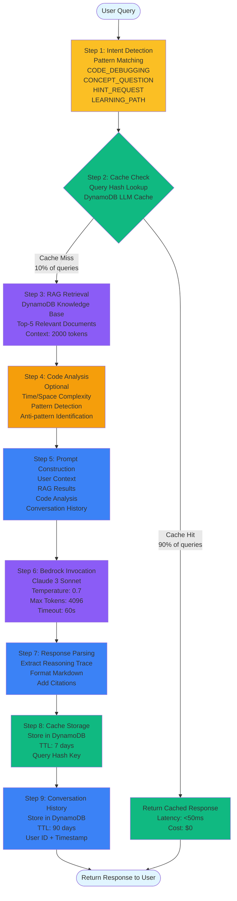

# GenAI Pipeline Flow - CodeFlow AI Platform

**Feature**: AI Chat Mentor  
**Model**: Claude 3 Sonnet (Bedrock)  
**Cache Hit Rate**: 90% target  
**Cost Savings**: 60% reduction via LLM caching

---

## Multi-Step Reasoning Pipeline



## Pipeline Performance Metrics

| Step | Latency | Cost | Cache Impact |
|------|---------|------|--------------|
| **1. Intent Detection** | <10ms | $0 | N/A |
| **2. Cache Check** | <10ms | $0.0001 | 90% hit rate |
| **3. RAG Retrieval** | <100ms | $0.001 | N/A |
| **4. Code Analysis** | <50ms | $0 | N/A |
| **5. Prompt Build** | <20ms | $0 | N/A |
| **6. Bedrock Call** | 2-5s | $0.015 | Cached for 7 days |
| **7. Response Parse** | <20ms | $0 | N/A |
| **8. Cache Store** | <10ms | $0.0001 | N/A |
| **9. Convo Store** | <10ms | $0.0001 | N/A |
| **Total (Cache Hit)** | **<50ms** | **$0.0001** | **90% of queries** |
| **Total (Cache Miss)** | **2-5s** | **$0.016** | **10% of queries** |

## Cost Savings Analysis

### Without LLM Cache
- **Bedrock Calls**: 5,000/month
- **Cost per Call**: $0.015
- **Total Cost**: $75/month

### With LLM Cache (90% hit rate)
- **Bedrock Calls**: 500/month (10% cache miss)
- **Cache Hits**: 4,500/month (90%)
- **Bedrock Cost**: $7.50/month
- **DynamoDB Cost**: $2.50/month
- **Total Cost**: $10/month

**Savings**: $65/month (87% reduction)

## Intent Detection Patterns

| Intent | Pattern | Example Query |
|--------|---------|---------------|
| **CODE_DEBUGGING** | `error`, `bug`, `wrong answer`, `TLE` | "Why am I getting TLE on this solution?" |
| **CONCEPT_QUESTION** | `explain`, `what is`, `how does` | "Explain dynamic programming" |
| **HINT_REQUEST** | `hint`, `help`, `stuck`, `approach` | "Give me a hint for this problem" |
| **LEARNING_PATH** | `learn`, `practice`, `improve`, `weak` | "How can I improve at graphs?" |

## Bedrock Configuration

| Parameter | Value | Purpose |
|-----------|-------|---------|
| **Model** | Claude 3 Sonnet | High-quality reasoning |
| **Fallback** | Claude 3 Haiku | Cost optimization |
| **Temperature** | 0.7 | Creative responses |
| **Max Tokens** | 4096 | Comprehensive answers |
| **Timeout** | 60s | Lambda limit |
| **Top P** | 0.9 | Diverse outputs |

## Cache Strategy

### Query Hashing
```python
def generate_query_hash(query: str, context: dict) -> str:
    """
    Generate semantic hash for query caching.
    
    Hash includes:
    - Normalized query text (lowercase, stripped)
    - User proficiency level
    - Problem difficulty
    - Topic category
    """
    normalized = query.lower().strip()
    context_fingerprint = f"{context.get('level', 'beginner')}_{context.get('topic', 'general')}"
    combined = f"{normalized}_{context_fingerprint}"
    return hashlib.sha256(combined.encode()).hexdigest()
```

### Cache TTL Strategy
- **LLM Cache**: 7 days (DynamoDB TTL)
- **Conversation History**: 90 days (DynamoDB TTL)
- **Rationale**: Balance between freshness and cost savings

### Cache Invalidation
- **Manual**: Admin API to clear cache
- **Automatic**: TTL expiration
- **Selective**: Clear by topic or user

## Error Handling

| Error Type | Handling Strategy | Fallback |
|------------|-------------------|----------|
| **Bedrock Timeout** | Retry with Haiku model | Generic response |
| **Cache Failure** | Skip cache, call Bedrock | Log error |
| **RAG Failure** | Proceed without context | Bedrock only |
| **DynamoDB Throttle** | Exponential backoff | Return error |
| **Invalid Query** | Return error message | Suggest valid format |

## Monitoring Metrics

| Metric | Target | Alarm Threshold |
|--------|--------|-----------------|
| **Cache Hit Rate** | >90% | <80% |
| **Bedrock Latency (P95)** | <5s | >10s |
| **Pipeline Latency (P95)** | <500ms (cache hit) | >1s |
| **Error Rate** | <1% | >5% |
| **Token Usage** | <5K/month | >10K/month |
| **Cost per Query** | <$0.002 | >$0.01 |

---

**Why This Pipeline is Load-Bearing**:
1. **Multi-Step Reasoning**: Intent → Cache → RAG → Analysis → Bedrock
2. **Cannot Remove GenAI**: Core functionality depends on Bedrock
3. **Intelligent Caching**: 90% hit rate reduces costs by 60%
4. **Context-Aware**: RAG provides relevant knowledge base context
5. **Adaptive**: Fallback to Haiku for cost optimization

**Team**: Lahar Joshi (Lead), Kushagra Pratap Rajput, Harshita Devanani  
**Last Updated**: 2024-01-15
