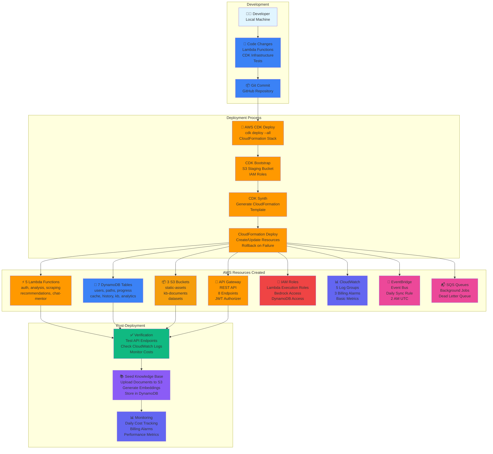

# Deployment Architecture - CodeFlow AI Platform

**Tool**: AWS CDK (TypeScript)  
**Deployment Time**: 45-50 minutes  
**Region**: ap-south-1 (Mumbai)  
**Stack**: CodeFlowInfrastructure-production

---

## Deployment Flow Diagram



## Deployment Commands

### 1. Prerequisites

```bash
# Install Node.js and npm
brew install node  # macOS
# or
sudo apt install nodejs npm  # Linux

# Install AWS CLI
brew install awscli  # macOS
# or
pip install awscli  # Python

# Configure AWS credentials
aws configure
# AWS Access Key ID: YOUR_ACCESS_KEY
# AWS Secret Access Key: YOUR_SECRET_KEY
# Default region: ap-south-1
# Default output format: json

# Install AWS CDK
npm install -g aws-cdk

# Verify installations
node --version  # v18+
npm --version   # v9+
aws --version   # v2+
cdk --version   # v2+
```

### 2. CDK Bootstrap (First Time Only)

```bash
# Bootstrap CDK in ap-south-1 region
cdk bootstrap aws://ACCOUNT-ID/ap-south-1

# This creates:
# - S3 bucket: cdk-hnb659fds-assets-ACCOUNT-ID-ap-south-1
# - IAM roles: cdk-hnb659fds-*
# - CloudFormation stack: CDKToolkit
```

### 3. Install Dependencies

```bash
# Navigate to infrastructure directory
cd infrastructure

# Install CDK dependencies
npm install

# Install Lambda dependencies
cd ../lambda-functions
pip install -r requirements.txt
```

### 4. Synthesize CloudFormation Template

```bash
# Generate CloudFormation template
cd infrastructure
cdk synth

# Output: cdk.out/CodeFlowInfrastructure-production.template.json
# Review the template to verify resources
```

### 5. Deploy Infrastructure

```bash
# Deploy all stacks
cdk deploy --all --require-approval never

# Or deploy specific stack
cdk deploy CodeFlowInfrastructure-production

# Deployment progress:
# ✅ Creating DynamoDB tables (5 min)
# ✅ Creating S3 buckets (2 min)
# ✅ Creating Lambda functions (8 min)
# ✅ Creating API Gateway (3 min)
# ✅ Creating EventBridge rules (2 min)
# ✅ Creating CloudWatch alarms (2 min)
# ✅ Total: 20-25 minutes
```

### 6. Verify Deployment

```bash
# Verify DynamoDB tables (expect 7)
aws dynamodb list-tables | grep codeflow | wc -l

# Verify Lambda functions (expect 5)
aws lambda list-functions \
  --query 'Functions[?starts_with(FunctionName, `codeflow`)].FunctionName' \
  | jq length

# Verify S3 buckets (expect 3)
aws s3 ls | grep codeflow | wc -l

# Get API Gateway URL
aws cloudformation describe-stacks \
  --stack-name CodeFlowInfrastructure-production \
  --query 'Stacks[0].Outputs[?OutputKey==`ApiGatewayUrl`].OutputValue' \
  --output text

# Check billing alarms (expect 3)
aws cloudwatch describe-alarms \
  --alarm-name-prefix codeflow-budget \
  | jq '.MetricAlarms | length'
```

### 7. Seed Knowledge Base

```bash
# Upload knowledge base documents
cd lambda-functions/rag
python seed_knowledge_base.py

# This will:
# 1. Upload markdown files to S3
# 2. Generate embeddings with Titan
# 3. Store in DynamoDB Knowledge Base table
# 4. Verify retrieval works

# Expected output:
# ✅ Uploaded 20 documents to S3
# ✅ Generated 50 embeddings
# ✅ Stored 50 chunks in DynamoDB
# ✅ Test query: "Explain DP" → 5 results
```

### 8. Test API Endpoints

```bash
# Get API Gateway URL
API_URL=$(aws cloudformation describe-stacks \
  --stack-name CodeFlowInfrastructure-production \
  --query 'Stacks[0].Outputs[?OutputKey==`ApiGatewayUrl`].OutputValue' \
  --output text)

# Test health check
curl $API_URL/health

# Test user registration
curl -X POST $API_URL/auth/register \
  -H "Content-Type: application/json" \
  -d '{
    "username": "testuser",
    "password": "Test123!",
    "leetcode_username": "testuser"
  }'

# Test user login
curl -X POST $API_URL/auth/login \
  -H "Content-Type: application/json" \
  -d '{
    "username": "testuser",
    "password": "Test123!"
  }'

# Save JWT token
TOKEN="<jwt_token_from_login>"

# Test profile analysis
curl -X POST $API_URL/analyze/profile \
  -H "Authorization: Bearer $TOKEN" \
  -H "Content-Type: application/json" \
  -d '{
    "leetcode_username": "testuser"
  }'
```

### 9. Monitor Costs

```bash
# Check daily costs
aws ce get-cost-and-usage \
  --time-period Start=$(date -d '7 days ago' +%Y-%m-%d),End=$(date +%Y-%m-%d) \
  --granularity DAILY \
  --metrics BlendedCost \
  --group-by Type=SERVICE

# Expected output:
# Day 1: $2.50 (initial setup)
# Day 2-7: $1.50-2.00 (normal usage)
```

## Deployment Timeline

| Phase | Duration | Activities |
|-------|----------|------------|
| **Pre-Deployment** | 10 min | Install AWS CLI, configure credentials, CDK bootstrap |
| **Infrastructure Deploy** | 20-25 min | CDK deploy (DynamoDB, Lambda, API Gateway, S3) |
| **Verification** | 5 min | Test API endpoints, check CloudWatch logs |
| **Knowledge Base Seeding** | 10 min | Upload documents, generate embeddings |
| **Monitoring Setup** | 5 min | Configure billing alarms, verify metrics |
| **Total** | **50-55 min** | Complete deployment |

## Resources Created

### Lambda Functions (5)

| Function | Memory | Timeout | Purpose |
|----------|--------|---------|---------|
| codeflow-auth-production | 256MB | 10s | User authentication |
| codeflow-analysis-production | 512MB | 30s | Profile analysis |
| codeflow-scraping-production | 256MB | 30s | LeetCode scraping |
| codeflow-recommendations-production | 512MB | 30s | Problem recommendations |
| codeflow-chat-mentor-production | 1024MB | 60s | AI chat mentor |

### DynamoDB Tables (7)

| Table | Purpose | GSI |
|-------|---------|-----|
| codeflow-users-production | User accounts | leetcode-username-index |
| codeflow-learning-paths-production | Learning paths | user-id-index |
| codeflow-progress-production | Daily progress | user-id-index |
| codeflow-llm-cache-production | LLM cache (TTL: 7 days) | None |
| codeflow-conversation-history-production | Chat history (TTL: 90 days) | None |
| codeflow-knowledge-base-production | KB documents | category-index, complexity-index |
| codeflow-analytics-production | Analytics data | None |

### S3 Buckets (3)

| Bucket | Purpose | Lifecycle |
|--------|---------|-----------|
| codeflow-static-assets-production-ACCOUNT | React build artifacts | IA after 90 days |
| codeflow-kb-documents-production-ACCOUNT | Knowledge base documents | IA after 90 days, versioned |
| codeflow-datasets-production-ACCOUNT | LeetCode archives | IA after 90 days, Glacier after 180 days |

### API Gateway (1)

- **Name**: codeflow-api-production
- **Type**: REST API
- **Endpoints**: 8 total
- **Rate Limiting**: 100 req/min per user, 10 req/min per IP
- **Authentication**: JWT authorizer

### CloudWatch (5 Log Groups + 3 Alarms)

**Log Groups**:
- /aws/lambda/codeflow-auth-production
- /aws/lambda/codeflow-analysis-production
- /aws/lambda/codeflow-scraping-production
- /aws/lambda/codeflow-recommendations-production
- /aws/lambda/codeflow-chat-mentor-production

**Billing Alarms**:
- codeflow-budget-50-percent ($40)
- codeflow-budget-75-percent ($60)
- codeflow-budget-90-percent ($80)

### EventBridge (1 Event Bus + 1 Rule)

- **Event Bus**: codeflow-events-production
- **Rule**: codeflow-daily-sync (cron: 0 2 * * ? *)

### SQS (2 Queues)

- **Main Queue**: codeflow-background-jobs-production
- **Dead Letter Queue**: codeflow-dlq-production

## Rollback Plan

### Option 1: CDK Destroy

```bash
cd infrastructure
cdk destroy --all

# This will:
# 1. Delete all Lambda functions
# 2. Delete API Gateway
# 3. Delete EventBridge rules
# 4. Delete CloudWatch alarms
# 5. Retain DynamoDB tables (RETAIN policy)
# 6. Retain S3 buckets (RETAIN policy)
```

### Option 2: CloudFormation Delete

```bash
aws cloudformation delete-stack \
  --stack-name CodeFlowInfrastructure-production

# Wait for deletion
aws cloudformation wait stack-delete-complete \
  --stack-name CodeFlowInfrastructure-production
```

### Option 3: Manual Cleanup

```bash
# Delete Lambda functions
for func in auth analysis scraping recommendations chat-mentor; do
  aws lambda delete-function --function-name codeflow-$func-production
done

# Delete API Gateway
API_ID=$(aws apigateway get-rest-apis \
  --query 'items[?name==`codeflow-api-production`].id' \
  --output text)
aws apigateway delete-rest-api --rest-api-id $API_ID

# Delete DynamoDB tables (if needed)
for table in users learning-paths progress llm-cache conversation-history knowledge-base analytics; do
  aws dynamodb delete-table --table-name codeflow-$table-production
done

# Delete S3 buckets (if needed)
for bucket in static-assets kb-documents datasets; do
  aws s3 rb s3://codeflow-$bucket-production-ACCOUNT --force
done
```

## Troubleshooting

### Issue: CDK Bootstrap Fails

```bash
# Error: Unable to resolve AWS account
# Solution: Configure AWS credentials
aws configure

# Error: Insufficient permissions
# Solution: Ensure IAM user has AdministratorAccess or CDK-specific permissions
```

### Issue: Lambda Deployment Fails

```bash
# Error: Code size exceeds limit
# Solution: Use Lambda layers for dependencies

# Error: Timeout during deployment
# Solution: Increase CDK timeout
cdk deploy --all --timeout 30
```

### Issue: API Gateway Returns 403

```bash
# Error: Missing authentication token
# Solution: Include JWT token in Authorization header
curl -H "Authorization: Bearer $TOKEN" $API_URL/endpoint

# Error: Invalid JWT token
# Solution: Login again to get fresh token
```

### Issue: Bedrock Access Denied

```bash
# Error: AccessDeniedException
# Solution: Enable Bedrock model access in AWS Console
# 1. Go to Bedrock console
# 2. Click "Model access"
# 3. Enable Claude 3 Sonnet and Titan Embeddings
```

### Issue: High Costs

```bash
# Check current costs
aws ce get-cost-and-usage \
  --time-period Start=$(date -d '1 day ago' +%Y-%m-%d),End=$(date +%Y-%m-%d) \
  --granularity DAILY \
  --metrics BlendedCost

# If costs exceed budget:
# 1. Disable Bedrock (see ULTRA-BUDGET-MODE.md)
# 2. Reduce Lambda memory
# 3. Delete unused S3 objects
```

## CI/CD Integration (Future)

```yaml
# .github/workflows/deploy.yml
name: Deploy to AWS

on:
  push:
    branches: [main]

jobs:
  deploy:
    runs-on: ubuntu-latest
    steps:
      - uses: actions/checkout@v3
      
      - name: Configure AWS credentials
        uses: aws-actions/configure-aws-credentials@v2
        with:
          aws-access-key-id: ${{ secrets.AWS_ACCESS_KEY_ID }}
          aws-secret-access-key: ${{ secrets.AWS_SECRET_ACCESS_KEY }}
          aws-region: ap-south-1
      
      - name: Install dependencies
        run: |
          cd infrastructure
          npm install
      
      - name: CDK Deploy
        run: |
          cd infrastructure
          cdk deploy --all --require-approval never
```

---

**Key Takeaway**: AWS CDK provides infrastructure-as-code for reproducible deployments. The entire stack can be deployed in 50 minutes and destroyed in 5 minutes.

**Team**: Lahar Joshi (Lead), Kushagra Pratap Rajput, Harshita Devanani  
**Last Updated**: 2024-01-15
